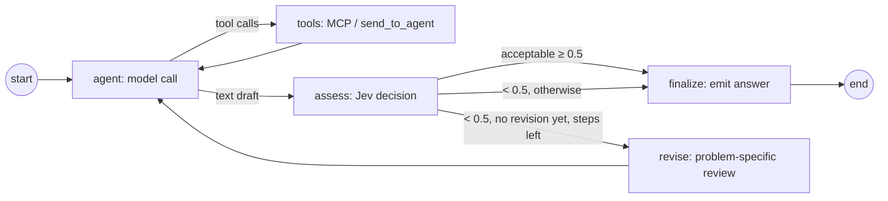

# report agent

Builds charts (`create_chart`) and a saved markdown report (`save_report`) from the findings and datasets it is given; replies with the report id.

A Backend plugin (see [`agents/_template`](../_template/README.md) and the `vdagent_sdk` docstring):
`vdagent_report/__init__.py` exports `setup(api, opts)`, which registers the agent. The brain is a
hand-built LangGraph `StateGraph` (`graph.py`) with a quality gate:



- Tool-call steps are emitted as they happen. A text reply is only a draft: `assess` (`judge.py`)
  asks Jev (`typesafe/jev-1.13`, TypeSafe's decisions model, via OpenRouter's
  `/api/alpha/decisions` endpoint, not `chat/completions`) for a calibrated probability that the
  draft is acceptable (`noul`) and its main problem (`choice`). Below 0.5 the draft goes back once
  with the review for that problem. Only the draft that leaves `assess` is emitted, so the Backend
  never sees a rejected draft.
- A Jev error or unusable reply counts as a pass; the verdict and its probabilities are logged
  (`jev: acceptable=… problem=… → pass|revise`).

Prompts: role `prompts/system.md`, summariser `prompts/compact.md`.

MCP tools granted by the Backend (`backend/vdagent_backend/mcp/tools.py`): `create_chart`, `save_report`, `describe_dataset`, `get_dataset_rows`;
plus `send_to_agent` to reach the other agents.

## Run

The Backend loads it at startup when `vdagent_report` is listed under `plugins:` in
`backend/config.yaml` (it is by default): `make backend` from the repo root. There is no separate
process.

Configure it in `agents/report/.env` (gitignored). The plugin reads the file itself with
`dotenv_values()`; its values win over the Backend's process environment. A missing required
variable makes the plugin fail to load: the Backend logs `plugin vdagent_report failed: …` and starts
without this agent.

| Variable | |
|---|---|
| `OPENAI_API_KEY`, `OPENAI_BASE_URL`, `LLM_MODEL` | Required. OpenAI-compatible endpoint with tool calling. |
| `LLM_TIMEOUT_S` | Per LLM call, default 120. |
| `JUDGE_MODEL` | Jev model for the quality gate, default `typesafe/jev-1.13` (called with `OPENAI_API_KEY`). |
| `JEV_DECISIONS_URL` | Decisions endpoint, default `https://openrouter.ai/api/alpha/decisions`. |

## Test

```
uv run pytest agents/report
```
