# Chart Agent — Master Specification

**VDAgent — Hệ thống Multi-Agent phân tích dữ liệu bất động sản**

Tài liệu này là specification tổng hợp của Chart Agent, gồm 10 phần: mục đích và phạm vi, User Intent, Input Contract, Output Contract, Tool & Dependency, luồng xử lý và suy luận, quy tắc nghiệp vụ & Guardrails, xử lý lỗi & Fallback, Evaluation, và Observability & Integration.

---

**CHART AGENT**

**ĐẶC TẢ THIẾT KẾ & TRIỂN KHAI TỔNG THỂ**

VDAgent - Hệ thống Multi-Agent phân tích dữ liệu bất động sản

**Định dạng:** Markdown
**Phạm vi:** Specification đầy đủ gồm 10 phần

## Mục lục

1. [Mục đích và phạm vi](#1-mục-đích-và-phạm-vi)
2. [User Intent](#2-user-intent)
3. [Input Contract](#3-input-contract)
4. [Output Contract](#4-output-contract-hợp-đồng-đầu-ra)
5. [Tool và Dependency](#5-tool-công-cụ-và-dependency-phụ-thuộc)
6. [Luồng xử lý và suy luận](#6-luồng-xử-lý-và-suy-luận)
7. [Quy tắc nghiệp vụ & Guardrails](#7-quy-tắc-nghiệp-vụ--guardrails)
8. [Xử lý lỗi & Fallback](#8-xử-lý-lỗi--fallback)
9. [Evaluation](#9-evaluation-đánh-giá)
10. [Observability & Integration](#10-observability--integration)

---

# 1. Mục đích và phạm vi

## 1.1. Bài toán Chart Agent cần giải quyết

Trong VDAgent, người dùng chính là Sales Operations cần phân tích hiệu suất bán hàng và điều tra các sản phẩm hoặc phân khu có dấu hiệu bán chậm. Các câu hỏi thường gặp không chỉ yêu cầu một con số, mà còn cần cách thể hiện giúp người đọc kiểm tra nhanh mức độ, xu hướng, chênh lệch và vị trí tương đối của kết quả trong bối cảnh nghiệp vụ.

- Căn hoặc phân khu nào có số ngày tồn kho (DOM) cao bất thường?

- Một target đang chậm hơn peer group hoặc benchmark bao nhiêu?

- Absorption Rate, Price/m² hoặc DOM thay đổi theo thời gian như thế nào?

- Inventory tập trung ở project, area hoặc nhóm sản phẩm nào?

- Cơ cấu Available / Booked / Sold thay đổi ra sao?

- Một target nằm ở đâu trong phân bố của peer group?

- Hai biến số như Price/m² và DOM có pattern quan sát được hay không?

Một bảng số liệu hoặc một câu insight có thể đúng nhưng vẫn chưa đủ để người dùng kiểm chứng nhanh. Khoảng trống cần được giải quyết là chuyển một kết quả phân tích đã được xác thực thành bằng chứng trực quan có thể sử dụng nhất quán trong giao diện và báo cáo.

**Khoảng trống cần được Chart Agent xử lý**

Kết quả phân tích đã được xác thực → Bằng chứng trực quan → Biểu đồ trong Chat / Dashboard / Report

Nếu lớp Frontend hoặc Report Agent tự lấy dữ liệu và tự quyết định cách vẽ, hệ thống có thể phát sinh các sai lệch khó kiểm soát: cùng một metric nhưng khác scope, khác snapshot, khác đơn vị, khác peer group; biểu đồ trên dashboard và report không đồng nhất; hoặc Renderer vô tình tính lại logic nghiệp vụ. Vì vậy, chart trong VDAgent không được xem chỉ là một UI component. Nó phải là một artifact phân tích có cấu trúc, có version, có lineage và có thể tái lập.

Một biểu đồ chỉ được coi là đúng khi đồng thời bảo toàn các yếu tố sau:

- Đúng giá trị và đúng metric đã được xác thực.

- Đúng scope, snapshot, time range, filter và data grain.

- Đúng unit và đúng ý nghĩa nghiệp vụ của từng trường dữ liệu.

- Đúng peer group, benchmark, gap hoặc rank nếu biểu đồ dựa trên comparison.

- Đúng evidence và có thể truy ngược về calculation/source tương ứng.

- Không diễn giải mạnh hơn bằng chứng thực tế và không tạo ra kết luận mới ngoài upstream.

- Đủ thông tin để Renderer dựng được mà không cần tính hoặc suy luận lại business logic.

## 1.2. Mục đích của Chart Agent

**Định nghĩa cốt lõi**

Chart Agent là thành phần chuyển các kết quả phân tích đã được xác thực thành bằng chứng trực quan có cấu trúc, có khả năng truy vết và đủ thông tin để Renderer hoặc Report Agent sử dụng mà không cần tính toán hay suy luận lại logic nghiệp vụ.

Chart Agent tồn tại để tạo ra một ranh giới rõ ràng giữa "sự thật phân tích" và "cách trình bày trực quan". Upstream quyết định dữ liệu nào là đúng; Chart Agent quyết định cách thể hiện dữ liệu đó sao cho phù hợp với câu hỏi trực quan, dễ đọc và không gây hiểu sai.

Các mục đích chính của Chart Agent gồm:

1.  Chuyển validated metrics/computations, comparison, insight và evidence thành visualization có cấu trúc, có thể sử dụng trực tiếp trong sản phẩm và báo cáo.

2.  Bảo đảm biểu đồ trực quan hóa đúng điều upstream đang nói; không tự chọn một góc nhìn khác chỉ vì dễ vẽ, đẹp hơn hoặc tạo cảm giác nổi bật hơn.

3.  Bảo toàn numeric truth: không tự tính lại hoặc điều chỉnh các giá trị như Absorption Rate, DOM, Price/m², inventory, benchmark, peer gap, rank hoặc business score.

4.  Bảo toàn ngữ cảnh dữ liệu: value, unit, scope, snapshot, time range, filter, grain và population của biểu đồ phải nhất quán với upstream artifacts.

5.  Tạo ChartSpec đầy đủ để Renderer có thể dựng biểu đồ chỉ từ spec, không cần hiểu thêm logic nghiệp vụ bên ngoài.

6.  Bảo đảm mọi giá trị quan trọng trên biểu đồ có lineage đến metric, evidence, calculation/comparison và source liên quan.

7.  Cho phép cùng một Chart Artifact được tái sử dụng nhất quán giữa chat, dashboard và report; tránh mỗi lớp tự xây dựng lại biểu đồ theo cách khác nhau.

8.  Chuẩn hóa governance thông qua run_id, artifact version, status, source/evidence lineage, ruleset version, validator version và content hash để hỗ trợ audit, replay và reproducibility.

## 1.3. Phạm vi trách nhiệm của Chart Agent

Chart Agent chịu trách nhiệm toàn bộ quá trình biến một mục tiêu trực quan hợp lệ thành Chart Artifact đã được kiểm tra. Trách nhiệm này bắt đầu từ thời điểm Chart Agent nhận task đã được Orchestrator chuẩn hóa và kết thúc khi ChartSpec hợp lệ được persist hoặc khi task trả về trạng thái partial/failed cùng lý do rõ ràng.

| **Nhóm trách nhiệm**             | **Nội dung**                                                                                                                                                                               |
|----------------------------------|--------------------------------------------------------------------------------------------------------------------------------------------------------------------------------------------|
| **Kiểm tra điều kiện đầu vào**   | Kiểm tra các ArtifactRef bắt buộc đã resolve được đúng artifact_id, version, status và quyền truy cập. Nếu thiếu dependency bắt buộc thì không tiếp tục tạo chart.                         |
| **Chuẩn bị ngữ cảnh**            | Đọc exact artifact version, kiểm tra kiểu dữ liệu và chuẩn hóa thành representation nội bộ ổn định; đồng thời kiểm tra run, snapshot, scope, unit, grain và value consistency.             |
| **Xác định mục tiêu trực quan**  | Xác định chính xác metric, comparison, insight hoặc nội dung report nào cần được thể hiện. Chart Agent không tự tạo insight mới trong normal path.                                         |
| **Liên kết bằng chứng**          | Map từng mục tiêu trực quan với đúng metric, evidence, comparison và source/calculation tương ứng để tránh tình trạng insight một đằng, chart một nẻo.                                     |
| **Phân loại câu hỏi trực quan**  | Xác định chart cần trả lời câu hỏi gì: giá trị hiện tại, trend, comparison, target-vs-peer, composition, distribution, relationship, geospatial hoặc dạng khác được hỗ trợ.                |
| **Sinh phương án biểu đồ**       | Tạo các candidate phù hợp với data shape, unit, grain, visual question và policy.                                                                                                          |
| **Chọn loại biểu đồ**            | Đánh giá candidate theo mức độ phù hợp, khả năng đọc và nguy cơ gây hiểu sai. Đây là phần visual reasoning mà Chart Agent được phép thực hiện.                                             |
| **Chuẩn bị dữ liệu hiển thị**    | Select, sort, rename, reshape và format các giá trị đã được xác thực. Không được chạy lại business formula, thay population hoặc tự impute dữ liệu.                                        |
| **Xây dựng thông tin trình bày** | Tạo title, subtitle, axis, legend, tooltip, annotation, number format và limitation. Nội dung trình bày không được mạnh hơn evidence.                                                      |
| **Tạo ChartSpec**                | Đóng gói dataset, encoding, presentation, scope, evidence và lineage thành render contract tự chứa.                                                                                        |
| **Kiểm tra đầu ra**              | Kiểm tra schema, data, unit, scope, semantics, evidence completeness, security và khả năng Renderer sử dụng.                                                                               |
| **Fallback và persist**          | Nếu chart ưu tiên không phù hợp, chuyển sang representation an toàn hơn như KPI, Table hoặc no-chart theo policy; nếu hợp lệ thì lưu Chart Artifact bất biến kèm version, hash và lineage. |

Chart Agent có reasoning nhưng reasoning này bị giới hạn ở ngữ nghĩa trực quan. Agent được phép quyết định nên dùng Bar hay Grouped Bar, có cần annotation benchmark hay không, có nên fallback sang Table khi quá nhiều category, hoặc title cần diễn đạt như thế nào để không overclaim. Ngược lại, Chart Agent không được suy đoán giá trị còn thiếu, đổi peer group, loại outlier, tự tính metric hoặc biến một correlation thành kết luận nhân quả.

## 1.4. Phạm vi bài toán trực quan hóa được hỗ trợ

Phạm vi của Chart Agent được xác định theo loại câu hỏi trực quan mà người dùng hoặc downstream cần trả lời, không chỉ theo khả năng của thư viện render. Một chart type chỉ có ý nghĩa khi nó gắn với một câu hỏi phân tích rõ ràng và có thể kiểm tra bằng contract.

| **Nhóm câu hỏi**                 | **Câu hỏi trực quan**                                          | **Ví dụ bất động sản**                                      |
|----------------------------------|----------------------------------------------------------------|-------------------------------------------------------------|
| **Giá trị hiện tại**             | "Hiện tại là bao nhiêu?"                                       | Absorption Rate hiện tại; DOM của một căn; số căn còn hàng. |
| **Xu hướng theo thời gian**      | "Chỉ số thay đổi theo thời gian như thế nào?"                  | Price/m², DOM hoặc Absorption Rate theo tháng.              |
| **So sánh giữa các nhóm**        | "Các project/area/category khác nhau ra sao?"                  | Inventory theo Area; DOM theo Project.                      |
| **Target so với peer/benchmark** | "Target đang khác peer ở đâu và bao nhiêu?"                    | DOM của căn A12-08 so với peer group.                       |
| **Thành phần - tổng thể**        | "Một tổng được cấu thành từ những phần nào?"                   | Available / Booked / Sold trong cùng inventory population.  |
| **Phân bố**                      | "Một biến số phân bố như thế nào?"                             | Phân bố DOM của các căn trong peer group.                   |
| **So sánh phân bố**              | "Phân bố giữa các cohort khác nhau ra sao?"                    | DOM giữa các Area hoặc nhóm hướng căn.                      |
| **Mối quan hệ**                  | "Hai biến có pattern/association quan sát được không?"         | Price/m² so với DOM; Discount so với DOM.                   |
| **Ma trận hai chiều**            | "Mức độ thay đổi trên hai dimension như thế nào?"              | Floor × Direction; Project × Month.                         |
| **Không gian địa lý**            | "Metric phân bố theo vị trí địa lý như thế nào?"               | Price/m² hoặc Absorption Rate theo project/khu vực.         |
| **Chuyển đổi theo giai đoạn**    | "Tỷ lệ chuyển đổi thay đổi qua các bước như thế nào?"          | Inquiry → Visit → Booking → Deposit → Contract.             |
| **Đóng góp tăng/giảm**           | "Thành phần nào làm tăng hoặc giảm để tạo thành giá trị cuối?" | List Price → Discount → Financial Support → Net Price.      |
| **Phân cấp**                     | "Một tổng được chia theo hierarchy như thế nào?"               | Project → Area → Unit Type.                                 |
| **So với mục tiêu**              | "Actual đang ở đâu so với target hoặc khoảng tham chiếu?"      | Absorption Rate thực tế so với mục tiêu.                    |

Các nhóm câu hỏi trên bao phủ 3 use case trung tâm của VDAgent: điều tra sản phẩm bán chậm, so sánh peer group và tra cứu/tổng hợp KPI hiệu suất. Tùy task, Chart Agent có thể phục vụ trực tiếp người dùng, hỗ trợ một Insight/Comparison cụ thể hoặc tạo visual evidence để đưa vào report.

## 1.5. Các loại biểu đồ hỗ trợ

Danh mục biểu đồ của Chart Agent được xây dựng từ nhu cầu phân tích, data shape và khả năng validation. Không nên đưa một chart type vào chỉ vì Renderer có thể vẽ được. Mỗi loại phải có câu hỏi trực quan rõ ràng, input contract xác định được, guardrail chống misleading và khả năng truy vết về metric/evidence.

| **chart_type**  | **Tên biểu đồ**   | **Câu hỏi chính**                                                         | **Ví dụ bất động sản**                    | **Mức hỗ trợ** |
|-----------------|-------------------|---------------------------------------------------------------------------|-------------------------------------------|----------------|
| **kpi_card**    | Thẻ KPI           | Giá trị hoặc trạng thái hiện tại là gì?                                   | Absorption Rate hiện tại; DOM của một căn | **Bắt buộc**   |
| **line**        | Biểu đồ đường     | Chỉ số thay đổi theo thời gian như thế nào?                               | Price/m² hoặc DOM theo tháng              | **Bắt buộc**   |
| **area**        | Biểu đồ miền      | Quy mô hoặc giá trị tích lũy thay đổi theo thời gian như thế nào?         | Nguồn cung tích lũy; số căn bán tích lũy  | **Tùy chọn**   |
| **bar**         | Biểu đồ cột       | Các nhóm hoặc đối tượng khác nhau như thế nào?                            | Inventory theo Area; DOM theo Project     | **Bắt buộc**   |
| **grouped_bar** | Biểu đồ nhóm cột  | Nhiều series khác nhau giữa các nhóm như thế nào?                         | DOM theo Area và Direction                | **Bắt buộc**   |
| **stacked_bar** | Biểu đồ cột chồng | Các thành phần cấu thành một tổng khác nhau như thế nào giữa các nhóm?    | Available / Booked / Sold theo Area       | **Bắt buộc**   |
| **pie**         | Biểu đồ tròn      | Các thành phần chiếm tỷ trọng bao nhiêu trong một tổng tại một thời điểm? | Cơ cấu Unit Type hoặc trạng thái bán hàng | **Bắt buộc**   |
| **scatter**     | Biểu đồ phân tán  | Hai biến số có mối quan hệ hoặc pattern như thế nào?                      | Price/m² so với DOM                       | **Bắt buộc**   |

| **histogram** | Biểu đồ tần suất         | Một biến số được phân bố như thế nào?                              | Phân bố DOM của các căn                    | **Bắt buộc** |
|---------------|--------------------------|--------------------------------------------------------------------|--------------------------------------------|--------------|
| **box_plot**  | Biểu đồ hộp              | Phân bố của một chỉ số khác nhau như thế nào giữa các nhóm?        | So sánh phân bố DOM giữa các Area          | **Bắt buộc** |
| **heatmap**   | Bản đồ nhiệt             | Cường độ của metric thay đổi như thế nào trên hai chiều?           | Floor × Direction; Project × Month         | **Bắt buộc** |
| **map**       | Bản đồ địa lý            | Metric phân bố theo vị trí địa lý như thế nào?                     | Price/m² hoặc Absorption Rate theo khu vực | **Bắt buộc** |
| **funnel**    | Biểu đồ phễu             | Tỷ lệ chuyển đổi thay đổi như thế nào qua các bước tuần tự?        | Visit → Booking → Deposit → Contract       | **Bắt buộc** |
| **waterfall** | Biểu đồ thác nước        | Các thành phần tăng/giảm tạo thành giá trị cuối như thế nào?       | List Price → Discount → Net Price          | **Tùy chọn** |
| **treemap**   | Biểu đồ cây phân cấp     | Một tổng được phân chia theo cấu trúc phân cấp như thế nào?        | Project → Area → Unit Type                 | **Tùy chọn** |
| **bullet**    | Biểu đồ so sánh mục tiêu | Kết quả thực tế đang ở đâu so với mục tiêu hoặc khoảng tham chiếu? | Absorption Rate thực tế so với target      | **Tùy chọn** |

Quy ước mở rộng để giữ contract gọn và tránh trùng semantics:

- table là dạng hiển thị dự phòng khi không có biểu đồ phù hợp hoặc khi chart có nguy cơ gây hiểu sai; không tính là một trong 16 chart type chính.

- donut là variant của pie vì cùng biểu diễn quan hệ thành phần - tổng thể.

- bubble là variant của scatter, bổ sung size_field để mã hóa biến thứ ba bằng kích thước điểm.

- stacked_area là variant của area, sử dụng stack_mode để xác định cách chồng series.

- choropleth, cluster và map_heatmap là các mode của map, không tách thành chart type riêng.

**Nguyên tắc chọn catalog**

Chart catalog phải xuất phát từ câu hỏi phân tích và khả năng validation, không xuất phát từ việc thư viện Renderer đang hỗ trợ được bao nhiêu loại biểu đồ.

## 1.6. Ranh giới trách nhiệm và ngoài phạm vi

Chart Agent là một Agent chuyên trách về visual semantics, không phải một Data Agent, Insight Agent, Compare Agent hoặc Report Agent thứ hai. Vì vậy, boundary với từng thành phần phải được giữ rõ để tránh trùng trách nhiệm và tránh việc Chart Agent tự mở rộng quyền.

| **Thành phần**            | **Chart Agent được phép**                                                                                                  | **Chart Agent không được phép**                                                                                 |
|---------------------------|----------------------------------------------------------------------------------------------------------------------------|-----------------------------------------------------------------------------------------------------------------|
| **Orchestrator**          | Đọc task, intent, scope, required refs; trả ChartTaskResult hoặc dependency request.                                       | Không sửa execution plan, tự mở rộng scope, tự tăng quyền hoặc tự gọi Agent khác trong normal path.             |
| **Data Agent / Core**     | Đọc validated values, evidence và source/calculation metadata; select/sort/reshape phục vụ presentation.                   | Không query raw Data Warehouse, không chạy business formula, không sửa metric hoặc Data Quality result.         |
| **Insight Agent**         | Dùng claim làm semantic target; dùng evidence refs và limitation; có thể dùng importance để ưu tiên khi giới hạn số chart. | Không rewrite claim, invent insight mới, tăng confidence hoặc tự kết luận nguyên nhân.                          |
| **Compare Agent**         | Dùng target, peer group, benchmark, gap, rank, criteria version và evidence refs.                                          | Không thay peer membership, đổi peer criteria, tính lại gap/benchmark hoặc tự rank.                             |
| **Shared Artifact Store** | Resolve exact artifact version và persist Chart Artifact bất biến.                                                         | Không xem Store là owner của business meaning; không fallback latest một cách mơ hồ trong evidence/report flow. |
| **Renderer / Frontend**   | Nhận declarative ChartSpec, chart-ready dataset/ref, encoding, presentation và accessibility metadata.                     | Không tính metric, business filtering, chọn peer, tự top-N, impute hoặc đổi unit.                               |
| **Report Agent**          | Nhận exact Chart Artifact kèm lineage và limitation để compose report.                                                     | Không sửa series/value, không đổi chart semantics và không lookup latest thay cho version đã pin.               |

Một boundary đặc biệt quan trọng là quan hệ giữa Insight Agent và Compare Agent. Hai Agent này độc lập; không có rule mặc định buộc Insight phải chờ Compare hoặc ngược lại. Orchestrator xác định dependency theo từng task cụ thể. Chart Agent chỉ sử dụng những ArtifactRef được cấp và không được tự tạo hidden dependency giữa hai Agent.

Ngoài phạm vi của Chart Agent:

- Query trực tiếp CRM, raw Data Warehouse, production database hoặc tự tìm external data.

- Tính hoặc sửa business metric như Absorption Rate, DOM, Price/m², inventory, benchmark, peer gap, rank, business score, conversion hoặc sales velocity.

- Tự chọn lại peer group, thay peer membership, đổi peer criteria hoặc tính lại benchmark/gap.

- Sinh insight mới, sửa nghĩa claim, thay importance hoặc tăng confidence của Insight.

- Kết luận quan hệ nhân quả từ trend, scatter hoặc comparison khi không có causal artifact được xác thực.

- Tự impute/interpolate dữ liệu thiếu, loại outlier hoặc bỏ category chỉ để biểu đồ dễ nhìn hơn.

- Thay đổi business population, filter hoặc scope ngoài phạm vi được cấp.

- Tạo final report, tự sắp xếp narrative report hoặc quyết định chart nào được pin vào bản báo cáo cuối cùng.

- Tự động thay đổi giá, chính sách bán hàng, trạng thái căn hoặc thực hiện quyết định nghiệp vụ thay người dùng.

## 1.7. Nguyên tắc và tiêu chí hoàn thành

Các nguyên tắc dưới đây được dùng làm chuẩn để đánh giá một tác vụ của Chart Agent có thực hiện đúng chức năng hay không. Các nguyên tắc này phải được duy trì xuyên suốt toàn bộ quá trình, từ tiếp nhận và kiểm tra đầu vào, xác định mục tiêu trực quan, chuẩn bị dữ liệu hiển thị, lựa chọn biểu đồ, tạo ChartSpec, kiểm tra đầu ra cho đến khi lưu kết quả dưới dạng artifact

**Các nguyên tắc:**

| **Nguyên tắc**                                                | **Ý nghĩa**                                                                                                                                                                                                                                             |
|---------------------------------------------------------------|---------------------------------------------------------------------------------------------------------------------------------------------------------------------------------------------------------------------------------------------------------|
| **Số liệu và kết quả nghiệp vụ phải lấy từ thành phần nguồn** | Các chỉ số, phép tính, kết quả so sánh và nhận định nghiệp vụ phải lấy từ các artifact đã được Data/Core, Insight Agent hoặc Compare Agent tạo và xác thực. Chart Agent không được tự tính lại, sửa đổi hoặc suy đoán các giá trị này.                  |
| **Chart Agent chịu trách nhiệm về cách trực quan hóa**        | Chart Agent quyết định câu hỏi trực quan cần trả lời, loại biểu đồ, cách ánh xạ dữ liệu lên biểu đồ, cách trình bày và các kiểm tra nhằm bảo đảm biểu đồ không gây hiểu sai.                                                                            |
| **Biểu đồ phải dựa trên bằng chứng**                          | Một biểu đồ dùng để chứng minh hoặc hỗ trợ một nhận định chỉ được tạo khi các bằng chứng cần thiết đã được xác định và kiểm tra đầy đủ theo yêu cầu của tác vụ.                                                                                         |
| **Sử dụng đúng phiên bản dữ liệu và artifact**                | Chart Agent phải sử dụng đúng artifact_id và version được chỉ định. Không tự động lấy phiên bản mới nhất khi đang tạo bằng chứng hoặc biểu đồ cho báo cáo.                                                                                              |
| **Không tự tạo phụ thuộc giữa các Agent**                     | Insight Agent và Compare Agent chỉ được xem là đầu vào bắt buộc khi tác vụ thực sự cần đến và Orchestrator đã khai báo rõ. Chart Agent không được tự yêu cầu thêm một Agent chỉ vì luồng xử lý thông thường có thành phần đó.                           |
| **Không thay đổi tập dữ liệu nghiệp vụ**                      | Các thao tác phục vụ trình bày như sắp xếp, đổi nhãn hoặc chuyển đổi cấu trúc dữ liệu không được làm thay đổi tập đối tượng đang được phân tích, phạm vi nghiệp vụ hoặc điều kiện lọc đã được xác định từ trước.                                        |
| **Không diễn giải vượt quá bằng chứng**                       | Tiêu đề, tiêu đề phụ, chú thích và nội dung đi kèm biểu đồ không được đưa ra kết luận mạnh hơn dữ liệu hoặc nhận định đã được xác thực. Đặc biệt, không được biến mối tương quan thành quan hệ nguyên nhân – kết quả nếu không có bằng chứng tương ứng. |
| **Đầu ra phải đủ thông tin để dựng biểu đồ**                  | ChartSpec phải chứa đầy đủ dữ liệu hoặc tham chiếu dữ liệu, cách ánh xạ trường dữ liệu, thông tin trình bày, phạm vi, bằng chứng và thông tin truy vết để Renderer có thể dựng biểu đồ mà không cần tự thực hiện thêm logic nghiệp vụ.                  |
| **Kết quả phải có khả năng tái lập**                          | Khi sử dụng cùng đầu vào, cùng phiên bản artifact và cùng bộ quy tắc, Chart Agent phải tạo ra kết quả có ý nghĩa trực quan nhất quán, có thể chạy lại và kiểm tra khi cần.                                                                              |
| **Lỗi và giới hạn phải được thể hiện rõ ràng**                | Khi thiếu đầu vào, dữ liệu mâu thuẫn, bằng chứng không đủ hoặc có giới hạn ảnh hưởng đến kết quả, Chart Agent phải trả về trạng thái và lý do rõ ràng. Không được âm thầm thay thế bằng dữ liệu ước đoán hoặc bỏ qua lỗi.                               |

**Tiêu chí hoàn thành:**

Một task của Chart Agent được coi là hoàn thành đúng khi đáp ứng tối thiểu các điều kiện sau:

- Biểu đồ trả lời đúng mục tiêu trực quan của tác vụ hoặc trực tiếp hỗ trợ Insight/Comparison đã được chọn.

- Không có giá trị nghiệp vụ nào do Chart Agent tự tính lại, chỉnh sửa hoặc suy đoán.

- Giá trị, đơn vị, phạm vi, phiên bản dữ liệu, khoảng thời gian, điều kiện lọc, mức chi tiết dữ liệu và tập đối tượng phân tích phải nhất quán với các artifact đầu vào.

- Loại biểu đồ được lựa chọn phải phù hợp với câu hỏi trực quan và cấu trúc dữ liệu. Nếu phải sử dụng phương án thay thế, hệ thống phải ghi rõ lý do.

- Các giá trị quan trọng xuất hiện trên biểu đồ phải có khả năng truy ngược tới chỉ số, bằng chứng, phép tính, kết quả so sánh và nguồn dữ liệu tương ứng.

- Tiêu đề, chú thích và nội dung mô tả ngắn của biểu đồ không được diễn giải vượt quá bằng chứng hiện có hoặc tạo ra kết luận nhân quả chưa được xác thực.

- ChartSpec phải vượt qua các bước kiểm tra về cấu trúc, dữ liệu, ý nghĩa, quyền truy cập, khả năng hiển thị và các quy tắc áp dụng cho tác vụ.

- Kết quả phải được lưu dưới dạng artifact có đầy đủ thông tin quản trị cần thiết như run_id, phiên bản, trạng thái, mã kiểm tra toàn vẹn nội dung, phiên bản bộ quy tắc, phiên bản bộ kiểm tra và thông tin truy vết.

- Renderer phải có thể dựng biểu đồ trực tiếp từ ChartSpec mà không cần tự tính lại chỉ số, tự chọn nhóm so sánh, tự thay đổi điều kiện lọc hoặc thực hiện thêm logic nghiệp vụ.

- Nếu không đủ điều kiện để tạo biểu đồ hợp lệ, tác vụ phải trả về trạng thái **một phần**, **thất bại** hoặc **phương án hiển thị thay thế** kèm lý do rõ ràng, thay vì tạo một biểu đồ thiếu căn cứ.

**Definition of Done ở mức phạm vi
**Một task Chart Agent được xem là hoàn thành khi bảo đảm: **đúng dữ liệu, đúng chỉ số, đúng phạm vi, đúng bằng chứng, đúng cách trực quan hóa, có đầy đủ khả năng truy vết, Renderer có thể dựng được biểu đồ và không cần tính lại logic nghiệp vụ.**

# 2. User Intent

Ý định người dùng mô tả điều mà Chart Agent cần trực quan hóa sau khi yêu cầu ban đầu đã được Orchestrator chuẩn hóa. Ý định không phải là tên biểu đồ, không chứa các số liệu nghiệp vụ mà cũng không quyết định sẵn cách vẽ. Vai trò của nó là chuyển yêu cầu nghiệp vụ thành một hoặc nhiều câu hỏi trực quan có cấu trúc, từ đó Chart Agent có thể lựa chọn cách biểu diễn phù hợp và kiểm tra được.

**Nguyên tắc cốt lõi**

Phải xác định trước người xem cần hiểu điều gì từ dữ liệu; chỉ sau đó mới lựa chọn loại biểu đồ. Việc lựa chọn phải dựa trên data shape (cấu trúc dữ liệu), bằng chứng hiện có và policy áp dụng. Vì vậy, một ý định không được gắn cứng với một loại biểu đồ duy nhất.

Quy ước thuật ngữ: target (đối tượng mục tiêu), peer/peer group (đối tượng/nhóm tương đồng), benchmark (mốc so sánh), data shape (cấu trúc dữ liệu), candidate (phương án ứng viên), policy (bộ quy tắc), population (tập đối tượng phân tích) và upstream (thành phần nguồn).

## 2.1. Vai trò và nguyên tắc mô hình hóa ý định

Chart Agent không hoạt động như một chatbot độc lập. Yêu cầu bằng ngôn ngữ tự nhiên của người dùng được tiếp nhận ở lớp điều phối. Orchestrator xác định phạm vi được phép truy cập, đối tượng cần phân tích, mục tiêu nghiệp vụ và các kết quả trung gian cần thiết. Chart Agent chỉ xác định khi đã nhận được một tác vụ có mục tiêu trực quan rõ ràng.

Ý định người dùng có 4 vai trò chính:

- Giữ lại mục tiêu nghiệp vụ của yêu cầu nhưng biểu diễn dưới dạng có cấu trúc để hệ thống có thể kiểm tra và xử lý nhất quán.

- Xác định câu hỏi trực quan mà biểu đồ cần phải trả lời, chẳng hạn giá trị hiện tại, xu hướng, so sánh, cơ cấu, phân bố, mối liên hệ, vị trí địa lý hoặc mức độ đạt mục tiêu.

- Làm tín hiệu điều khiển cho bước lập kế hoạch trực quan và lựa chọn phương án biểu diễn, nhưng không làm thay đổi số liệu hoặc kết quả đã được upstream xác thực.

- Tách nhu cầu của người dùng khỏi lựa chọn loại biểu đồ. Một câu hỏi trực quan có thể có nhiều cách biểu diễn hợp lệ; một loại biểu đồ cũng có thể phục vụ nhiều ngữ cảnh khác nhau.

**Câu hỏi nghiệp vụ gốc** có thể được giữ lại để **bảo toàn ngữ cảnh**, nhưng Chart Agent không được dùng câu hỏi đó để tự mở rộng phạm vi, tự tìm thêm dữ liệu hoặc tự tạo kết luận mới. **Nếu chưa xác định được rõ đối tượng, chỉ số hoặc khoảng thời gian cần phân tích, Chart Agent phải trả yêu cầu làm rõ về Orchestrator thay vì tự suy đoán.**

## 2.2. Cấu trúc của ý định người dùng

Để hỗ trợ đầy đủ các loại biểu đồ trong phạm vi đã xác định ở Phần 1 mà vẫn giữ ranh giới trách nhiệm rõ ràng, ý định người dùng được mô hình hóa theo 3 lớp. 3 lớp này lần lượt trả lời: biểu đồ được tạo để làm gì?, người xem cần hiểu điều gì từ biểu đồ và biểu đồ sẽ được trình bày trong bối cảnh nào.

| **Lớp**            | **Câu hỏi cần trả lời**                          | **Nội dung chính**                                                                                                                    | **Tác động đến Chart Agent**                                                                                   |
|--------------------|--------------------------------------------------|---------------------------------------------------------------------------------------------------------------------------------------|----------------------------------------------------------------------------------------------------------------|
| Mục đích sử dụng   | Biểu đồ được tạo để làm gì trong luồng hệ thống? | Trực quan trực tiếp; hỗ trợ Insight Agent; hỗ trợ Compare Agent; phục vụ Report Agent.                                                | Xác định loại kết quả trung gian cần được bảo toàn và mức độ ràng buộc với kết quả đã có.                      |
| Câu hỏi trực quan  | Người xem cần nhận biết hoặc so sánh điều gì?    | Giá trị hiện tại, xu hướng, so sánh, cơ cấu, phân bố, mối liên hệ, địa lý, chuyển đổi, đóng góp, phân cấp, thực tế so với mục tiêu... | Là tín hiệu chính để sinh các chart candidate (phương án biểu đồ ứng viên) và kiểm tra sự phù hợp với dữ liệu. |
| Bối cảnh trình bày | Ai xem, xem ở đâu và có yêu cầu trình bày nào?   | Đối tượng xem, ngôn ngữ, số biểu đồ tối đa, phần báo cáo, loại biểu đồ mong muốn, giới hạn hiển thị.                                  | Chỉ điều chỉnh cách trình bày; không được thay đổi số liệu, phạm vi hoặc ý nghĩa nghiệp vụ.                    |

Mục đích sử dụng được chuẩn hóa thành 4 nhóm:

| **Mã nội bộ**        | **Ý nghĩa**                                                                                    | **Ví dụ**                                                                          |
|----------------------|------------------------------------------------------------------------------------------------|------------------------------------------------------------------------------------|
| direct_visualization | Người dùng yêu cầu trực tiếp một kết quả trực quan từ chỉ số hoặc bằng chứng đã được xác thực. | “Cho tôi xem xu hướng giá/m² theo tháng.”                                          |
| support_insight      | Biểu đồ phải hỗ trợ trực tiếp một nhận định đã được Insight Agent xác thực.                    | “Tạo biểu đồ thể hiện nhóm hướng Tây có DOM cao hơn peer group (nhóm tương đồng).” |
| support_comparison   | Biểu đồ phải thể hiện đúng kết quả so sánh do Compare Agent tạo.                               | “Trực quan hóa căn A12-08 khác peer group (nhóm tương đồng) ở điểm nào.”           |
| support_report       | Tạo một hoặc nhiều bằng chứng trực quan cho các kết quả đã được chọn để đưa vào báo cáo.       | “Tạo các biểu đồ cho phần tồn kho và điều tra sản phẩm bán chậm.”                  |

**Lưu ý:** 4 mã trên chỉ mô tả mục đích sử dụng của biểu đồ, không mô tả loại câu hỏi trực quan. Ví dụ, một tác vụ hỗ trợ Insight Agent có thể cần biểu đồ cột (bar chart), histogram, biểu đồ hộp, biểu đồ phân tán hoặc map tùy nội dung nhận định.

## 2.3. Danh mục câu hỏi trực quan được hỗ trợ

**Câu hỏi trực quan** là thành phần trung tâm của ý định người dùng. Nó mô tả điều mà người xem cần nhận ra từ biểu đồ, không gắn cứng với một loại biểu đồ cụ thể. Danh mục dưới đây bao phủ toàn bộ phạm vi biểu đồ đã xác định ở Phần 1.

| **Mã câu hỏi**            | **Nhóm câu hỏi**                                                | **Câu hỏi điển hình**                                                                                          | **Biểu đồ thường phù hợp**                       | **Ví dụ bất động sản**                              |
|---------------------------|-----------------------------------------------------------------|----------------------------------------------------------------------------------------------------------------|--------------------------------------------------|-----------------------------------------------------|
| current_value             | Giá trị hiện tại                                                | Hiện tại là bao nhiêu?                                                                                         | KPI Card                                         | Tỷ lệ hấp thụ hiện tại; DOM của một căn.            |
| trend_over_time           | Xu hướng theo thời gian                                         | Chỉ số thay đổi theo thời gian như thế nào?                                                                    | Line Chart                                       | Giá/m² hoặc DOM theo tháng.                         |
| cumulative_over_time      | Giá trị tích lũy theo thời gian                                 | Quy mô tích lũy thay đổi ra sao?                                                                               | Area Chart                                       | Nguồn cung tích lũy; số căn bán tích lũy.           |
| compare_categories        | So sánh các nhóm                                                | Các nhóm hoặc đối tượng khác nhau như thế nào?                                                                 | Bar Chart (biểu đồ cột)                          | Tồn kho theo phân khu; DOM theo dự án.              |
| compare_multiple_series   | So sánh nhiều chuỗi                                             | Nhiều chuỗi khác nhau thế nào giữa các nhóm?                                                                   | Grouped Bar Chart (biểu đồ nhóm cột)             | DOM theo phân khu và hướng căn.                     |
| target_vs_peer            | Target vs peer (đối tượng mục tiêu so với peer/nhóm tương đồng) | Target (đối tượng mục tiêu) khác peer group (nhóm tương đồng) hoặc benchmark (mốc so sánh) ở đâu và bao nhiêu? | Bar Chart / Histogram / Box Plot (biểu đồ hộp)   | DOM của A12-08 so với peer group (nhóm tương đồng). |
| composition_snapshot      | Cơ cấu tại một thời điểm                                        | Các thành phần chiếm tỷ trọng bao nhiêu trong một tổng?                                                        | Pie/Donut Chart (biểu đồ tròn/vành khuyên)       | Cơ cấu loại căn hoặc trạng thái bán hàng.           |
| composition_across_groups | Cơ cấu giữa nhiều nhóm                                          | Cơ cấu thành phần khác nhau ra sao giữa các nhóm?                                                              | Stacked Bar Chart (biểu đồ cột chồng)            | Còn hàng / Đã đặt chỗ / Đã bán theo phân khu.       |
| distribution              | Phân bố                                                         | Một biến số phân bố như thế nào?                                                                               | Histogram                                        | Phân bố DOM của peer group (nhóm tương đồng).       |
| distribution_comparison   | So sánh phân bố                                                 | Phân bố giữa các nhóm khác nhau ra sao?                                                                        | Box Plot (biểu đồ hộp)                           | DOM giữa A01, A02 và A03.                           |
| relationship              | Mối liên hệ giữa hai biến                                       | Hai biến có dạng liên hệ quan sát được như thế nào?                                                            | Scatter/Bubble Plot (biểu đồ phân tán/bong bóng) | Giá/m² so với DOM.                                  |
| matrix_intensity          | Cường độ trên hai chiều                                         | Mức độ thay đổi trên hai chiều như thế nào?                                                                    | Heatmap (bản đồ nhiệt)                           | Tầng × Hướng căn; Dự án × Tháng.                    |
| geospatial                | Phân bố theo không gian                                         | Chỉ số phân bố theo vị trí địa lý như thế nào?                                                                 | Map (bản đồ địa lý)                              | Giá/m² theo dự án hoặc khu vực.                     |
| funnel_conversion         | Chuyển đổi theo giai đoạn                                       | Số lượng hoặc tỷ lệ thay đổi qua các bước ra sao?                                                              | Funnel Chart (biểu đồ phễu)                      | Thăm dự án → Đặt chỗ → Đặt cọc → Ký hợp đồng.       |
| contribution_bridge       | Đóng góp tăng/giảm                                              | Các thành phần làm tăng hoặc giảm để tạo ra giá trị cuối như thế nào?                                          | Waterfall Chart (biểu đồ thác nước)              | Giá niêm yết → Chiết khấu → Giá bán ròng.           |
| hierarchical_composition  | Cơ cấu phân cấp                                                 | Một tổng được chia theo cấu trúc phân cấp như thế nào?                                                         | Treemap (biểu đồ cây phân cấp)                   | Dự án → Phân khu → Loại căn.                        |
| actual_vs_target          | Thực tế so với mục tiêu                                         | Kết quả thực tế đang ở đâu so với mục tiêu hoặc mức tham chiếu?                                                | Bullet Chart (biểu đồ so sánh mục tiêu)          | Tỷ lệ hấp thụ thực tế so với mục tiêu.              |

Danh mục trên không tạo quan hệ một-một giữa câu hỏi trực quan và loại biểu đồ. Ví dụ, câu hỏi “đối tượng cần phân tích khác nhóm tương đồng (peer group) như thế nào?” có thể dùng biểu đồ cột khi cần so sánh giá trị trực tiếp, biểu đồ histogram khi cần thấy vị trí của đối tượng trong phân bố, hoặc biểu đồ hộp khi cần so sánh phân bố giữa các nhóm. Quyết định cuối cùng chỉ được đưa ra sau khi kiểm tra data shape và bằng chứng.

## 2.4. Từ câu hỏi trực quan đến loại biểu đồ

Chart Agent không chọn biểu đồ chỉ dựa trên tên câu hỏi. Việc lựa chọn phải xem xét đồng thời mục tiêu trực quan, data shape, đơn vị, mức độ quan sát, ý nghĩa nghiệp vụ, bằng chứng, policy và yêu cầu trình bày của người dùng.

**Thứ tự quyết định**

Câu hỏi trực quan → Kiểm tra dữ liệu và bằng chứng → Sinh các chart candidate (phương án biểu đồ ứng viên) hợp lệ → Loại bỏ phương án có nguy cơ gây hiểu sai → Xem xét loại biểu đồ người dùng mong muốn → Chọn phương án phù hợp nhất.

| **Câu hỏi trực quan**     | **Cấu trúc dữ liệu cần có**                    | **Biểu đồ ưu tiên**                     | **Điều kiện quan trọng**                                                                                          |
|---------------------------|------------------------------------------------|-----------------------------------------|-------------------------------------------------------------------------------------------------------------------|
| Giá trị hiện tại          | Một giá trị                                    | KPI Card                                | Không dùng Line Chart (biểu đồ đường) hoặc Bar Chart (biểu đồ cột/thanh) chỉ để trang trí khi chỉ có một giá trị. |
| Xu hướng theo thời gian   | Chuỗi thời gian có thứ tự                      | Line Chart                              | Biểu đồ miền chỉ dùng khi ý nghĩa là quy mô hoặc tích lũy.                                                        |
| Giá trị tích lũy          | Chuỗi thời gian tích lũy                       | Area Chart                              | Không tự cộng dồn nếu upstream (thành phần nguồn) chưa cung cấp giá trị tích lũy hợp lệ.                          |
| So sánh nhóm              | Nhiều nhóm cùng chỉ số                         | Bar Chart                               | Dùng biểu đồ nhóm khi có nhiều chuỗi cùng đơn vị và cùng mức quan sát.                                            |
| Cơ cấu tại một thời điểm  | Các phần tạo thành một tổng                    | Pie/Donut Chart                         | Chỉ dùng khi các phần cộng thành một tổng có ý nghĩa và số nhóm đủ ít để đọc.                                     |
| Cơ cấu giữa nhiều nhóm    | Các phần tạo thành tổng theo từng nhóm         | Stacked Bar Chart                       | Không chồng các chuỗi có đơn vị khác nhau hoặc không thể cộng thành tổng.                                         |
| Phân bố                   | Nhiều quan sát hoặc các khoảng phân bố         | Histogram                               | Không thay bằng Bar Chart (biểu đồ cột/thanh) thông thường vì sẽ làm sai ý nghĩa phân bố.                         |
| So sánh phân bố           | Nhiều nhóm có phân bố tương ứng                | Box Plot                                | Cần đủ dữ liệu hoặc thống kê phân bố hợp lệ cho từng nhóm.                                                        |
| Mối liên hệ hai biến      | Các cặp X-Y cùng mức quan sát                  | Scatter Plot                            | Biểu đồ bong bóng chỉ dùng khi có biến thứ ba hợp lệ cho kích thước; không suy diễn nhân quả.                     |
| Ma trận hai chiều         | Hai chiều + một chỉ số                         | Heatmap                                 | Hai chiều phải có ý nghĩa nghiệp vụ rõ ràng.                                                                      |
| Phân bố theo không gian   | Vị trí địa lý + chỉ số                         | Map (bản đồ địa lý)                     | Chỉ dùng khi vị trí địa lý thực sự liên quan đến câu hỏi.                                                         |
| Chuyển đổi theo giai đoạn | Các giai đoạn có thứ tự + số lượng/tỷ lệ       | Funnel Chart (biểu đồ phễu)             | Không tự tính tỷ lệ chuyển đổi mới trong Chart Agent.                                                             |
| Đóng góp tăng/giảm        | Giá trị đầu, các bước điều chỉnh, giá trị cuối | Waterfall Chart (biểu đồ thác nước)     | Các bước phải có logic cộng/trừ đã được upstream (thành phần nguồn) xác thực.                                     |
| Cơ cấu phân cấp           | Quan hệ cha-con + giá trị                      | Treemap (biểu đồ cây phân cấp)          | Không dùng nếu dữ liệu chỉ là danh mục phẳng.                                                                     |
| Thực tế so với mục tiêu   | Giá trị thực tế + mục tiêu/mức tham chiếu      | Bullet Chart (biểu đồ so sánh mục tiêu) | Hai giá trị phải cùng đơn vị, cùng định nghĩa và phạm vi tương thích.                                             |

## 2.5. Chuẩn hóa yêu cầu có một hoặc nhiều mục tiêu

Một yêu cầu của người dùng có thể chỉ chứa một mục tiêu đơn giản hoặc đồng thời chứa nhiều nội dung cần trực quan hóa. Không nên ép toàn bộ yêu cầu vào một mã ý định duy nhất. Thay vào đó, Orchestrator tách yêu cầu thành các mục tiêu trực quan độc lập nhưng có thể dùng chung phạm vi và bối cảnh khi phù hợp.

Quy trình chuẩn hóa đề xuất:

1.  Xác định mục đích sử dụng: trực quan trực tiếp, hỗ trợ Insight Agent, hỗ trợ Compare Agent hay phục vụ Report Agent.

2.  Giữ lại câu hỏi nghiệp vụ gốc để bảo toàn ngữ cảnh, nhưng không coi câu hỏi đó là nguồn số liệu.

3.  Tách yêu cầu thành các mục tiêu trực quan độc lập nếu người dùng đang hỏi nhiều vấn đề khác nhau.

4.  Gán loại câu hỏi trực quan cho từng mục tiêu dựa trên ý nghĩa cần truyền đạt, không dựa trên tên biểu đồ mà người dùng nêu.

5.  Xác định các chỉ số, bằng chứng, Insight hoặc kết quả so sánh cần thiết và tạo các tham chiếu tương ứng trong tác vụ

6.  Ghi nhận loại biểu đồ mà người dùng mong muốn như một ưu tiên trình bày, không phải mệnh lệnh vượt qua các quy tắc an toàn.

7.  Gắn bối cảnh trình bày như đối tượng xem, ngôn ngữ, phần báo cáo, số biểu đồ tối đa và giới hạn của giao diện.

8.  Kiểm tra tính đầy đủ trước khi giao Chart Agent: mỗi mục tiêu phải đủ rõ, không mâu thuẫn phạm vi và có thể liên kết tới dữ liệu được cấp.

**Ví dụ**

Yêu cầu “Cho tôi xem tồn kho của A03: xu hướng theo tháng, cơ cấu Còn hàng / Đã đặt chỗ / Đã bán và so với mục tiêu” nên được tách thành ba mục tiêu trực quan: xu hướng theo thời gian, cơ cấu tại thời điểm cuối kỳ và thực tế so với mục tiêu. Ba mục tiêu có thể tạo ba biểu đồ khác nhau trong cùng một tác vụ nếu giới hạn số biểu đồ cho phép.

## 2.6. Điều kiện đầu vào tối thiểu theo nhóm câu hỏi

Ý định người dùng không mang các giá trị nghiệp vụ. Sau khi được chuẩn hóa, Orchestrator phải cấp đúng các kết quả trung gian để Chart Agent có thể thực hiện từng mục tiêu. Đầu vào tối thiểu phụ thuộc vào loại câu hỏi trực quan.

| **Nhóm câu hỏi**                                                | **Đầu vào tối thiểu**                                                                                                                                             | **Không bắt buộc mặc định**                                                 |
|-----------------------------------------------------------------|-------------------------------------------------------------------------------------------------------------------------------------------------------------------|-----------------------------------------------------------------------------|
| Giá trị hiện tại                                                | Chỉ số dạng một giá trị + bằng chứng.                                                                                                                             | Insight/Comparison nếu chỉ hiển thị chỉ số trực tiếp.                       |
| Xu hướng / tích lũy theo thời gian                              | Chỉ số dạng chuỗi thời gian + bằng chứng. Giá trị tích lũy phải do upstream (thành phần nguồn) cung cấp nếu đó là phép tính nghiệp vụ.                            | Insight/Comparison.                                                         |
| So sánh nhóm / nhiều chuỗi                                      | Chỉ số theo nhóm có cùng đơn vị và mức quan sát + bằng chứng; kết quả so sánh nếu câu hỏi mang ý nghĩa peer group (nhóm tương đồng) hoặc benchmark (mốc so sánh). | Insight trong trường hợp trực quan trực tiếp.                               |
| Target vs peer (đối tượng mục tiêu so với peer/nhóm tương đồng) | Kết quả từ Compare Agent + chỉ số/bằng chứng mà phép so sánh tham chiếu.                                                                                          | Insight, trừ khi mục đích là hỗ trợ một Insight phụ thuộc vào phép so sánh. |
| Cơ cấu                                                          | Các thành phần cùng tập đối tượng, cùng mức quan sát, cùng đơn vị và có quan hệ phần-tổng thể hợp lệ.                                                             | Insight/Comparison nếu chỉ mô tả cơ cấu.                                    |
| Phân bố / so sánh phân bố                                       | Các quan sát, khoảng phân bố hoặc thống kê phân bố đã được xác thực + bằng chứng.                                                                                 | Insight nếu chỉ xem phân bố.                                                |
| Mối liên hệ                                                     | Các cặp quan sát X-Y có cùng khóa quan sát và cùng mức chi tiết + bằng chứng.                                                                                     | Insight/Comparison nếu chỉ quan sát dạng liên hệ.                           |
| Ma trận hai chiều                                               | Hai chiều phân tích + chỉ số/bằng chứng tại từng ô hoặc từng bản ghi tương ứng.                                                                                   | Insight.                                                                    |
| Không gian địa lý                                               | Định danh hoặc vị trí địa lý + chỉ số/bằng chứng.                                                                                                                 | Insight nếu chỉ mô tả phân bố không gian.                                   |
| Chuyển đổi theo giai đoạn                                       | Các giai đoạn có thứ tự + số lượng hoặc tỷ lệ đã được xác thực + bằng chứng.                                                                                      | Insight.                                                                    |
| Đóng góp tăng/giảm                                              | Giá trị đầu/cuối + các thành phần tăng/giảm đã được xác thực + bằng chứng.                                                                                        | Insight.                                                                    |
| Cơ cấu phân cấp                                                 | Cấu trúc cha-con + giá trị đã được xác thực + bằng chứng.                                                                                                         | Insight.                                                                    |
| Thực tế so với mục tiêu                                         | Chỉ số thực tế + mục tiêu hoặc mức tham chiếu tương thích + bằng chứng.                                                                                           | Insight.                                                                    |

**Điều kiện chờ trước khi Chart Agent chạy:**

Chart Agent luôn cần chờ những tham chiếu được đánh dấu là bắt buộc cho các mục tiêu trực quan của tác vụ. **Không có quy tắc “luôn phải chờ cả Insight Agent và Compare Agent”**

## 2.7. Yêu cầu về loại biểu đồ và bối cảnh trình bày

Người dùng có thể yêu cầu trực tiếp một loại biểu đồ, chẳng hạn dùng biểu đồ tròn, vẽ heatmap hoặc hiển thị bằng map. Yêu cầu này được ghi nhận nhưng không thay thế câu hỏi trực quan hoặc không được vượt qua các quy tắc kiểm tra dữ liệu.

- Nếu loại biểu đồ được yêu cầu phù hợp với câu hỏi trực quan, data shape và policy áp dụng, Chart Agent có thể ưu tiên sử dụng.

- Nếu loại biểu đồ được yêu cầu không phù hợp nhưng có phương án an toàn hơn, Chart Agent chọn phương án thay thế và ghi rõ lý do.

- Nếu người dùng yêu cầu Pie Chart (biểu đồ tròn) nhưng dữ liệu không có quan hệ phần-tổng thể, Chart Agent không được ép dữ liệu vào Pie Chart (biểu đồ tròn).

- Nếu người dùng yêu cầu Map (bản đồ địa lý) nhưng dữ liệu không có yếu tố địa lý có ý nghĩa, Chart Agent phải chọn biểu đồ khác hoặc trả về không thể đáp ứng yêu cầu về hình thức.

- Nếu người dùng yêu cầu Stacked Bar Chart (biểu đồ cột chồng) nhưng các chuỗi có đơn vị khác nhau hoặc không thể cộng thành tổng, Chart Agent phải từ chối cách chồng.

- Yêu cầu về hình thức không được làm thay đổi phạm vi, điều kiện lọc, population (tập đối tượng phân tích), peer group (nhóm tương đồng), chỉ số hoặc bằng chứng.

Bối cảnh trình bày chỉ được phép điều chỉnh mức độ chi tiết và cách diễn đạt. Cùng một mục tiêu trực quan có thể được trình bày khác nhau cho Sales Operations, Sales Manager/Project Director hoặc Report Agent, nhưng số liệu và ý nghĩa phân tích phải giữ nguyên.

| **Đối tượng xem**                | **Ưu tiên trình bày**                                                                                               | **Không được thay đổi**                                                               |
|----------------------------------|---------------------------------------------------------------------------------------------------------------------|---------------------------------------------------------------------------------------|
| Sales Operations                 | Hiển thị rõ bằng chứng, benchmark (mốc so sánh), phạm vi, điều kiện lọc, giới hạn dữ liệu và khả năng xem chi tiết. | Không được lược bỏ cảnh báo dữ liệu hoặc làm mất ý nghĩa của phép so sánh.            |
| Sales Manager / Project Director | Ưu tiên thông điệp chính, xu hướng hoặc chênh lệch dễ đọc và hạn chế nhiễu.                                         | Không đơn giản hóa đến mức che giấu giới hạn hoặc làm kết luận mạnh hơn bằng chứng.   |
| Report Agent                     | Cần ChartSpec tự chứa, đúng phiên bản, có thông tin truy vết và giới hạn để đưa vào báo cáo.                        | Không cho phép Report Agent sửa chuỗi dữ liệu/giá trị hoặc tự lấy phiên bản mới nhất. |

Các thông tin trình bày có thể gồm:

- đối tượng xem chính;

- ngôn ngữ hiển thị;

- phần báo cáo hoặc khu vực giao diện mà biểu đồ phục vụ;

- số biểu đồ tối đa trong tác vụ;

- loại biểu đồ người dùng mong muốn;

- các giới hạn về kích thước, cuộn, độ cô đọng hoặc khả năng tương tác của giao diện.

## 2.8. Xử lý yêu cầu mơ hồ, xung đột và điều kiện sẵn sàng

Ý định chỉ được chuyển sang bước lập kế hoạch trực quan khi đủ rõ để Chart Agent xác định được điều cần thể hiện và các kết quả trung gian cần dùng. Các trường hợp mơ hồ hoặc xung đột phải được xử lý trước khi sinh chart candidate (phương án biểu đồ ứng viên).

| **Tình huống**                                                  | **Cách xử lý đúng**                                                                           | **Không được làm**                                              |
|-----------------------------------------------------------------|-----------------------------------------------------------------------------------------------|-----------------------------------------------------------------|
| Không xác định được đối tượng hoặc chỉ số cần trực quan hóa     | Trả yêu cầu làm rõ hoặc yêu cầu bổ sung đầu vào cho Orchestrator.                             | Không tự chọn chỉ số “có vẻ phù hợp”.                           |
| Một câu hỏi chứa nhiều mục tiêu độc lập                         | Tách thành nhiều mục tiêu trực quan hoặc nhiều tác vụ tùy giới hạn.                           | Không ép tất cả vào một biểu đồ duy nhất.                       |
| Loại câu hỏi trực quan chưa được hỗ trợ                         | Trả trạng thái không hỗ trợ và nêu rõ lý do.                                                  | Không tự tạo loại câu hỏi hoặc loại biểu đồ mới ngoài contract. |
| Loại biểu đồ người dùng yêu cầu không tương thích               | Bỏ ưu tiên đó, chọn phương án hợp lệ hơn và ghi lý do.                                        | Không ép dữ liệu vào biểu đồ được yêu cầu.                      |
| Thiếu kết quả trung gian bắt buộc                               | Trả lỗi phụ thuộc hoặc yêu cầu bổ sung đầu vào.                                               | Không truy vấn dữ liệu thô hoặc tự tính lại.                    |
| Dữ liệu mâu thuẫn về phạm vi, đơn vị, mức quan sát hoặc giá trị | Dừng trước bước lập kế hoạch trực quan.                                                       | Không để LLM tự chọn “giá trị đúng”.                            |
| Số mục tiêu trực quan vượt giới hạn số biểu đồ                  | Ưu tiên theo policy (bộ quy tắc) của tác vụ hoặc yêu cầu Orchestrator tách tác vụ.            | Không âm thầm bỏ mục tiêu mà không ghi nhận.                    |
| Không có biểu đồ nào an toàn và phù hợp                         | Chuyển sang bảng, KPI Card (thẻ KPI) hoặc không tạo biểu đồ theo policy (bộ quy tắc) áp dụng. | Không bắt buộc phải tạo biểu đồ bằng mọi giá.                   |

**Điều kiện sẵn sàng của ý định người dùng**

Ý định được coi là sẵn sàng khi: mục đích sử dụng hợp lệ; có ít nhất một mục tiêu trực quan; mỗi mục tiêu xác định được câu hỏi cần trả lời và nội dung cần thể hiện; không mở rộng ngoài phạm vi được cấp; yêu cầu về loại biểu đồ chỉ là ưu tiên; và Orchestrator có thể xác định được các kết quả trung gian bắt buộc để Chart Agent xử lý.

# 3. Input Contract

Input Contract xác định chính xác Chart Agent nhận dữ liệu gì, dữ liệu đến từ thành phần nào, trường nào là bắt buộc, ai chịu trách nhiệm về ý nghĩa nghiệp vụ của dữ liệu và Chart AGent được phép sử dụng dữ liệu đó đến mức nào. Đây không chỉ là một JSON schema, mà là ranh giới trách nhiệm giữa Orchestrator, Data Agent/Core, Insight Agent, Compare Agent, Policy/Config layer, Shared Analysis Artifact Store và Chart Agent.

**Cách hiểu ngắn gọn**

Chart Agent nhận hai nhóm đầu vào chính: (1) gói giao việc do Orchestrator tạo để xác định “cần làm gì, trong phạm vi nào và được phép dùng artifact nào”; (2) upstream artifacts (artifact từ thành phần nguồn) đã được xác thực để xác định “sự thật dữ liệu hiện có là gì”. Shared Analysis Artifact Store chỉ lưu và cung cấp đúng phiên bản; Store không phải chủ sở hữu của chỉ số, bằng chứng, insight hay comparison.

## 3.1. Nguồn hình thành từng đầu vào và quyền sở hữu

Điểm quan trọng nhất của Input Contract là phân biệt rõ thành phần tạo/chủ sở hữu ý nghĩa nghiệp vụ với nơi lưu trữ artifact. Một trường xuất hiện trong ChartTaskInput không có nghĩa Orchestrator là chủ sở hữu nội dung nghiệp vụ của trường đó. Orchestrator chịu trách nhiệm về gói giao việc, phân quyền, scope (phạm vi được phép) và khai báo phụ thuộc; Data Agent/Core chịu trách nhiệm về sự thật số liệu và evidence (bằng chứng); Insight Agent chịu trách nhiệm về claim (nhận định); Compare Agent chịu trách nhiệm về peer group (nhóm tương đồng), benchmark (mốc so sánh) và gap (chênh lệch).

| **Đầu vào Chart Agent**                        | **Thành phần tạo/Chủ sở hữu**                      | **Đầu ra upstream tương ứng**                                                                                        | **Mức bắt buộc**                        | **Chart Agent được phép**                                                                                                              | **Chart Agent không được phép**                                                                                        |
|------------------------------------------------|----------------------------------------------------|----------------------------------------------------------------------------------------------------------------------|-----------------------------------------|----------------------------------------------------------------------------------------------------------------------------------------|------------------------------------------------------------------------------------------------------------------------|
| Identity, mode, phạm vi, intent, artifact_refs | Orchestrator                                       | đã chuẩn hóa yêu cầu, execution plan, tác vụ/subtask, được phân quyền phạm vi                                        | MUST                                    | Điều phối tác vụ và xác định ranh giới sử dụng dữ liệu.                                                                                | Không sửa execution plan; không tự mở rộng phạm vi.                                                                    |
| phân quyền, requested_by, trace_context        | Orchestrator + Platform/Auth layer                 | Actor/auth context, trace/span context                                                                               | SHOULD /MUST theo môi trường            | Bảo toàn quyền truy cập và correlation (liên kết vết chạy).                                                                            | Không tự tăng quyền hoặc đọc artifact ngoài refs được cấp.                                                             |
| Policy/ruleset                                 | Policy/Config Store; phiên bản được tác vụ cố định | ChartPolicy versioned                                                                                                | MUST                                    | Chọn chart candidate (phương án ứng viên) (phương án ứng viên), kiểm tra và phương án thay thế (phương án thay thế) theo cùng ruleset. | Không dùng default ngầm hoặc hard-code rule rải rác.                                                                   |
| Validated metrics/computations                 | Data Agent / Core                                  | MetricArtifact + phép tính/nguồn siêu dữ liệu                                                                        | Theo visual target (đối tượng mục tiêu) | Đọc giá trị đã tính; select/sort/reshape phục vụ trình bày                                                                             | Không tính lại chỉ số nghiệp vụ hoặc đổi công thức.                                                                    |
| bằng chứng + chất lượng + các giới hạn         | Data Agent / Core                                  | EvidenceArtifact + Data chất lượng result + nguồn refs                                                               | Thông thường MUST                       | Kiểm chứng giá trị/phạm vi/truy vết và truyền giới hạn xuống chart.                                                                    | Không “làm mới”, sửa chất lượng hoặc tự bù dữ liệu.                                                                    |
| Insight                                        | Insight Agent                                      | InsightArtifact: claim, bằng chứng links, mức độ quan trọng, độ tin cậy, các giới hạn                                | Có điều kiện                            | Dùng làm ngữ nghĩa target (đối tượng mục tiêu) khi purpose yêu cầu hỗ trợ Insight.                                                     | Không rewrite claim, tăng độ tin cậy hoặc tạo insight mới.                                                             |
| Comparison                                     | Compare Agent                                      | Comparison Artifact: target, peer group, tiêu chí, benchmark (mốc so sánh), gaps, rank/relative position, bằng chứng | Có điều kiện                            | Trực quan hóa comparison đã có.                                                                                                        | Không thay peer thành viên, tiêu chí hoặc tính lại benchmark/gap/rank.                                                 |
| Artifact nội dung artifact exact phiên bản     | Shared Analysis Artifact Store                     | ArtifactEnvelope theo artifact_id + phiên bản                                                                        | Runtime MUST                            | truy xuất đúng artifact đã được Orchestrator cấp và lưu đầu ra mới.                                                                    | Không browse để tìm artifact “phù hợp hơn”; không phương án thay thế (phương án thay thế) latest (phiên bản mới nhất). |

**Ranh giới đặc biệt: Insight Agent và Compare Agent độc lập**

Không có phụ thuộc mặc định Insight → Compare hoặc Compare → Insight. Orchestrator xác định phụ thuộc theo từng visual target (đối tượng mục tiêu). Chart Agent chỉ chờ các ArtifactRef có bắt buộc=true; không tự tạo hidden phụ thuộc (phụ thuộc ngầm).

## 3.2. Mô hình Input Contract theo 3 lớp

Input Contract được tổ chức thành ba lớp để tách rõ phần điều phối, sự thật nghiệp vụ và dữ liệu nội bộ đã chuẩn hóa mà Chart Agent dùng để xử lý:

| **Lớp**                                                    | **Thành phần**                                                                           | **Mục đích**                                                                                        | **chủ sở hữu / nguồn**                  |
|------------------------------------------------------------|------------------------------------------------------------------------------------------|-----------------------------------------------------------------------------------------------------|-----------------------------------------|
| Lớp A - gói giao việc                                      | ChartTaskInput: identity, mode, phạm vi, intent, ArtifactRef\[\], policy_ref, auth/trace | Nói tác vụ nào đang chạy, mục tiêu gì, phạm vi nào và được phép dùng artifact nào.                  | Orchestrator + Platform/policy          |
| Lớp B - Resolved upstream Artifacts                        | MetricArtifact, EvidenceArtifact, InsightArtifact, ComparisonArtifact                    | Chứa sự thật nghiệp vụ do upstream tạo và lưu.                                                      | Data/Core, Insight Agent, Compare Agent |
| Lớp C - Internal Canonical Context (ngữ cảnh chuẩn nội bộ) | ResolvedChartContext + typed DTO + InputValidationSummary                                | Chuẩn hóa dữ liệu sau truy xuất/chuẩn hóa/kiểm tra; các module reasoning phía sau chỉ dùng lớp này. | Chart Agent tạo sau kiểm tra            |

**Nguyên tắc dừng sớm khi phát hiện lỗi**

Không thực hiện reasoning trước khi schema, phân quyền, version chính xác, completeness dependency và cross-artifact invariants (các bất biến giữa artifact) đều đạt. Không đưa đầu vào mâu thuẫn cho LLM để LLM “tự chọn cái đúng”.

## 3.3. ChartTaskInput – gói giao việc do Orchestrator tạo

ChartTaskInput có thể xem như phiếu giao việc cho Chart Agent. Nó không chứa toàn bộ dataset và không thay thế kết quả nghiệp vụ của Data Agent/Core, Insight Agent hoặc Compare Agent. ChartTaskInput chỉ chứa thông tin điều phối cùng ArtifactRef để Chart Agent truy xuất đúng artifact, đúng version và đúng phạm vi đã được phân quyền.

| **Field**                    | **Bắt buộc** | **Ý nghĩa**                                                           | **Nguồn / Owner**                     | **Ví dụ**                                       | **Ràng buộc triển khai**                                                      |
|------------------------------|--------------|-----------------------------------------------------------------------|---------------------------------------|-------------------------------------------------|-------------------------------------------------------------------------------|
| schema_version               | MUST         | Phiên bản schema của task request.                                    | Platform/Orchestrator                 | chart-task/2.0                                  | Reject nếu không thuộc supported schema list.                                 |
| run_id                       | MUST         | ID của phiên phân tích end-to-end.                                    | Orchestrator                          | run_2026_06_30_001                              | Required artifacts phải cùng run_id, trừ contract cho phép cross-run rõ ràng. |
| task_id                      | MUST         | ID riêng của Chart task trong run.                                    | Orchestrator                          | chart_task_005                                  | Unique trong run; dùng cho trace và idempotency.                              |
| mode                         | MUST         | Bối cảnh thực thi.                                                    | Orchestrator                          | investigation_evidence                          | Chỉ nhận giá trị trong allowlist.                                             |
| scope                        | MUST         | Authorized/requested scope (phạm vi được phép/yêu cầu).               | Orchestrator + Auth layer             | P01 / A03 / H1-2026                             | Không được mở rộng ngoài boundary này.                                        |
| intent                       | MUST         | User Intent (ý định người dùng) đã chuẩn hóa theo Phần 2.             | Orchestrator                          | purpose + visual_targets + presentation_context | Không chứa business truth mới; phải khớp artifact refs.                       |
| artifact_refs                | MUST         | Danh sách exact artifact cần/được phép dùng.                          | Orchestrator                          | ins_012@2, cmp_007@1, ...                       | Mỗi required ref phải pin version rõ ràng.                                    |
| policy_ref / ruleset_version | MUST         | Version policy (bộ quy tắc) dùng cho selection, validation, fallback. | Policy/Config layer; Orchestrator pin | chart-policy/1.0                                | Không dùng default ngầm nếu load thất bại.                                    |
| requested_by / auth_context  | SHOULD       | Ai/service yêu cầu task và quyền đã authorize.                        | Orchestrator/Platform                 | actor/service/role/project access               | Chart Agent không tự tăng quyền.                                              |
| idempotency_key              | SHOULD       | Khóa nhận biết cùng logical request khi retry.                        | Orchestrator/Platform                 | sha256:...                                      | Cùng canonical input + config nên reuse semantic result.                      |
| trace_context                | SHOULD       | trace_id/span_id nối log giữa service.                                | Platform                              | trace_id, parent_span_id                        | Propagate vào structured log; không ghi raw PII.                              |

Các giá trị của trường mode:

| **mode**               | **Khi dùng**                                                                                                                      | **Dependency tối thiểu**                                                                 |
|------------------------|-----------------------------------------------------------------------------------------------------------------------------------|------------------------------------------------------------------------------------------|
| investigation_evidence | Chart phục vụ luồng điều tra và phải tạo visual evidence (bằng chứng trực quan) cho Insight và/hoặc Comparison được task yêu cầu. | Data/Core hoàn tất; các Insight/Compare được đánh required đã hoàn tất.                  |
| direct_visualization   | Người dùng cần KPI, trend, composition, distribution, relationship, map... mang tính mô tả trực tiếp.                             | Validated metric/evidence đủ cho visual target; Insight/Compare không mặc định bắt buộc. |
| report_compilation     | Tạo chart cho các artifact đã được chọn để đưa vào report.                                                                        | Selected insight/comparison/evidence finalized và pin exact version.                     |

##  3.4. ScopeContract – Chart Agent được phép sử dụng dữ liệu nào?

ScopeContract là ranh giới dữ liệu của task. Nó mô tả population (tập đối tượng phân tích), khoảng thời gian, snapshot, filter (điều kiện lọc) và data grain (mức chi tiết dữ liệu) mà Chart Agent được phép sử dụng. ScopeContract không chứa công thức tính chỉ số nghiệp vụ. Phạm vi của task chỉ xác định “được phép dùng dữ liệu nào”; mỗi upstream artifact vẫn phải mang phạm vi thực tế riêng để Chart Agent kiểm tra tính tương thích.

| **Field**      | **Kiểu**                          | **Ý nghĩa**                                                                    | **Ví dụ**                 | **Ràng buộc**                                                                        |
|----------------|-----------------------------------|--------------------------------------------------------------------------------|---------------------------|--------------------------------------------------------------------------------------|
| level          | market \| project \| area \| unit | Cấp nghiệp vụ cao nhất của task.                                               | area                      | MUST.                                                                                |
| market_ids     | string\[\]                        | Các market nằm trong scope.                                                    | \["HN"\]                  | Chỉ dùng khi có market liên quan.                                                    |
| project_ids    | string\[\]                        | Các project được phép sử dụng.                                                 | \["P01"\]                 | Không tự thêm project ngoài quyền.                                                   |
| area_ids       | string\[\]                        | Các area/subdivision thuộc scope.                                              | \["A03"\]                 | Không tự mở rộng sang area khác.                                                     |
| unit_ids       | string\[\]                        | Các unit cụ thể nếu task ở mức unit.                                           | \["U001","U002"\]         | Chỉ dùng khi cần.                                                                    |
| snapshot_id    | string                            | Phiên bản dữ liệu đóng băng.                                                   | snapshot_2026_06_30       | MUST trong POC.                                                                      |
| time_range     | {start,end,timezone}              | Khoảng thời gian metric/chart được phép phản ánh.                              | 01/01/2026 - 30/06/2026   | MUST nếu dữ liệu có time semantics; start \<= end.                                   |
| filters        | FilterClause\[\]                  | Điều kiện lọc đã được chốt.                                                    | status = open_for_sale    | Chart Agent giữ nguyên logic filter.                                                 |
| data_grain     | string                            | Mỗi observation/record đại diện cho cái gì.                                    | unit, area_month, project | MUST cho dữ liệu series/grouped/paired.                                              |
| population_ref | string \| null                    | Khuyến nghị: tham chiếu định nghĩa population ổn định khi population phức tạp. | pop_A03_open_for_sale_v2  | Nếu có, phải nhất quán với filters/scope upstream; Chart Agent không sửa membership. |

**Ba lớp scope cần phân biệt**

Authorized/requested scope (Orchestrator cấp) = Chart Agent được phép nói về đâu. Artifact actual scope (producer upstream ghi) = artifact thực sự đúng trong phạm vi nào. Presentation subset (tập con phục vụ trình bày) = Chart Agent chỉ được tạo khi policy cho phép và không đổi business population; mọi omitted_count/transform phải được ghi lại.

## 3.5. IntentContract – biểu đồ cần trả lời điều gì?

IntentContract nối User Intent với Input Contract. Thay vì gắn một intent_type cố định với một loại biểu đồ, contract giữ 3 lớp thông tin: mục đích sử dụng, danh sách mục tiêu trực quan và bối cảnh trình bày. Mỗi mục tiêu trực quan có thể dẫn đến một loại biểu đồ khác nhau; quyết định cuối cùng phải dựa trên data shape, evidence (bằng chứng) và policy áp dụng.

| **Field**            | **Bắt buộc** | **Ý nghĩa**                                                               | **Ví dụ**                                                                 | **Ràng buộc**                                            |
|----------------------|--------------|---------------------------------------------------------------------------|---------------------------------------------------------------------------|----------------------------------------------------------|
| purpose              | MUST         | Mục đích sử dụng của task.                                                | direct_visualization, support_insight, support_comparison, support_report | Không quyết định chart_type.                             |
| business_question    | SHOULD       | Câu hỏi nghiệp vụ gốc để giữ context.                                     | “Vì sao nhóm căn hướng Tây bán chậm?”                                     | Không dùng để tự mở rộng scope hoặc tạo data.            |
| visual_targets       | MUST         | Danh sách 1..N mục tiêu trực quan độc lập.                                | trend, target_vs_peer, composition...                                     | Mỗi target phải có target_id và visual_question hợp lệ.  |
| presentation_context | SHOULD       | Đối tượng xem, ngôn ngữ, report section, max_charts, display constraints. | sales_operations, vi-VN, max_charts=3                                     | Chỉ ảnh hưởng presentation, không thay đổi data meaning. |

Mỗi phần tử trong visual_targets nên có tối thiểu các trường sau:

| **Field**            | **Bắt buộc** | **Ý nghĩa**                                                    | **Ví dụ / Quy tắc**                                            |
|----------------------|--------------|----------------------------------------------------------------|----------------------------------------------------------------|
| target_id            | MUST         | ID ổn định trong task để theo dõi target-level status.         | vt_001                                                         |
| visual_question      | MUST         | Loại câu hỏi trực quan theo taxonomy ở Phần 2.                 | trend_over_time, distribution, geospatial, actual_vs_target... |
| visualization_goal   | MUST         | Điều cụ thể chart cần thể hiện.                                | “So sánh DOM trung bình của target với peer group.”            |
| source_kind          | MUST         | Nguồn ngữ nghĩa chính của target.                              | direct_metric \| insight \| comparison \| report_selection     |
| source_artifact_ids  | SHOULD       | Logical IDs của artifact chính; phải có ArtifactRef tương ứng. | \["ins_012"\], \["cmp_007"\]                                   |
| preferred_chart_type | MAY          | Chart type user mong muốn.                                     | pie, heatmap, map...; chỉ là preference (ưu tiên).             |
| preferred_variant    | MAY          | Variant (biến thể) nếu có.                                     | donut, bubble, stacked_area, choropleth...                     |
| priority             | MAY          | Mức ưu tiên khi max_charts nhỏ hơn số target.                  | high / normal                                                  |

**Visual question taxonomy (danh mục câu hỏi trực quan)**

`current_value`, `trend_over_time`, `cumulative_over_time`, `compare_categories`, `compare_multiple_series`, `target_vs_peer`, `composition_snapshot`, `composition_across_groups`, `distribution`, `distribution_comparison`, `relationship`, `matrix_intensity`, `geospatial`, `funnel_conversion`, `contribution_bridge`, `hierarchical_composition`, `actual_vs_target`.

## 3.6. Artifact Ref – tham chiếu chính xác tới đầu ra upstream

ArtifactRef cho phép Orchestrator truyền tham chiếu thay vì đưa toàn bộ dataset vào prompt/context. Chart Agent truy xuất exact version từ Shared Analysis Artifact Store rồi chuyển thành typed DTO. Cách này giúp contract ổn định, giảm context drift, hỗ trợ kiểm tra/chạy lại và ngăn việc tự động dùng phiên bản mới nhất (lastest).

| **Field**         | **Ý nghĩa**                                 | **Ví dụ**                             | **Ràng buộc**                                          |
|-------------------|---------------------------------------------|---------------------------------------|--------------------------------------------------------|
| artifact_id       | Logical ID của artifact.                    | ins_012                               | Phải resolve được trong Store.                         |
| artifact_type     | Loại artifact để chọn adapter/schema.       | metric, evidence, insight, comparison | Phải khớp envelope/payload thực tế.                    |
| version           | Exact version cần dùng.                     | 3                                     | Không dùng latest trong evidence/report flow.          |
| required_status   | Trạng thái tối thiểu.                       | validated                             | partial chỉ khi policy cho phép.                       |
| content_hash      | Dấu vân tay nội dung.                       | sha256:abc...                         | Phát hiện mutation/version conflict.                   |
| required          | Artifact có bắt buộc cho target/task không. | true                                  | Resolve fail =\> target không được SUCCESS.            |
| visual_target_ids | Khuyến nghị: target nào dùng ref này.       | \["vt_001","vt_002"\]                 | Giúp dependency completeness rõ với multi-target task. |

## 3.7. Contract của upstream artifact sau khi chuẩn hóa

Sau khi truy xuất artifact, các module xử lý phía sau trong Chart Agent không nên phụ thuộc trực tiếp vào schema lưu trữ. Mỗi artifact được adapter chuyển thành typed DTO với cấu trúc ổn định. Từ đó, các bước ánh xạ bằng chứng, lựa chọn biểu đồ, chuẩn bị dataset và kiểm tra đầu ra chỉ làm việc với DTO đã chuẩn hóa.

### 3.7.1. MetricArtifactNormalized – đầu ra của Data Agent/Core

| **Field**                 | **Bắt buộc**             | **Ý nghĩa**                               | **Ràng buộc / sử dụng**                                     |
|---------------------------|--------------------------|-------------------------------------------|-------------------------------------------------------------|
| metric_id                 | MUST                     | ID ổn định của metric.                    | Dùng cho lineage/reference.                                 |
| name / display_name       | MUST                     | Tên kỹ thuật và tên hiển thị.             | Tên hiển thị dùng cho title/axis nhưng không đổi semantics. |
| shape                     | MUST                     | Data shape (cấu trúc dữ liệu) của metric. | Dùng kiểm tra chart compatibility.                          |
| unit                      | MUST                     | Đơn vị nghiệp vụ.                         | Không trộn incompatible units trên cùng value axis.         |
| grain                     | MUST                     | Observation grain (mức quan sát).         | Các field dùng chung chart phải tương thích grain.          |
| dimensions                | Conditional              | Các dimension (chiều phân tích).          | time/category/series/geo/stage/hierarchy...                 |
| values / records          | MUST                     | Giá trị upstream đã tính.                 | Chart Agent chỉ đọc; không tính lại business metric.        |
| observation_keys          | Conditional              | Khóa nối các quan sát.                    | Bắt buộc với paired_points/scatter và dữ liệu cần join.     |
| formula_ref               | MUST cho business metric | Tham chiếu logic/công thức.               | Phục vụ traceability.                                       |
| evidence_ids              | MUST                     | Evidence hỗ trợ metric.                   | Phải resolve được.                                          |
| quality_status            | MUST                     | validated / partial...                    | Policy gate.                                                |
| scope/snapshot/time_range | MUST theo semantics      | Actual scope của metric.                  | Dùng cross-artifact validation.                             |
| source_refs               | MUST                     | Nguồn tạo metric.                         | Truy vết table/column/filter/snapshot.                      |

Các giá trị shape khuyến nghị để bao phủ catalog biểu đồ:

| **shape**         | **Phù hợp với câu hỏi / biểu đồ**                                          | **Dữ liệu kỳ vọng**                                                      |
|-------------------|----------------------------------------------------------------------------|--------------------------------------------------------------------------|
| scalar            | current_value → KPI Card (thẻ KPI)                                         | Một giá trị.                                                             |
| time_series       | trend_over_time → Line Chart (biểu đồ đường)                               | time + giá trị; có thứ tự thời gian.                                     |
| cumulative_series | cumulative_over_time → Area Chart (biểu đồ miền)                           | time + tích lũy giá trị đã xác thực.                                     |
| grouped_series    | compare_categories / compare_multiple_series → Bar / Grouped Bar           | nhóm danh mục + giá trị; tùy chọn chuỗi dữ liệu.                         |
| composition       | composition_snapshot / composition_across_groups → Pie/Donut / Stacked Bar | component + giá trị; quan hệ thành phần - tổng thể hợp lệ.               |
| distribution      | distribution / distribution_comparison → Histogram / Box Plot              | các quan sát thô, bins hoặc đã xác thực distribution tóm tắt.            |
| paired_points     | relationship → Scatter/Bubble Plot                                         | observation_key + x + y; tùy chọn size/group.                            |
| matrix            | matrix_intensity → Heatmap                                                 | x_dimension + y_dimension + giá trị.                                     |
| geospatial        | geospatial → Map                                                           | geo key hoặc lat/long + giá trị.                                         |
| stage_series      | funnel_conversion → Funnel Chart                                           | ordered stage + đã xác thực giá trị/rate.                                |
| bridge            | contribution_bridge → Waterfall Chart                                      | start/end + ordered deltas.                                              |
| hierarchy         | hierarchical_composition → Treemap                                         | id + parent_id + giá trị.                                                |
| target_reference  | actual_vs_target → Bullet Chart                                            | thực tế + target (đối tượng mục tiêu)/tham chiếu, cùng ngữ nghĩa/đơn vị. |

### 3.7.2. EvidenceArtifactNormalized – output của Data Agent/Core

| **Field**                    | **Bắt buộc**              | **Ý nghĩa**                               | **Ràng buộc**                                    |
|------------------------------|---------------------------|-------------------------------------------|--------------------------------------------------|
| evidence_id                  | MUST                      | ID ổn định của evidence.                  | Unique/stable.                                   |
| scope                        | MUST                      | Phạm vi evidence đúng.                    | Phải tương thích task scope.                     |
| metric_ids                   | MUST nếu evidence số liệu | Metric được evidence hỗ trợ.              | Ít nhất một metric nếu dùng để chứng minh value. |
| calculation_refs             | MUST                      | Phép tính/logic tạo evidence.             | Phục vụ truy vết.                                |
| source_refs                  | MUST                      | Nguồn dữ liệu gốc.                        | Audit/drill-down.                                |
| dataset_ref / inline_records | MUST one-of               | Dataset structured tham chiếu hoặc nhúng. | Payload lớn dùng ref; payload nhỏ có thể inline. |
| quality                      | MUST                      | Freshness, missing rate, consistency...   | Chart Agent đọc, không tự sửa.                   |
| limitations                  | MAY                       | Giới hạn của evidence.                    | Propagate xuống chart/report khi liên quan.      |
| status                       | MUST                      | Trạng thái evidence.                      | Required evidence phải đạt policy gate.          |

### 3.7.3. InsightArtifactNormalized – output của Insight Agent

| **Field**      | **Bắt buộc** | **Ý nghĩa**                                                 | **Ràng buộc**                                        |
|----------------|--------------|-------------------------------------------------------------|------------------------------------------------------|
| insight_id     | MUST         | ID của insight.                                             | Stable identity.                                     |
| claim          | MUST         | Nhận định cần truyền đạt.                                   | Chart Agent không rewrite meaning.                   |
| claim_type     | SHOULD       | Loại insight: gap, trend, ranking, anomaly, relationship... | Hỗ trợ visual planning.                              |
| importance     | SHOULD       | Mức độ quan trọng.                                          | Dùng ưu tiên khi giới hạn số chart.                  |
| metric_ids     | SHOULD       | Metric trực tiếp hỗ trợ claim.                              | Nếu thiếu phải resolve qua evidence.                 |
| evidence_ids   | MUST         | Evidence chứng minh claim.                                  | Required refs phải resolve.                          |
| comparison_ids | Conditional  | Comparison liên quan nếu claim dùng peer/benchmark.         | Chỉ bắt buộc khi claim thực sự phụ thuộc comparison. |
| limitations    | MAY          | Giới hạn của insight/evidence.                              | Propagate xuống chart.                               |
| confidence     | MAY          | Confidence do upstream cung cấp.                            | Chart Agent không tự nâng.                           |
| status         | MUST         | Trạng thái insight.                                         | support_report thường yêu cầu validated.             |

### 3.7.4. ComparisonArtifactNormalized – output của Compare Agent

| **Field**                | **Bắt buộc**             | **Ý nghĩa**                               | **Ràng buộc**                             |
|--------------------------|--------------------------|-------------------------------------------|-------------------------------------------|
| comparison_id            | MUST                     | ID comparison.                            | Stable identity.                          |
| target                   | MUST                     | Target (đối tượng mục tiêu) được so sánh. | Phải nằm trong authorized scope.          |
| peer_group               | MUST nếu peer comparison | Peer group (nhóm tương đồng).             | Chart Agent không tự thay membership.     |
| criteria_version         | MUST khi có peer         | Version rule chọn peer.                   | Cần cho reproducibility.                  |
| metric_ids               | MUST                     | Metric dùng để comparison.                | Phải resolve validated values.            |
| benchmark                | Conditional              | Benchmark (mốc so sánh) / đại diện peer.  | Không recompute ở Chart Agent.            |
| gaps                     | Conditional              | Gap (chênh lệch) do Compare Agent tính.   | Không tính lại business gap.              |
| evidence_ids             | MUST                     | Evidence hỗ trợ comparison.               | Phải resolve.                             |
| rank / relative_position | MAY                      | Thứ hạng / vị trí tương đối.              | Không tự suy ra nếu upstream không có.    |
| status                   | MUST                     | Artifact status.                          | Required comparison phải đạt policy gate. |

## 3.8. Dependency completeness theo mục đích sử dụng và câu hỏi trực quan

Không phải task Chart nào cũng cần đồng thời Insight Agent và Compare Agent. Phụ thuộc phải được suy ra từ từng mục tiêu trực quan và được Orchestrator thể hiện bằng ArtifactRef.required. Điểm chờ trước Chart Agent là “tất cả tham chiếu bắt buộc của tác vụ hoặc mục tiêu này đã sẵn sàng”, không phải luôn chờ cả Insight và Compare.

| **Mục đích sử dụng** | **Đầu vào bắt buộc**                                                                                                  | **Không mặc định bắt buộc**                                                               |
|----------------------|-----------------------------------------------------------------------------------------------------------------------|-------------------------------------------------------------------------------------------|
| direct_visualization | chỉ số/bằng chứng đủ để trả lời từng câu hỏi trực quan.                                                               | Insight, Comparison.                                                                      |
| support_insight      | InsightArtifact + chỉ số/bằng chứng trực tiếp hỗ trợ claim; ComparisonArtifact chỉ khi claim thực sự dùng comparison. | Comparison nếu claim không phụ thuộc peer (đối tượng tương đồng)/benchmark (mốc so sánh). |
| support_comparison   | ComparisonArtifact + chỉ số/bằng chứng mà comparison tham chiếu.                                                      | Insight.                                                                                  |
| support_report       | Selected chỉ số/bằng chứng/insight/comparison đã finalized và cố định exact phiên bản.                                | Không có loại cố định; phụ thuộc nội dung report được chọn.                               |

| **Visual question**       | **Nắt buộc đầu vào tối thiểu**                                                                                                     | **Lưu ý**                                          |
|---------------------------|------------------------------------------------------------------------------------------------------------------------------------|----------------------------------------------------|
| current_value             | Scalar chỉ số + bằng chứng.                                                                                                        | Insight/Comparison.                                |
| trend_over_time           | Time chuỗi dữ liệu \>= 2 điểm hợp lệ + bằng chứng.                                                                                 | Insight/Comparison.                                |
| cumulative_over_time      | Validated tích lũy chuỗi dữ liệu + bằng chứng.                                                                                     | Chart Agent không tự cộng dồn business giá trị.    |
| compare_categories        | Grouped chỉ số + bằng chứng; hoặc ComparisonArtifact nếu ngữ nghĩa là benchmark (mốc so sánh)/peer (đối tượng tương đồng).         | Insight.                                           |
| compare_multiple_series   | Nhiều chuỗi dữ liệu cùng đơn vị/mức quan sát + bằng chứng.                                                                         | Insight.                                           |
| target_vs_peer            | ComparisonArtifact + target (đối tượng mục tiêu)/peer (đối tượng tương đồng) metrics/bằng chứng.                                   | Insight, trừ support_insight phụ thuộc comparison. |
| composition_snapshot      | Component values cùng population (tập đối tượng phân tích)/đơn vị/mức quan sát + bằng chứng; quan hệ thành phần - tổng thể hợp lệ. | Insight/Comparison.                                |
| composition_across_groups | Grouped component values + bằng chứng; mỗi group có tổng hợp lệ.                                                                   | Insight.                                           |
| distribution              | Observations/bins/distribution tóm tắt + bằng chứng.                                                                               | Insight.                                           |
| distribution_comparison   | Grouped distributions hoặc tóm tắt stats + bằng chứng.                                                                             | Insight.                                           |
| relationship              | Paired numeric observations cùng quan sát key/mức quan sát + bằng chứng.                                                           | Insight/Comparison.                                |
| matrix_intensity          | Hai chiều dữ liệu + chỉ số/bằng chứng ở từng cell/bản ghi.                                                                         | Insight.                                           |
| geospatial                | Geo key hoặc lat/long + chỉ số/bằng chứng.                                                                                         | Insight.                                           |
| funnel_conversion         | Ordered stages + đã xác thực values/rates + bằng chứng.                                                                            | Insight.                                           |
| contribution_bridge       | Validated start/end + ordered contributions + bằng chứng.                                                                          | Insight.                                           |
| hierarchical_composition  | Parent-child hierarchy + giá trị + bằng chứng.                                                                                     | Insight.                                           |
| actual_vs_target          | thực tế + target (đối tượng mục tiêu)/tham chiếu cùng đơn vị/definition/phạm vi + bằng chứng.                                      | Insight.                                           |

## 3.9. Các bất biến giữa artifact phải kiểm tra trước khi suy luận

Sau khi truy xuất toàn bộ tham chiếu bắt buộc, Chart Agent phải chạy các kiểm tra xác định theo quy tắc trước khi tạo ResolvedChartContext. Dữ liệu mâu thuẫn không được chuyển cho LLM để “tự chọn giá trị đúng”.

| **Kiểm tra**         | **Diễn giải**                                                                                | **Ví dụ sai**                                                             | **Hành động**                             |
|----------------------|----------------------------------------------------------------------------------------------|---------------------------------------------------------------------------|-------------------------------------------|
| run_id               | Các required artifacts cùng run_id của task, trừ khi contract cho phép cross-run rõ ràng.    | Insight run_A, metric run_B.                                              | Fail input consistency.                   |
| snapshot / version   | Không trộn snapshot/version không tương thích.                                               | Metric 30/06, evidence 31/07.                                             | Fail trước reasoning.                     |
| scope                | Actual scope phải bằng hoặc subset hợp lệ của authorized scope.                              | Task A03 nhưng evidence chứa A04 không được cấp.                          | Reject hoặc subset chỉ khi task explicit. |
| population           | Không đổi membership/tập quan sát giữa metric, evidence và comparison.                       | Peer metric tính trên 50 units nhưng evidence chỉ 40 mà không giải thích. | Fail hoặc limitation theo policy.         |
| time_range / filters | Các artifact dùng chung target phải phản ánh cùng kỳ và logic filter tương thích.            | Một series H1, comparison cả năm.                                         | Fail target.                              |
| unit                 | Giá trị trên cùng value axis phải tương thích unit.                                          | count + VND.                                                              | Split chart hoặc fail.                    |
| grain                | Observation dùng chung chart phải ở cùng grain hoặc có mapping được contract cho phép.       | Scatter unit-level X với project-level Y.                                 | Fail target.                              |
| status               | Required artifact phải đạt status policy cho phép.                                           | Evidence=draft.                                                           | Dependency error.                         |
| evidence refs        | Insight/comparison evidence_ids phải resolve được.                                           | Insight trỏ evidence không tồn tại.                                       | Contract failure.                         |
| value consistency    | Cùng metric/scope/version không có value conflict.                                           | avg_dom 126 vs 119.                                                       | Dừng trước reasoning.                     |
| part-to-whole        | Composition components cùng population/unit/grain, không double count và tạo total có nghĩa. | Price/m² + DOM.                                                           | Reject Pie/Stacked semantics.             |
| paired keys          | Relationship X/Y có identical observation keys.                                              | X có U01,U02; Y có U01,U03.                                               | Fail relationship target.                 |
| time ordering        | Time field parse được và sequence có semantics thứ tự.                                       | Month labels lẫn format/duplicate không xử lý được.                       | Fail hoặc normalize deterministic.        |
| hierarchy            | Parent-child hợp lệ, không cycle và node IDs ổn định.                                        | A→B→A.                                                                    | Fail hierarchy target.                    |
| geospatial           | Geo identifiers/coordinates hợp lệ và nằm trong scope.                                       | Coordinate thiếu/ngoài target geography.                                  | Fail hoặc limitation.                     |
| stage order          | Funnel stages có order rõ, unique.                                                           | Booking xuất hiện hai thứ tự mâu thuẫn.                                   | Fail target.                              |
| bridge consistency   | Waterfall start + contributions khớp end trong tolerance đã định.                            | Net price không khớp chuỗi adjustment.                                    | Fail consistency.                         |
| actual vs target     | Actual và target/reference cùng metric semantics, unit và scope tương thích.                 | Actual absorption % vs target revenue.                                    | Fail Bullet target.                       |

## 3.10. ResolvedChartContext và điều kiện sẵn sàng

ResolvedChartContext là đầu vào thực sự của các module lập kế hoạch trực quan phía sau. Từ thời điểm context này được tạo, các bước ánh xạ bằng chứng, sinh candidate, lựa chọn biểu đồ và chuẩn bị dataset không cần biết artifact được lưu ở bảng nào hoặc Shared Analysis Artifact Store dùng schema lưu trữ nào.

```python
class ResolvedChartContext:
    run_id: str
    task_id: str
    mode: str
    scope: ScopeContract
    intent: IntentContract
    metrics: list[MetricArtifactNormalized]
    evidence: list[EvidenceArtifactNormalized]
    insights: list[InsightArtifactNormalized]
    comparisons: list[ComparisonArtifactNormalized]
    policy: ChartPolicy
    resolved_refs: list[ResolvedArtifactRef]
    validation_summary: InputValidationSummary
```

Trình tự kiểm tra đầu vào được khuyến nghị:

1.  Kiểm tra ChartTaskInput: schema_version, identity, enum (tập giá trị cho phép), scope syntax, intent taxonomy và policy_ref

2.  Nạp đúng version của policy/ruleset version trước khi quyết định partial/fallback semantics.

3.  Resolve từng ArtifactRef bằng artifact_id + version; không fallback sang latest.

4.  Kiểm tra artifact envelope: type, producer/creator, status, run_id, version, content_hash và authorization.

5.  Normalize payload bằng adapter theo artifact_type/schema_version thành typed DTO.

6.  Chạy cross-artifact invariants: snapshot, scope, population, time/filter, unit, grain, evidence refs và value consistency.

7.  Kiểm tra dependency completeness theo purpose, visual question và ArtifactRef.required.

8.  Tạo ResolvedChartContext; chỉ từ đây mới cho phép build Evidence Map / Visual Question và sinh chart candidate.

**Definition of Ready cho Chart Agent**

Chart Agent chỉ chuyển sang visual planning khi: task schema hợp lệ; authorization được bảo toàn; mọi required ArtifactRef resolve đúng exact version; artifact type/status/hash khớp; upstream payload đã normalize; dependency completeness đạt; run/snapshot/scope/population/time/filter/unit/grain/value consistency đạt; evidence/source/calculation refs cần thiết resolve được; policy version load thành công; và ResolvedChartContext đã được tạo.

## 3.11. Ví dụ ChartTaskInput hoàn chỉnh

Ví dụ dưới đây minh họa một task có hai visual target: (1) target_vs_peer để hỗ trợ Comparison; (2) distribution để cho biết target nằm ở đâu trong phân bố peer group. Orchestrator khai báo exact refs; Compare Agent và Data/Core vẫn là owner của business facts tương ứng.

```json
{
  "schema_version": "chart-task/2.0",
  "run_id": "run_2026_06_30_001",
  "task_id": "chart_task_cmp_01",
  "mode": "investigation_evidence",
  "scope": {
    "level": "unit",
    "project_ids": [
      "P01"
    ],
    "area_ids": [
      "A03"
    ],
    "unit_ids": [
      "U-1208"
    ],
    "snapshot_id": "snapshot_2026_06_30",
    "time_range": {
      "start": "2026-01-01",
      "end": "2026-06-30",
      "timezone": "Asia/Ho_Chi_Minh"
    },
    "filters": [
      {
        "field": "status",
        "op": "eq",
        "value": "open_for_sale"
      }
    ],
    "data_grain": "unit"
  },
  "intent": {
    "purpose": "support_comparison",
    "business_question": "Căn A12-08 đang chậm hơn nhóm tương đồng như thế nào?",
    "visual_targets": [
      {
        "target_id": "vt_gap_01",
        "visual_question": "target_vs_peer",
        "visualization_goal": "So sánh DOM của target với benchmark của peer group",
        "source_kind": "comparison",
        "source_artifact_ids": [
          "cmp_007"
        ],
        "preferred_chart_type": "bar"
      },
      {
        "target_id": "vt_dist_02",
        "visual_question": "distribution",
        "visualization_goal": "Cho biết target nằm ở đâu trong phân bố DOM của peer group",
        "source_kind": "comparison",
        "source_artifact_ids": [
          "cmp_007"
        ],
        "preferred_chart_type": "histogram"
      }
    ],
    "presentation_context": {
      "audience": "sales_operations",
      "language": "vi-VN",
      "max_charts": 2
    }
  },
  "artifact_refs": [
    {
      "artifact_id": "cmp_007",
      "artifact_type": "comparison",
      "version": 1,
      "required_status": "validated",
      "required": true,
      "visual_target_ids": [
        "vt_gap_01",
        "vt_dist_02"
      ]
    },
    {
      "artifact_id": "m_dom_target",
      "artifact_type": "metric",
      "version": 1,
      "required_status": "validated",
      "required": true,
      "visual_target_ids": [
        "vt_gap_01"
      ]
    },
    {
      "artifact_id": "m_dom_peer_distribution",
      "artifact_type": "metric",
      "version": 1,
      "required_status": "validated",
      "required": true,
      "visual_target_ids": [
        "vt_dist_02"
      ]
    },
    {
      "artifact_id": "ev_cmp_007",
      "artifact_type": "evidence",
      "version": 1,
      "required_status": "validated",
      "required": true,
      "visual_target_ids": [
        "vt_gap_01",
        "vt_dist_02"
      ]
    }
  ],
  "policy_ref": {
    "ruleset_version": "chart-policy/1.0"
  },
  "requested_by": {
    "actor_type": "service",
    "actor_id": "orchestrator",
    "role": "system"
  },
  "idempotency_key": "sha256:...",
  "trace_context": {
    "trace_id": "tr_...",
    "parent_span_id": "sp_..."
  }
}
```

# 4. Output Contract (hợp đồng đầu ra)

Output Contract xác định Chart Agent phải trả gì cho Orchestrator, phải persist artifact nào vào Shared Analysis Artifact Store, Renderer được phép nhận và thực hiện gì, Report Agent phải pin version nào, và những thông tin nào bắt buộc để bảo đảm chart có thể render, audit, replay và truy vết mà không cần tính lại business logic.

**Nguyên tắc cốt lõi**

Chart Agent tạo hai cấp output: (1) ChartTaskResult - kết quả ở cấp task để Orchestrator biết task thành công, một phần hay thất bại; (2) ChartSpecArtifact - artifact bất biến mô tả từng chart cụ thể, gồm dataset, encoding, presentation, evidence, scope, lineage và validation. Renderer chỉ render declarative spec (đặc tả khai báo); Report Agent chỉ consume exact version.

## 4.1. Các lớp output và downstream consumer

| **Output**                    | **Producer / Owner**    | **Nơi lưu / nhận**                         | **Consumer**                        | **Vai trò**                                                                                   |
|-------------------------------|-------------------------|--------------------------------------------|-------------------------------------|-----------------------------------------------------------------------------------------------|
| ChartTaskResult               | Chart Agent             | Trả trực tiếp cho Orchestrator / API layer | Orchestrator, monitoring            | Tổng hợp trạng thái task, chart refs, warnings, errors, dependency requests và trace summary. |
| ChartSpecArtifact             | Chart Agent             | Shared Analysis Artifact Store             | Renderer, Report Agent, Evidence UI | Single source of truth cho một chart/version cụ thể.                                          |
| ChartSpec semantic body       | Chart Agent             | Nằm trong ChartSpecArtifact                | Frontend Renderer                   | Chứa dữ liệu chart-ready, encoding, presentation; Renderer không tính business metric.        |
| Lineage / Validation metadata | Chart Agent + validator | Nằm trong ChartSpecArtifact                | Report, audit, evaluation           | Cho biết chart đến từ artifact nào và đã qua những validation nào.                            |

## 4.2. ChartTaskResult - kết quả cấp task

ChartTaskResult phản ánh toàn bộ kết quả của một Chart task, có thể chứa 0..N chart artifacts. Với multi-target task, status ở cấp task không che giấu failure ở từng target; warnings/errors phải chỉ rõ target_id liên quan.

| **Field**           | **Type / Required**                 | **Ý nghĩa / Semantics**                                                                                |
|---------------------|-------------------------------------|--------------------------------------------------------------------------------------------------------|
| schema_version      | string / MUST                       | chart-result/2.0.                                                                                      |
| run_id / task_id    | string / MUST                       | Correlation end-to-end; phải khớp input.                                                               |
| status              | success \| partial \| failed / MUST | Trạng thái toàn task.                                                                                  |
| chart_artifacts     | ChartSpecRef\[\] / MUST             | 0..N persisted chart refs; success thường có ít nhất một chart nếu task có visual target.              |
| target_results      | TargetResult\[\] / SHOULD           | Khuyến nghị cho multi-target: target_id, status, chart_ref/fallback và reason_code.                    |
| warnings            | Issue\[\] / MUST                    | Điều kiện không fatal, limitation hoặc fallback đã áp dụng.                                            |
| errors              | Issue\[\] / MUST                    | Fatal hoặc target-level failures.                                                                      |
| dependency_requests | DependencyRequest\[\] / MUST        | Yêu cầu upstream action khi thiếu artifact/metric/evidence.                                            |
| trace_summary       | object / SHOULD                     | Timing + chart_agent/policy/schema/validator/renderer versions và artifact versions/hashes đã consume. |

Ý nghĩa status:

| **Status** | **Khi dùng**                                                                          | **Downstream behavior**                                                |
|------------|---------------------------------------------------------------------------------------|------------------------------------------------------------------------|
| success    | Tất cả required visual targets hoàn tất an toàn và outputs usable.                    | Renderer/Report có thể consume exact versions.                         |
| partial    | Có kết quả hữu ích nhưng một số target fallback/fail hoặc có limitation cần hiển thị. | Downstream phải propagate limitation; không giả vờ đầy đủ.             |
| failed     | Contract/dependency/security/consistency khiến task không thể trả lời an toàn.        | Orchestrator xử lý dependency/retry/fix; không publish chart evidence. |

## 4.3. ChartSpecArtifact - artifact envelope và versioning metadata

| **Field**                 | **Bắt buộc** | **Quy tắc**                                                                             |
|---------------------------|--------------|-----------------------------------------------------------------------------------------|
| artifact_id               | MUST         | Unique immutable artifact ID.                                                           |
| artifact_type             | MUST         | chart_spec.                                                                             |
| schema_version            | MUST         | chart-spec/2.0 hoặc version contract được hệ thống công bố.                             |
| run_id / task_id          | MUST         | Lineage/correlation với task tạo artifact.                                              |
| chart_id                  | MUST         | Logical chart identity; cùng purpose giữ chart_id khi tạo revision mới.                 |
| visual_target_id(s)       | MUST         | Target trong IntentContract mà chart này trả lời.                                       |
| version                   | MUST         | Monotonic theo chart_id.                                                                |
| status                    | MUST         | validated \| partial \| failed; validated/partial theo policy mới được downstream dùng. |
| created_at                | MUST         | UTC ISO-8601.                                                                           |
| creator                   | MUST         | agent_name + agent_version.                                                             |
| ruleset_version           | MUST         | Exact policy (bộ quy tắc) đã dùng.                                                      |
| validator_version         | MUST         | Version validation logic.                                                               |
| renderer_contract_version | SHOULD       | Version renderer contract đã kiểm tra tương thích.                                      |
| input_artifact_refs       | MUST         | Exact artifact_id + version + optional hash đã consume.                                 |
| content_hash              | SHOULD       | Hash canonical payload để phát hiện mutation.                                           |

## 4.4. ChartSpec - semantic body (nội dung ngữ nghĩa)

ChartSpec là render contract (hợp đồng dựng biểu đồ) tự chứa. Renderer không cần hiểu business formula, không chọn lại peer group, không tự top-N và không tự thay đổi unit. Các nhóm field dưới đây là phần bắt buộc để chart giữ đúng semantics (ý nghĩa) từ input đến giao diện/report.

| **Nhóm**           | **Fields chính**                                                                   | **Yêu cầu bắt buộc**                                                          |
|--------------------|------------------------------------------------------------------------------------|-------------------------------------------------------------------------------|
| Identity & purpose | chart_type, variant, purpose, visual_question, visual_target_id                    | Enum hợp lệ; tương thích với IntentContract và selection decision.            |
| Selection metadata | selection_reason_code, preferred_chart_type_result, fallback_reason                | Giải thích vì sao chọn chart này và vì sao reject preference/fallback nếu có. |
| Targets            | insight_ids, comparison_ids, report_selection_refs                                 | Required theo purpose/source_kind; không invent target mới.                   |
| Evidence           | metric_ids, evidence_ids, calculation_refs, source_refs                            | Phải resolve đầy đủ và khớp exact versions.                                   |
| Scope              | scope + snapshot/time/filter/grain/population metadata                             | Phải khớp task và actual upstream scope.                                      |
| Dataset            | dataset.schema, records/data_ref, row_count, dataset_hash, presentation_transforms | Chart-ready; Renderer không tính business metric.                             |
| Encoding           | field mappings + variant-specific settings                                         | Declarative only; không chứa business filtering/calculation.                  |
| Presentation       | title, subtitle, axes, legend, tooltip, number_format, annotations, narrative_hint | Unit-aware; không overclaim; limitation rõ.                                   |
| Accessibility      | alt_text/summary, label strategy (SHOULD)                                          | Giúp Renderer/UI cung cấp mô tả tương đương khi cần.                          |
| Limitations        | limitations\[\], fallback_reason                                                   | Propagate upstream limitation/fallback; không che giấu thiếu dữ liệu.         |
| Lineage            | input refs, source/calculation refs, versions/hashes                               | Đủ để audit và reproduce.                                                     |
| Validation         | checks\[\], overall_result, validator_version, renderer_check                      | Kết quả deterministic validation trước persist.                               |

## 4.5. ChartDataset - hợp đồng dữ liệu sẵn sàng để dựng biểu đồ

Renderer nên nhận chart-ready records (bản ghi sẵn sàng hiển thị). Dataset có thể inline đối với payload nhỏ hoặc dùng \`data_ref\` khi payload lớn. Cả hai mode phải có row_count và dataset_hash để validation/reproducibility. Mọi presentation transform phải explicit (tường minh).

| **Field**               | **Bắt buộc**       | **Ý nghĩa / Quy tắc**                                                       |
|-------------------------|--------------------|-----------------------------------------------------------------------------|
| mode                    | MUST               | inline \| ref.                                                              |
| schema                  | MUST               | Danh sách field name, type, role, unit, optional semantic_ref.              |
| records / data_ref      | MUST one-of        | Inline records hoặc reference tới structured dataset.                       |
| row_count               | MUST               | Số bản ghi thực dùng để render.                                             |
| dataset_hash            | MUST               | Hash canonical dataset sau presentation transforms.                         |
| presentation_transforms | MUST (có thể rỗng) | Select/sort/rename/reshape/binning/pivot/top-N... phải khai báo tường minh. |
| omitted_count           | Conditional        | Số record/category bị lược theo policy; không silent truncate.              |
| null_handling           | SHOULD             | Cách biểu diễn null/gap; không impute ngầm.                                 |

Quy tắc dataset bắt buộc:

- Không recompute business metric. Mọi value nghiệp vụ phải xuất phát từ validated upstream values.

- Không silently impute/interpolate. Nếu Line Chart (biểu đồ đường) có missing point, giữ gap hoặc áp dụng policy đã công bố và ghi transform/limitation.

- Không silently drop category hoặc observation. Top-N chỉ khi policy cho phép, phải ghi omitted_count và transform.

- Sort/rename/reshape là presentation transform (biến đổi trình bày); business filtering hoặc thay population nằm ngoài phạm vi.

- Histogram binning (chia khoảng) chỉ được dùng như deterministic presentation transform nếu policy cho phép; bin definition phải lưu trong transforms.

- Box Plot (biểu đồ hộp) không được để Renderer tự tính quartile. Các thống kê min/Q1/median/Q3/max phải đến từ validated upstream summary hoặc deterministic analytics được contract cho phép.

## 4.6. Encoding Contract theo từng chart type

Encoding (ánh xạ trực quan) chỉ mô tả field nào được đặt vào trục, nhóm, kích thước, màu hoặc vai trò hiển thị. Encoding không được chứa công thức nghiệp vụ hoặc filter làm thay đổi population. Bảng dưới đây bao phủ catalog 16 loại chart chính và Table (bảng) fallback đã xác định ở Phần 1.

| **chart_type** | **Tên biểu đồ**                                  | **Required encoding**                                                           | **Forbidden / Notes**                                                                          |
|----------------|--------------------------------------------------|---------------------------------------------------------------------------------|------------------------------------------------------------------------------------------------|
| kpi_card       | KPI Card (thẻ KPI)                               | value_field; unit/number_format; optional target/reference_field                | Một scalar; không có x/y axes; delta chỉ dùng nếu upstream có validated delta.                 |
| line           | Line Chart (biểu đồ đường)                       | time_field; value_field; optional series_field                                  | Time ordered; giữ gaps; series cùng unit nếu chung axis.                                       |
| area           | Area Chart (biểu đồ miền)                        | time_field; value_field; optional series_field; stack_mode                      | Giá trị cumulative phải upstream xác thực; stacked_area chỉ khi series có semantics cộng được. |
| bar            | Bar Chart (biểu đồ cột/thanh)                    | category_field; value_field; orientation; sort                                  | Không mixed unit trên cùng axis; baseline 0 theo policy.                                       |
| grouped_bar    | Grouped Bar Chart (biểu đồ cột/thanh nhóm)       | category_field; series_field; value_field; orientation                          | Các series cùng unit/grain và category domain tương thích.                                     |
| stacked_bar    | Stacked Bar Chart (biểu đồ cột/thanh chồng)      | category_field; series_field/component_field; value_field; stack_mode           | Chỉ cho part-to-whole; không double count; 100% stack dùng percentage values hợp lệ.           |
| pie            | Pie/Donut Chart (biểu đồ tròn/vành khuyên)       | category_field/name_field; value_field; variant=pie\|donut                      | Một thời điểm; các phần tạo total có nghĩa; không dùng nhiều slices vượt policy.               |
| scatter        | Scatter/Bubble Plot (biểu đồ phân tán/bong bóng) | x_field; y_field; optional group_field, id_field, size_field                    | X/Y cùng observation key/grain; bubble cần size_field hợp lệ; không causal wording.            |
| histogram      | Histogram (biểu đồ tần suất)                     | bin_start/bin_end + count OR deterministic bin spec + observation field         | Renderer nhận bins chart-ready; không tự bin. Binning phải được ghi transform.                 |
| box_plot       | Box Plot (biểu đồ hộp)                           | category_field; min/q1/median/q3/max; optional outlier_ref                      | Distribution summary phải validated/deterministic upstream; Renderer không tự tính quartile.   |
| heatmap        | Heatmap (bản đồ nhiệt)                           | x_dimension; y_dimension; value_field                                           | Hai dimension rõ semantics; cells cùng metric/unit.                                            |
| map            | Map (bản đồ địa lý)                              | geo_key OR latitude/longitude; value_field; mode                                | mode có thể choropleth/cluster/map_heatmap; geospatial identity phải resolve upstream.         |
| funnel         | Funnel Chart (biểu đồ phễu)                      | stage_field; value_field; order_field; optional rate_field                      | Stage order đã xác thực; conversion rate không được tự tính nếu là business KPI.               |
| waterfall      | Waterfall Chart (biểu đồ thác nước)              | step_field; delta_field; kind_field(start/increase/decrease/total); order_field | Start + contributions phải khớp end theo invariant.                                            |
| treemap        | Treemap (biểu đồ cây phân cấp)                   | id_field; parent_field; label_field; value_field                                | Hierarchy không cycle; value semantics nhất quán.                                              |
| bullet         | Bullet Chart (biểu đồ so sánh mục tiêu)          | actual_field; target_field; optional qualitative_ranges                         | Actual/target cùng metric semantics, unit và scope.                                            |
| table          | Table (bảng) - fallback                          | columns\[\]; sort; optional grouping                                            | Fallback vẫn phải có lineage, scope và limitation; không phải “raw dump”.                      |

## 4.7. PresentationSpec - hợp đồng trình bày

PresentationSpec mô tả cách chart được đọc và hiểu. Presentation có thể thay đổi theo audience (đối tượng xem), nhưng không được thay đổi data meaning (ý nghĩa dữ liệu).

| **Field**         | **Mức**     | **Quy tắc**                                                                           |
|-------------------|-------------|---------------------------------------------------------------------------------------|
| title             | MUST        | Mô tả đúng visual target; không mạnh hơn Insight/Comparison; không thêm causal claim. |
| subtitle          | SHOULD      | Nêu scope/time/snapshot/peer context khi cần để tránh hiểu sai.                       |
| axes              | Conditional | Label và unit rõ; scale/baseline theo chart policy; không dual-axis nếu policy cấm.   |
| legend            | Conditional | Chỉ hiển thị khi nhiều series/category cần phân biệt; không lặp thông tin vô ích.     |
| tooltip           | SHOULD      | Chỉ hiển thị field đã sanitize; không chứa raw PII hoặc hidden business calculation.  |
| number_format     | MUST        | Unit-aware, deterministic; ratio/percent/currency transform phải explicit.            |
| annotations       | MAY         | Chỉ nhấn mạnh validated upstream facts hoặc benchmark; không tạo conclusion mới.      |
| narrative_hint    | MAY         | Mô tả ngắn cho Report Agent; vẫn tuân semantic guardrail.                             |
| language / locale | SHOULD      | Ví dụ vi-VN; ảnh hưởng nhãn/format nhưng không đổi values.                            |
| accessibility     | SHOULD      | Alt text/summary phản ánh chart semantics và limitation quan trọng.                   |

## 4.8. Lineage, selection và validation metadata

Một chart chỉ là evidence hợp lệ khi có thể truy ngược từ chart về đúng upstream artifacts và nguồn. Vì vậy lineage (dòng truy vết), selection metadata và validation summary là phần của output contract, không phải log phụ.

| **Nhóm**            | **Fields khuyến nghị / bắt buộc**                                                  | **Ý nghĩa**                                                           |
|---------------------|------------------------------------------------------------------------------------|-----------------------------------------------------------------------|
| Selection           | selection_reason_code; preferred_chart_type; preference_result; fallback_reason    | Giải thích quyết định chart type và fallback.                         |
| Semantic targets    | visual_target_id; insight_ids; comparison_ids                                      | Liên kết chart với mục tiêu, claim hoặc comparison cụ thể.            |
| Evidence lineage    | metric_ids; evidence_ids; calculation_refs; source_refs                            | Truy ngược value về metric/evidence và nguồn tính.                    |
| Artifact lineage    | input_artifact_refs {id,version,hash}; snapshot_refs                               | Pin exact upstream versions; phát hiện mutation.                      |
| Governance versions | ruleset_version; validator_version; chart_agent_version; renderer_contract_version | Reproduce và debug khi behavior thay đổi.                             |
| ValidationSummary   | overall_result; checks\[\]; warnings\[\]; renderer_compatibility                   | Cho downstream biết spec đã pass check nào và limitation nào còn lại. |

Các output validation tối thiểu:

- Schema/version/status validation.

- Value match với exact upstream metric/evidence.

- Scope/snapshot/time/filter/population consistency.

- Unit và observation grain compatibility.

- Chart-specific invariants theo Encoding Contract.

- Evidence linkage và semantic alignment với visual target / Insight / Comparison.

- Title/annotation guardrail: không overclaim, không causal wording ngoài evidence.

- Security/PII validation cho labels, tooltip và drill-down refs.

- Renderer compatibility: Renderer có thể dựng spec mà không cần business logic bổ sung.

## 4.9. Immutability, versioning và quy tắc sử dụng downstream

- Validated ChartSpecArtifact không được mutate in-place. Thay đổi dataset, encoding, title, annotation, presentation hoặc lineage phải tạo version mới.

- chart_id đại diện cho logical chart/purpose; version đại diện cho immutable revision. Nếu purpose thay đổi, phải tạo chart_id mới.

- Report Agent phải pin exact artifact_id/version; không lookup latest khi report đã chọn một chart version.

- content_hash và dataset_hash phải đủ để phát hiện unexpected mutation và hỗ trợ replay.

- Cùng idempotency_key + canonical input + ruleset nên trả lại cùng semantic result, không tạo divergent chart revisions vô nghĩa.

- Renderer chỉ được render fields đã có trong ChartSpec; không tự chọn peer, tự top-N, impute, đổi unit hoặc chạy business formula.

- Một task có nhiều chart được isolation (cô lập): một target fail có thể khiến task partial nhưng không làm mất các chart validated độc lập.

## 4.10. Ví dụ ChartSpecArtifact hoàn chỉnh

Ví dụ Bar Chart cho visual target target_vs_peer:

```json
{
  "artifact_id": "chart_art_021",
  "artifact_type": "chart_spec",
  "schema_version": "chart-spec/2.0",
  "run_id": "run_2026_06_30_001",
  "task_id": "chart_task_cmp_01",
  "chart_id": "chart_dom_target_vs_peer",
  "visual_target_ids": [
    "vt_gap_01"
  ],
  "version": 1,
  "status": "validated",
  "created_at": "2026-06-30T10:15:00Z",
  "creator": {
    "agent_name": "chart_agent",
    "agent_version": "3.0"
  },
  "ruleset_version": "chart-policy/1.0",
  "validator_version": "chart-validator/1.0",
  "renderer_contract_version": "renderer/1.0",
  "chart_type": "bar",
  "variant": null,
  "purpose": "support_comparison",
  "visual_question": "target_vs_peer",
  "selection": {
    "selection_reason_code": "SEL_BAR_TARGET_PEER",
    "preferred_chart_type": "bar",
    "preference_result": "accepted",
    "fallback_reason": null
  },
  "scope": {
    "project_ids": [
      "P01"
    ],
    "area_ids": [
      "A03"
    ],
    "snapshot_id": "snapshot_2026_06_30",
    "data_grain": "group"
  },
  "insight_ids": [],
  "comparison_ids": [
    "cmp_007"
  ],
  "metric_ids": [
    "m_dom_target",
    "m_dom_peer"
  ],
  "evidence_ids": [
    "ev_cmp_007"
  ],
  "dataset": {
    "mode": "inline",
    "schema": [
      {
        "name": "group",
        "type": "string",
        "role": "dimension"
      },
      {
        "name": "dom",
        "type": "number",
        "role": "metric",
        "unit": "day"
      }
    ],
    "records": [
      {
        "group": "Target A12-08",
        "dom": 126.0
      },
      {
        "group": "Peer group (nhóm tương đồng)",
        "dom": 91.0
      }
    ],
    "row_count": 2,
    "dataset_hash": "sha256:...",
    "presentation_transforms": [
      {
        "type": "sort",
        "field": "dom",
        "direction": "desc"
      }
    ]
  },
  "encoding": {
    "category_field": "group",
    "value_field": "dom",
    "orientation": "vertical",
    "sort": {
      "field": "dom",
      "direction": "desc"
    }
  },
  "presentation": {
    "title": "DOM: target A12-08 so với peer group (nhóm tương đồng)",
    "subtitle": "Phân khu A03 - snapshot 30/06/2026",
    "y_axis": {
      "label": "DOM",
      "unit": "day",
      "start_at_zero": true
    },
    "number_format": "0.0",
    "legend": {
      "show": false
    },
    "narrative_hint": "Target có DOM cao hơn benchmark (mốc so sánh) của peer group trong phạm vi đã phân tích."
  },
  "limitations": [],
  "lineage": {
    "calculation_refs": [
      "calc_dom/v1"
    ],
    "source_refs": [
      "dim_units",
      "fact_unit_snapshot",
      "unit_deal_events"
    ],
    "input_artifact_refs": [
      "cmp_007@1",
      "m_dom_target@1",
      "m_dom_peer@1",
      "ev_cmp_007@1"
    ]
  },
  "validation": {
    "overall_result": "pass",
    "validator_version": "chart-validator/1.0",
    "checks": [
      "schema",
      "scope",
      "snapshot",
      "unit",
      "grain",
      "value_match",
      "evidence_link",
      "semantic_alignment",
      "pii",
      "renderer_compatibility"
    ]
  }
}
```

## 4.11. Ví dụ ChartTaskResult cho multi-target task

```json
{
  "schema_version": "chart-result/2.0",
  "run_id": "run_2026_06_30_001",
  "task_id": "chart_task_cmp_01",
  "status": "partial",
  "chart_artifacts": [
    "chart_dom_target_vs_peer@1"
  ],
  "target_results": [
    {
      "target_id": "vt_gap_01",
      "status": "success",
      "chart_ref": "chart_dom_target_vs_peer@1"
    },
    {
      "target_id": "vt_dist_02",
      "status": "partial",
      "chart_ref": null,
      "fallback": "table",
      "reason_code": "DAT-002"
    }
  ],
  "warnings": [
    {
      "code": "DAT-002",
      "target_id": "vt_dist_02",
      "message": "Không đủ số quan sát để tạo Histogram (biểu đồ tần suất) theo policy.",
      "fallback": "table"
    }
  ],
  "errors": [],
  "dependency_requests": [],
  "trace_summary": {
    "chart_agent_version": "3.0",
    "ruleset_version": "chart-policy/1.0",
    "validator_version": "chart-validator/1.0",
    "renderer_contract_version": "renderer/1.0"
  }
}
```

## 4.12. Definition of Done cho output

Một ChartSpecArtifact được coi là hoàn thành và có thể dùng làm visual evidence khi đáp ứng đồng thời các điều kiện sau:

- Trả lời đúng purpose và visual question của visual target, hoặc trực tiếp hỗ trợ selected Insight/Comparison/Report selection.

- Không có business value nào được tạo ngoài validated metric/evidence hoặc deterministic presentation transform được policy cho phép.

- Value, label, unit, scope, snapshot, time range, filters, population và grain khớp upstream artifacts.

- Chart type và variant tương thích data shape; selection có reason code; fallback nếu có phải có reason/limitation.

- Có lineage đầy đủ từ run/task/visual target → insight/comparison → metric/evidence → calculation/source và exact versions/hashes.

- Dataset chart-ready có row_count, dataset_hash và transforms tường minh; không silent truncate/impute.

- Title, subtitle, annotation và narrative_hint không overclaim hoặc biến correlation thành causation.

- Schema/data/semantic/security/chart-specific/renderer validation đều pass theo policy; partial chỉ khi policy cho phép.

- Artifact được persist bất biến với chart_id, version, status, content_hash, ruleset_version và validator_version.

- Renderer có thể dựng biểu đồ hoàn chỉnh mà không tự tính metric, chọn peer group, business filtering hoặc thay đổi unit.

- Report Agent có thể pin exact artifact/version và giữ nguyên chart semantics khi compose report.

**Definition of Done cấp contract**

Đúng input source + đúng exact version + đúng business value + đúng scope/population + đúng visual semantics + dataset chart-ready + đủ lineage + validation pass + immutable artifact + Renderer/Report không cần business logic bổ sung.

---

# 5. Tool (công cụ) và Dependency (phụ thuộc)

## 5.1. Mục đích của lớp Tool và Dependency

Chart Agent không hoạt động độc lập và cũng không được phép tự điều phối các Agent khác. Để tạo được một `ChartSpec` đúng dữ liệu, đúng phạm vi và có thể truy vết, Chart Agent cần sử dụng một số tool (công cụ) và dependency (phụ thuộc) đã được xác định rõ trách nhiệm.

Lớp Tool và Dependency có bốn mục tiêu chính:

1. **Tách logic trực quan hóa khỏi nơi lưu trữ và hạ tầng.** Logic lựa chọn biểu đồ không được phụ thuộc trực tiếp vào SDK, cơ sở dữ liệu hoặc cách Shared Analysis Artifact Store (kho artifact phân tích dùng chung) được triển khai.
2. **Giữ đúng quyền sở hữu dữ liệu và kết quả phân tích.** Chart Agent chỉ đọc kết quả đã có; không chiếm quyền của Data Agent/Core, Insight Agent hoặc Compare Agent.
3. **Bảo đảm khả năng tái lập.** Mọi artifact đầu vào phải được đọc theo đúng `artifact_id + version`; mọi policy (chính sách) phải được nạp theo đúng `ruleset_version`.
4. **Ngăn business logic (logic nghiệp vụ) bị đẩy xuống Renderer (bộ dựng biểu đồ).** Renderer chỉ dựng biểu đồ từ `ChartSpec`; không tự tính metric (chỉ số), chọn peer group (nhóm tương đồng), lọc population (tập đối tượng phân tích) hay sửa dữ liệu.

> **Nguyên tắc cốt lõi**
> Chart Agent **không trực tiếp gọi Data Agent/Core, Insight Agent hoặc Compare Agent trong luồng xử lý thông thường**. Orchestrator quyết định dependency set (tập phụ thuộc) và cấp các `ArtifactRef` chính xác. Chart Agent chỉ resolve (phân giải) các artifact đã được cấp quyền.

---

## 5.2. Kiến trúc Tool và Dependency

Chart Agent có ba loại quan hệ khác nhau cần phân biệt rõ:

- **Logical upstream dependency (phụ thuộc logic vào thành phần nguồn):** Chart Agent cần kết quả của một Agent khác nhưng không gọi Agent đó trực tiếp.
- **Runtime direct dependency (phụ thuộc trực tiếp khi chạy):** Chart Agent thực sự gọi một service trong quá trình thực thi.
- **Downstream dependency (phụ thuộc phía sử dụng kết quả):** thành phần khác dùng kết quả của Chart Agent.

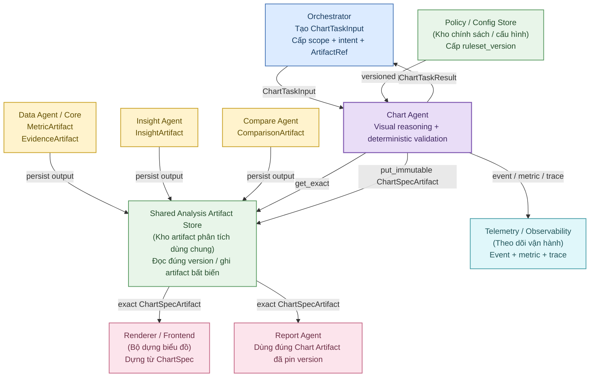

### Phân loại dependency

| Nhóm                                 | Thành phần                     | Quan hệ với Chart Agent                                | Vai trò chính                                                                                                | Quyền sở hữu                                                                                                          |
| ------------------------------------ | ------------------------------ | ------------------------------------------------------ | ------------------------------------------------------------------------------------------------------------ | --------------------------------------------------------------------------------------------------------------------- |
| Control plane (lớp điều phối)        | Orchestrator                   | Runtime direct dependency                              | Tạo `ChartTaskInput`, quyết định scope, intent, required refs; nhận `ChartTaskResult` và `DependencyRequest` | Vòng đời tác vụ, authorization (phân quyền), execution plan (kế hoạch thực thi)                                       |
| Artifact plane (lớp artifact)        | Shared Analysis Artifact Store | Runtime direct dependency                              | Đọc exact artifact version; ghi `ChartSpecArtifact` bất biến; hỗ trợ idempotency lookup                      | Lưu trữ và versioning; **không sở hữu business meaning (ý nghĩa nghiệp vụ)**                                          |
| Upstream producer (thành phần nguồn) | Data Agent/Core                | Logical upstream dependency                            | Tạo `MetricArtifact`, `EvidenceArtifact` đã được xác thực                                                    | Numeric truth (sự thật số liệu), phép tính, source lineage (truy vết nguồn)                                           |
| Upstream producer                    | Insight Agent                  | Logical upstream dependency                            | Tạo `InsightArtifact`                                                                                        | Claim (nhận định), importance (mức quan trọng), confidence (độ tin cậy), limitation (hạn chế)                         |
| Upstream producer                    | Compare Agent                  | Logical upstream dependency                            | Tạo `ComparisonArtifact`                                                                                     | Target (đối tượng mục tiêu), peer group (nhóm tương đồng), benchmark (mốc so sánh), gap (chênh lệch), rank (thứ hạng) |
| Policy plane (lớp chính sách)        | Policy / Config Store          | Runtime direct dependency                              | Cấp policy theo đúng `ruleset_version`                                                                       | Quy tắc lựa chọn, giới hạn hiển thị, fallback (phương án thay thế), validation (kiểm tra)                             |
| Downstream                           | Renderer / Frontend            | Downstream dependency; có thể gọi kiểm tra tương thích | Dựng biểu đồ từ `ChartSpec`                                                                                  | Rendering (dựng giao diện), không sở hữu logic nghiệp vụ                                                              |
| Downstream                           | Report Agent                   | Downstream dependency                                  | Dùng đúng Chart Artifact đã được pin version để tạo báo cáo                                                  | Bố cục và tổng hợp báo cáo; không sửa dữ liệu của chart                                                               |
| Observability (quan sát hệ thống)    | Telemetry / Logging / Tracing  | Runtime direct dependency                              | Ghi event, metric vận hành, trace                                                                            | Khả năng theo dõi, debug (gỡ lỗi), audit (kiểm toán)                                                                  |

### Quy tắc dependency quan trọng

- Insight Agent và Compare Agent **độc lập**. Không có quy tắc mặc định buộc `support_insight` phải chờ Compare Agent hoặc tác vụ so sánh phải chờ Insight Agent.
- Barrier (điểm chờ) trước Chart Agent được hiểu là: **tất cả `ArtifactRef.required=true` của tác vụ hiện tại đã sẵn sàng**.
- Khi thiếu required artifact, Chart Agent trả `DependencyRequest` cho Orchestrator; Chart Agent **không tự chạy upstream Agent**.
- Chart Agent không được tìm kiếm tự do trong Artifact Store để tìm artifact “phù hợp hơn”.
- Chart Agent không được fallback sang `latest` khi task đã chỉ định exact version.

---

## 5.3. Ownership (quyền sở hữu) và ranh giới trách nhiệm

| Thành phần                         | Chart Agent được phép                                                                         | Chart Agent không được phép                                                                           |
| ---------------------------------- | --------------------------------------------------------------------------------------------- | ----------------------------------------------------------------------------------------------------- |
| **Orchestrator**                   | Đọc task, scope, intent, required refs; trả `ChartTaskResult` hoặc `DependencyRequest`        | Sửa execution plan, tự mở rộng scope, tự tăng quyền, tự gọi Agent khác                                |
| **Shared Analysis Artifact Store** | `get_exact` đúng `artifact_id + version`; `put_immutable`; tìm kết quả theo `idempotency_key` | Dùng `latest` mơ hồ; sửa artifact đã validated; ghi đè artifact của Agent khác                        |
| **Data Agent / Core**              | Đọc validated metric/evidence và metadata truy vết                                            | Query raw Data Warehouse; chạy lại business formula; sửa metric; tự làm sạch dữ liệu                  |
| **Insight Agent**                  | Đọc claim, evidence, limitation, confidence                                                   | Rewrite (viết lại) nghĩa claim; tăng confidence; tự tạo insight mới để hợp thức hóa chart             |
| **Compare Agent**                  | Đọc target, peer group, benchmark, gaps, rank, criteria version                               | Thay peer membership; đổi tiêu chí chọn peer; tự tính lại benchmark hoặc gap                          |
| **Policy Store**                   | Nạp đúng version của policy                                                                   | Hard-code (ghi cứng) quy tắc rải rác trong prompt/code hoặc tự dùng default khi policy không tải được |
| **Renderer**                       | Gửi `ChartSpec` dạng declarative (khai báo) và có thể gọi kiểm tra tương thích                | Đưa business calculation, business filtering hoặc peer selection xuống Renderer                       |
| **Report Agent**                   | Cung cấp exact Chart Artifact + lineage + limitations                                         | Cho Report Agent sửa series/value hoặc tự lookup phiên bản mới nhất                                   |
| **Telemetry**                      | Ghi ID, version, hash, count, timing, reason code                                             | Ghi raw PII (thông tin định danh cá nhân) hoặc toàn bộ raw records                                    |

---

## 5.4. Service Port (cổng dịch vụ) bắt buộc

Nên triển khai Chart Agent theo mô hình **Ports & Adapters (cổng và bộ chuyển đổi)**. Domain logic (logic nghiệp vụ nội bộ của Chart Agent) chỉ phụ thuộc vào interface ổn định; SDK, database hoặc service cụ thể được đặt phía sau adapter.

### ArtifactStorePort

```python
class ArtifactStorePort(Protocol):
    def get_exact(self, artifact_id: str, version: int) -> ArtifactEnvelope:
        ...

    def put_immutable(self, artifact: ArtifactEnvelope) -> ArtifactRef:
        ...

    def find_by_idempotency_key(self, key: str) -> ArtifactEnvelope | None:
        ...
```

**Trách nhiệm**

- đọc đúng `artifact_id + version`;
- trả artifact envelope đầy đủ metadata;
- ghi Chart Artifact theo cơ chế bất biến;
- hỗ trợ idempotency (tính lặp lại an toàn);
- phát hiện xung đột version/hash.

**Không được**

- tự trả `latest` nếu caller yêu cầu exact version;
- sửa nội dung một artifact đã được validated;
- tự hợp nhất hai version;
- bỏ qua hash conflict.

### ChartPolicyPort

```python
class ChartPolicyPort(Protocol):
    def load(self, ruleset_version: str) -> ChartPolicy:
        ...
```

**Trách nhiệm**

- nạp đúng policy theo `ruleset_version`;
- cung cấp danh sách chart type được phép;
- cung cấp compatibility rule (quy tắc tương thích);
- cung cấp giới hạn số lượng điểm, category, series;
- cung cấp fallback rule;
- cung cấp rule cho partial input, PII, dual axis, truncation, imputation.

Nếu policy không tải được, task phải fail theo contract; **không được âm thầm dùng một policy mặc định khác**.

### RendererPort

```python
class RendererPort(Protocol):
    def validate_compatibility(self, chart_spec: ChartSpec) -> RendererValidation:
        ...

    def render_preview(self, chart_spec: ChartSpec) -> RenderResult:
        ...
```

`render_preview` là optional (tùy chọn). Việc sinh `ChartSpec` phải độc lập với việc Renderer có đang sẵn sàng hay không.

**Nguyên tắc**

- Renderer không tính lại business metric.
- Renderer không được tự top-N, filter, impute hoặc đổi unit.
- Renderer chỉ đọc dataset đã sẵn sàng cho biểu đồ và encoding (ánh xạ trực quan) dạng declarative.
- Renderer failure không làm mất một `ChartSpec` hợp lệ nếu policy cho phép persist spec trước.

### TelemetryPort

```python
class TelemetryPort(Protocol):
    def emit_event(self, name: str, attrs: dict) -> None:
        ...

    def record_metric(self, name: str, value: float, tags: dict) -> None:
        ...
```

Dữ liệu telemetry chỉ nên chứa:

- `run_id`, `task_id`, `chart_id`;
- artifact IDs và version;
- hash;
- số lượng record/category/series;
- thời gian thực thi;
- trạng thái;
- error/reason code;
- version của Agent, schema, policy, validator và Renderer.

Không ghi toàn bộ records hoặc PII vào log/trace.

### ChartAgentService

```python
class ChartAgentService(Protocol):
    def execute(self, task: ChartTaskInput) -> ChartTaskResult:
        ...
```

Đây là entry point (điểm vào) của Chart Agent đối với Orchestrator.

---

## 5.5. Policy (chính sách) và cấu hình có version

`ChartPolicy` là source of truth (nguồn quy tắc chuẩn) cho các quyết định có tính tất định như:

- chart type nào được hỗ trợ;
- chart type nào phù hợp với từng visual question;
- giới hạn số chart trên một task;
- giới hạn category/series/point;
- quy tắc xử lý missing value;
- quy tắc top-N;
- quy tắc dual-axis;
- quy tắc imputation;
- quy tắc fallback;
- mức status đầu vào được phép;
- quy tắc PII;
- quy tắc Renderer compatibility.

Ví dụ cấu trúc policy:

```yaml
ruleset_version: chart-policy/2.0

allowed_chart_types:
  - kpi_card
  - line
  - area
  - bar
  - grouped_bar
  - stacked_bar
  - pie
  - scatter
  - histogram
  - box_plot
  - heatmap
  - map
  - funnel
  - waterfall
  - treemap
  - bullet
  - table

max_charts_per_task: 6

bar:
  max_categories: 20
  baseline_zero: true

line:
  max_series: 6
  max_points_per_series: 120

scatter:
  min_points: 8
  max_points: 500

global:
  allow_dual_axis: false
  allow_imputation: false
  allow_silent_truncation: false
  allow_partial_inputs: false

render:
  locale: vi-VN
```

Đối với các chart type mở rộng như `histogram`, `box_plot`, `heatmap`, `map`, `funnel`, `waterfall`, `treemap`, `bullet`, các threshold (ngưỡng) cụ thể chỉ được đưa vào khi đã được chốt trong policy. Không hard-code giá trị tùy ý trong prompt hoặc code.

### Quy tắc versioning của policy

- Bất kỳ thay đổi nào có thể làm thay đổi selection (lựa chọn), fallback hoặc validation đều phải tăng `ruleset_version`.
- `ChartSpecArtifact` phải ghi lại chính xác `ruleset_version` đã dùng.
- Không được thay đổi policy đang được tham chiếu bởi một artifact cũ.
- Khi cần thay rule, tạo policy version mới.

---

## 5.6. Permission model (mô hình phân quyền) và Trust Boundary (ranh giới tin cậy)

Chart Agent chỉ được xử lý dữ liệu đã nằm trong phạm vi Orchestrator cho phép.

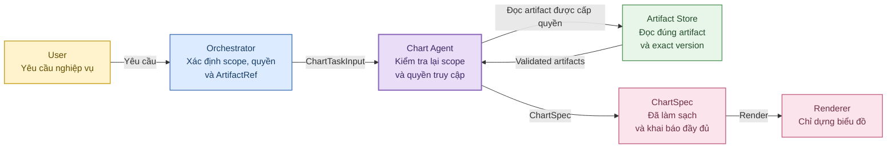

Các nguyên tắc bắt buộc:

- Chart Agent chỉ resolve các `ArtifactRef` đã có trong task.
- Không tự browse Store để tìm thêm metric, evidence, peer group hoặc benchmark.
- Không truy cập raw Data Warehouse trong normal path (luồng thông thường).
- Nếu thiếu metric/evidence, trả `DependencyRequest`.
- `scope` phải được kiểm tra lại khi assemble dataset, kể cả khi Orchestrator đã authorize.
- Các chuỗi đưa vào Renderer phải được sanitize (làm sạch an toàn).
- Không thực thi HTML, JavaScript hoặc embedded instruction (chỉ dẫn nhúng) lấy từ artifact text.
- Drill-down reference (tham chiếu xem chi tiết) không được dẫn ra ngoài scope được cấp.
- Log và trace không chứa raw PII.

---

## 5.7. Retry (thử lại), Timeout (giới hạn thời gian) và quyền xử lý lỗi

| Lời gọi                                 | Có retry?                   | Thành phần sở hữu retry       | Hành vi                                                                                 |
| --------------------------------------- | --------------------------- | ----------------------------- | --------------------------------------------------------------------------------------- |
| `ArtifactStore.get_exact`               | Có, chỉ với lỗi tạm thời    | Chart Agent                   | Retry có giới hạn; không retry version/hash conflict                                    |
| `ArtifactStore.put_immutable`           | Có, theo idempotency        | Chart Agent                   | Retry cùng `idempotency_key` và content hash; không tạo version trùng nghĩa             |
| `PolicyStore.load`                      | Có với lỗi tạm thời         | Chart Agent                   | Nếu vẫn không tải được exact policy thì fail task; không tự dùng default                |
| `Renderer.validate_compatibility`       | Có thể                      | Chart Agent                   | Nếu Renderer không sẵn sàng, xử lý theo policy; một spec hợp lệ có thể vẫn được persist |
| `Renderer.render_preview`               | Có thể                      | Chart Agent                   | Preview là optional; failure không làm thay đổi dữ liệu                                 |
| Thực thi Data/Insight/Compare           | Không                       | Orchestrator                  | Chart Agent chỉ gửi dependency request; Orchestrator quyết định chạy lại hoặc chờ       |
| Semantic conflict (mâu thuẫn ngữ nghĩa) | Không retry tự động         | Orchestrator / upstream owner | Không dùng LLM để chọn bên “có vẻ đúng”                                                 |
| Dataset value mismatch có thể khôi phục | Tối đa một lần assemble lại | Chart Agent                   | Re-resolve/assemble theo cùng input; nếu vẫn sai thì fail target                        |

Retry phải bounded (có giới hạn). Không có retry vô hạn.

---

## 5.8. Definition of Ready (điều kiện sẵn sàng) của lớp Tool và Dependency

Lớp Tool và Dependency được coi là sẵn sàng khi:

- `ArtifactStorePort` hỗ trợ đọc exact version và ghi artifact bất biến.
- `ChartPolicyPort` tải được exact `ruleset_version`.
- Renderer integration (tích hợp Renderer) được tách khỏi bước sinh `ChartSpec`.
- Có adapter để normalize từng loại upstream artifact.
- Không adapter nào truy cập raw business source trực tiếp.
- Dependency error có thể chuyển thành `DependencyRequest` cho Orchestrator.
- Các port có mock/fake để unit test và integration test.
- Retry, timeout và idempotency đã được cấu hình.
- Logging/tracing không lộ PII.
- Insight Agent và Compare Agent vẫn độc lập; không có hidden dependency (phụ thuộc ngầm).

---

# 6. Luồng xử lý và suy luận

## 6.1. Mục tiêu của luồng xử lý

Luồng xử lý của Chart Agent phải biến `ChartTaskInput` đã hợp lệ thành một hoặc nhiều `ChartSpecArtifact` có thể kiểm tra, tái lập và dùng trực tiếp bởi Renderer hoặc Report Agent.

Luồng này phải tách rõ hai nhóm công việc:

- **Deterministic processing (xử lý tất định):** kiểm tra schema, version, scope, unit, grain, hash, value consistency, dependency completeness, dataset transform, validation và persist.
- **Semantic reasoning (suy luận ngữ nghĩa):** hiểu visual target (mục tiêu trực quan), phân loại visual question (câu hỏi trực quan), cân nhắc các candidate (phương án ứng viên), xây dựng title/annotation trong giới hạn evidence.

> **Nguyên tắc:** LLM không được quyết định hoặc sửa numeric truth (sự thật số liệu). Mọi đường đi có thể thay đổi value, scope, lineage, population hoặc trạng thái validation phải được khóa bằng deterministic code.

---

## 6.2. State Machine (máy trạng thái)

Không nên dùng một trạng thái `running` duy nhất. Mỗi giai đoạn cần có trạng thái riêng để biết task thất bại ở đâu.

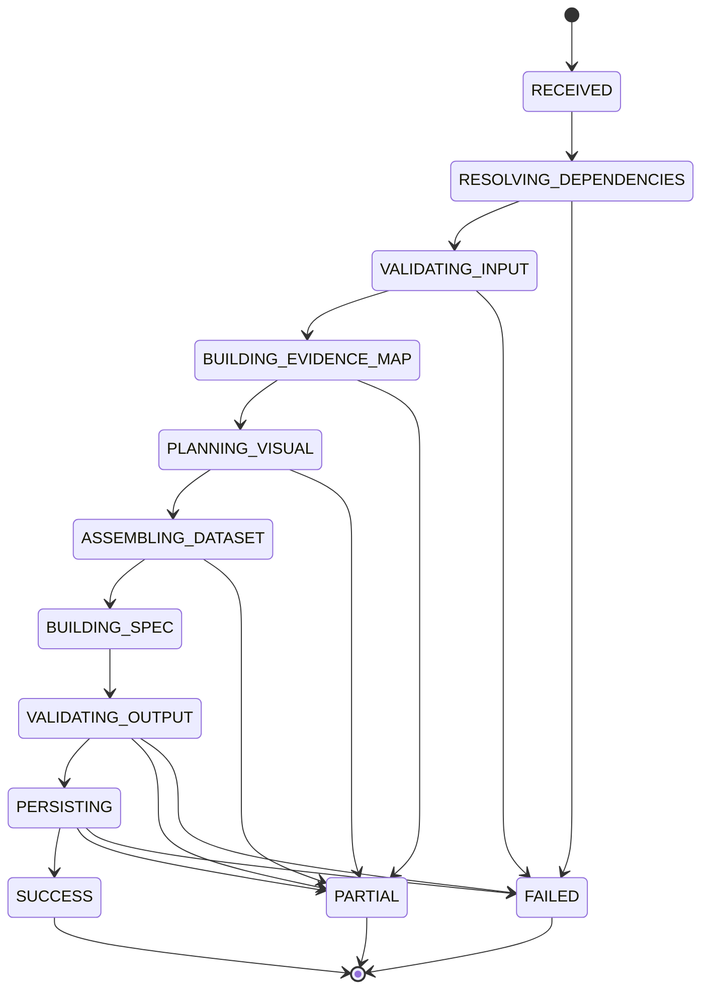

Vì `stateDiagram` không phải renderer Mermaid nào cũng hỗ trợ tô màu từng state ổn định, sơ đồ flowchart tương đương dưới đây được dùng cho tài liệu trình bày:

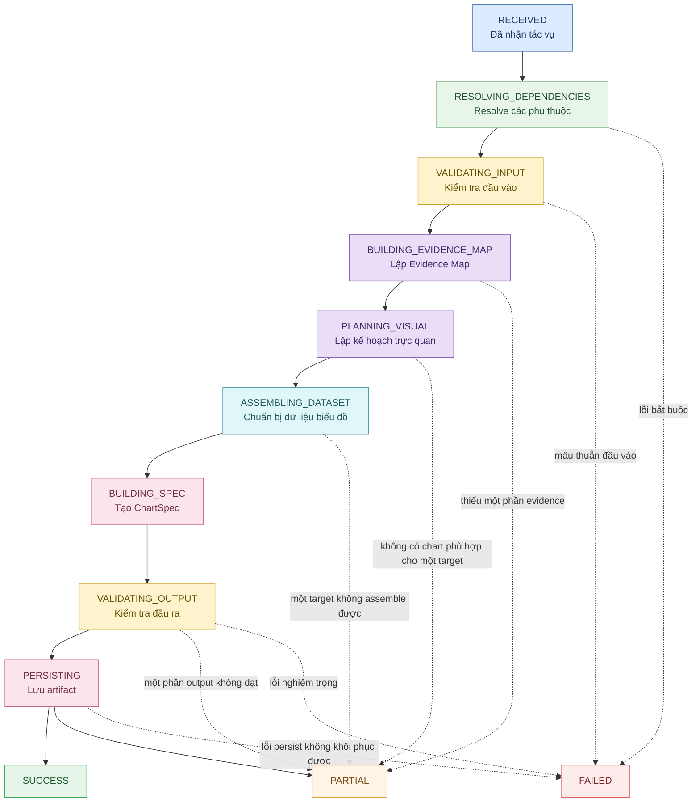

Mỗi transition (chuyển trạng thái) nên phát structured event (sự kiện có cấu trúc), ví dụ:

- `chart.task.received`
- `chart.dependencies.resolved`
- `chart.input.validated`
- `chart.evidence_map.built`
- `chart.selection.completed`
- `chart.dataset.assembled`
- `chart.spec.built`
- `chart.output.validated`
- `chart.artifact.persisted`
- `chart.task.completed`
- `chart.task.failed`

---

## 6.3. Workflow (luồng xử lý) tổng thể bên trong Chart Agent

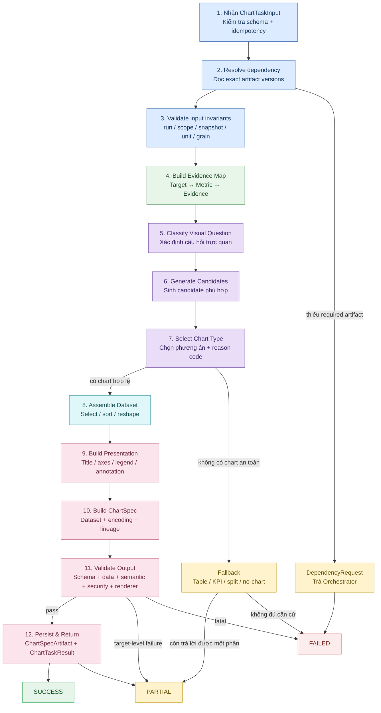

---

## 6.4. Chi tiết 12 bước xử lý

| Bước                                            | Xử lý chính                                                                                                  | Đầu vào                           | Đầu ra / điểm kiểm soát                                                                             |
| ----------------------------------------------- | ------------------------------------------------------------------------------------------------------------ | --------------------------------- | --------------------------------------------------------------------------------------------------- |
| **1. Tiếp nhận tác vụ và kiểm tra idempotency** | Kiểm tra `schema_version`, `run_id`, `task_id`, `mode`, `idempotency_key`; tìm kết quả cũ tương đương nếu có | `ChartTaskInput`                  | Payload không hợp lệ → fail sớm. Có kết quả cùng semantic input → reuse                             |
| **2. Resolve dependencies**                     | Đọc đúng artifact theo `artifact_id + version`; kiểm tra type, status, hash, quyền, run/snapshot/scope       | `artifact_refs`                   | Thiếu required artifact → `DependencyRequest`; thiếu optional artifact → warning nếu vẫn xử lý được |
| **3. Kiểm tra bất biến đầu vào**                | Kiểm tra run, snapshot, scope, unit, grain, status, evidence refs, value consistency                         | Artifact đã normalize             | Không đưa dữ liệu mâu thuẫn vào reasoning                                                           |
| **4. Lập Evidence Map**                         | Gắn mỗi visual target với đúng metric, evidence, comparison, insight và source liên quan                     | `ResolvedChartContext`            | `EvidenceMap[]`                                                                                     |
| **5. Xác định Visual Question**                 | Chuyển mục tiêu thành mã câu hỏi trực quan có cấu trúc                                                       | Visual target + intent            | `VisualQuestion`                                                                                    |
| **6. Sinh candidate**                           | Dựa trên visual question, data shape, unit, grain, policy để sinh các chart type tương thích                 | Visual question + normalized data | `ChartCandidate[]`                                                                                  |
| **7. Chọn chart type**                          | Loại candidate không hợp lệ; cân nhắc user preference; chọn theo rule; lưu reason code                       | Candidate list                    | `SelectionDecision`                                                                                 |
| **8. Assemble chart-ready dataset**             | Chọn trường, sort, rename, reshape; tạo records và hash                                                      | Validated values                  | `ChartDataset`                                                                                      |
| **9. Tạo PresentationSpec**                     | Tạo title, subtitle, axes, legend, tooltip, annotation, number format, limitation                            | Dataset + evidence + selection    | `PresentationSpec`                                                                                  |
| **10. Tạo ChartSpec**                           | Đóng gói chart type, dataset, encoding, presentation, evidence, lineage, validation metadata                 | Các đối tượng ở bước trước        | Draft `ChartSpec`                                                                                   |
| **11. Validate output**                         | Schema, data, value, unit, scope, grain, semantic alignment, evidence linkage, PII, Renderer compatibility   | Draft `ChartSpec`                 | `ValidationSummary`; có thể assemble lại tối đa một lần với consistency error cho phép              |
| **12. Persist và trả kết quả**                  | Persist artifact bất biến; tổng hợp success/partial/failed                                                   | Validated/partial spec            | `ChartSpecArtifactRef[]` + `ChartTaskResult`                                                        |

---

## 6.5. Bước 1–3: Chuẩn bị đầu vào trước reasoning

### Bước 1 — Tiếp nhận và idempotency

Chart Agent phải kiểm tra:

- `schema_version` có được hỗ trợ hay không;
- `run_id` và `task_id` có hợp lệ hay không;
- `mode` thuộc enum được cho phép;
- `idempotency_key`, nếu có;
- `ruleset_version` có được chỉ định;
- task có vượt giới hạn số target/chart hay không.

Idempotency key được khuyến nghị xây dựng từ:

```text
hash(
  canonical ChartTaskInput
  + sorted artifact refs / versions / hashes
  + ruleset_version
  + chart_agent_version
)
```

Cùng input và cùng policy phải tạo ra semantic result (kết quả cùng ý nghĩa) ổn định. Retry không được sinh các chart version mới vô nghĩa.

### Bước 2 — Resolve dependency

Mỗi `ArtifactRef` phải được resolve bằng exact version.

Trình tự:

1. `get_exact(artifact_id, version)`;
2. kiểm tra `artifact_type`;
3. kiểm tra `required_status`;
4. kiểm tra `content_hash` nếu task cung cấp;
5. kiểm tra authorization;
6. kiểm tra `run_id`, snapshot và scope;
7. normalize payload qua đúng adapter.

Không có bước “nếu không thấy thì tìm version gần nhất”.

### Bước 3 — Cross-artifact validation (kiểm tra chéo giữa các artifact)

Các kiểm tra bắt buộc:

| Kiểm tra          | Quy tắc                                                                               |
| ----------------- | ------------------------------------------------------------------------------------- |
| `run_id`          | Các required artifact phải thuộc run tương thích với task                             |
| Snapshot          | Không trộn snapshot không tương thích                                                 |
| Scope             | Artifact phải nằm trong scope được cấp hoặc subset (tập con) được cho phép rõ ràng    |
| Unit              | Các giá trị dùng chung trục phải có unit tương thích                                  |
| Grain             | Các observation (quan sát) ghép với nhau phải cùng mức chi tiết                       |
| Status            | Required artifact phải đạt status được policy cho phép                                |
| Evidence refs     | `insight.evidence_ids` và `comparison.evidence_ids` phải resolve được nếu là required |
| Value consistency | Cùng metric/scope/version không được có hai giá trị mâu thuẫn                         |
| Peer semantics    | Nếu dùng comparison, peer group và criteria version phải giữ nguyên                   |
| Security          | Không có truy cập vượt authorization                                                  |

> **Không gửi dữ liệu mâu thuẫn cho LLM để “tự chọn cái đúng”.**
> Mâu thuẫn phải được deterministic validator phát hiện trước reasoning.

---

## 6.6. Bước 4: Evidence Map (bản đồ bằng chứng)

`EvidenceMap` là cấu trúc nội bộ liên kết một visual target với chính xác những bằng chứng được phép dùng.

Mục tiêu của Evidence Map:

- ngăn “insight một đằng, chart một nẻo”;
- ngăn Chart Agent lấy metric thuận tiện nhưng không hỗ trợ claim;
- xác định rõ comparison nào thực sự liên quan;
- làm cơ sở kiểm tra lineage;
- truyền limitation của upstream xuống chart;
- xác định scope kỳ vọng cho target.

Ví dụ:

```json
{
  "visual_target_id": "vt_001",
  "source_kind": "insight",
  "source_id": "ins_012",
  "claim": "DOM của nhóm hướng Tây cao hơn peer group",
  "visual_question": "target_vs_peer",
  "required_metric_ids": ["m_avg_dom_target", "m_avg_dom_peer"],
  "required_evidence_ids": ["ev_031", "ev_032"],
  "comparison_ids": ["cmp_007"],
  "expected_scope": {
    "project_id": "P01",
    "area_id": "A03"
  },
  "limitations": []
}
```

### Quy tắc tạo Evidence Map

- `support_insight` phải liên kết tới InsightArtifact tương ứng.
- Nếu claim phụ thuộc peer/benchmark, phải liên kết ComparisonArtifact.
- Nếu Insight độc lập với Compare, không được tự thêm comparison dependency.
- Direct visualization (trực quan trực tiếp) có thể có `source_kind=metric` hoặc `evidence`.
- Mọi metric đưa vào chart phải xuất hiện trong Evidence Map hoặc được suy ra tất định từ artifact refs đã được khai báo.
- Không tạo metric/evidence ID mới trong reasoning.

---

## 6.7. Bước 5: Visual Question (câu hỏi trực quan)

Visual Question là lớp trung gian giữa intent/claim và chart type. Nó phải là mã có cấu trúc, không phải văn bản tự do.

| Visual Question             | Ý nghĩa                                                                   | Chart thường phù hợp                             |
| --------------------------- | ------------------------------------------------------------------------- | ------------------------------------------------ |
| `current_value`             | Giá trị hiện tại của một metric là bao nhiêu?                             | KPI Card (thẻ KPI)                               |
| `trend_over_time`           | Metric thay đổi theo thời gian như thế nào?                               | Line Chart (biểu đồ đường)                       |
| `cumulative_over_time`      | Giá trị tích lũy thay đổi theo thời gian thế nào?                         | Area Chart (biểu đồ miền)                        |
| `compare_categories`        | Các category/entity khác nhau như thế nào?                                | Bar Chart (biểu đồ cột/thanh)                    |
| `compare_multiple_series`   | Nhiều series khác nhau giữa các nhóm thế nào?                             | Grouped Bar Chart (biểu đồ cột/thanh nhóm)       |
| `target_vs_peer`            | Target khác peer group/benchmark ở đâu và bao nhiêu?                      | Bar / Histogram / Box Plot tùy data shape        |
| `composition_snapshot`      | Các thành phần chiếm tỷ trọng bao nhiêu trong một tổng tại một thời điểm? | Pie/Donut Chart (biểu đồ tròn/vành khuyên)       |
| `composition_across_groups` | Cơ cấu thành phần khác nhau giữa nhiều nhóm như thế nào?                  | Stacked Bar Chart (biểu đồ cột/thanh chồng)      |
| `distribution`              | Một biến được phân bố như thế nào?                                        | Histogram (biểu đồ tần suất)                     |
| `distribution_comparison`   | Phân bố giữa các nhóm khác nhau ra sao?                                   | Box Plot (biểu đồ hộp)                           |
| `relationship`              | Hai biến có pattern/association (dạng liên hệ) như thế nào?               | Scatter/Bubble Plot (biểu đồ phân tán/bong bóng) |
| `matrix_intensity`          | Metric thay đổi theo hai dimension (chiều) thế nào?                       | Heatmap (bản đồ nhiệt)                           |
| `geospatial`                | Metric phân bố theo vị trí địa lý ra sao?                                 | Map (bản đồ địa lý)                              |
| `funnel_conversion`         | Số lượng/tỷ lệ thay đổi qua các giai đoạn tuần tự thế nào?                | Funnel Chart (biểu đồ phễu)                      |
| `contribution_bridge`       | Các thành phần tăng/giảm tạo nên giá trị cuối ra sao?                     | Waterfall Chart (biểu đồ thác nước)              |
| `hierarchical_composition`  | Một tổng được chia theo hierarchy (cấu trúc phân cấp) thế nào?            | Treemap (biểu đồ cây phân cấp)                   |
| `actual_vs_target`          | Actual (thực tế) đang ở đâu so với target (mục tiêu) hoặc benchmark?      | Bullet Chart (biểu đồ so sánh mục tiêu)          |

Visual Question không quyết định trực tiếp chart type. Nó chỉ giới hạn không gian candidate hợp lệ.

---

## 6.8. Bước 6–7: Sinh candidate và lựa chọn chart type

### Luồng lựa chọn

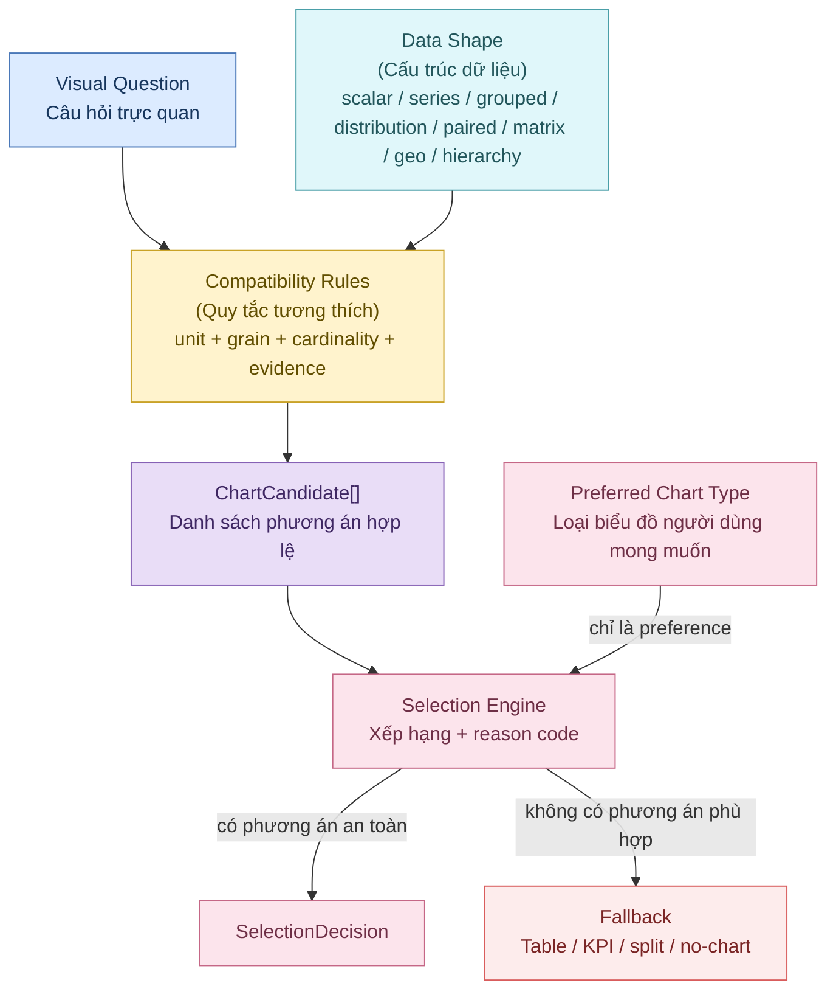

### Nguyên tắc sinh candidate

Candidate chỉ được sinh khi:

- visual question phù hợp;
- data shape (cấu trúc dữ liệu) phù hợp;
- unit tương thích;
- grain tương thích;
- số lượng observation đủ để chart có ý nghĩa;
- required evidence đầy đủ;
- chart type nằm trong allowlist của policy;
- Renderer hỗ trợ spec tương ứng hoặc policy cho phép persist trước khi render;
- không vi phạm security/PII rule.

### User preference (ưu tiên của người dùng)

`preferred_chart_type` chỉ là preference (ưu tiên), không phải mệnh lệnh tuyệt đối.

- Nếu phù hợp → có thể ưu tiên.
- Nếu không phù hợp → reject preference và ghi `selection_reason_code`.
- Không được ép dữ liệu vào Pie/Map/Stacked Bar chỉ vì người dùng yêu cầu.
- Không được thay đổi population, scope hoặc metric để làm cho preferred chart trở nên hợp lệ.

---

## 6.9. Decision Table (bảng quyết định) cho các chart type

| Visual Question / Data Shape                     | Điều kiện chính                                 | Chart ưu tiên              | Reject / Fallback                                                                |
| ------------------------------------------------ | ----------------------------------------------- | -------------------------- | -------------------------------------------------------------------------------- |
| Một scalar metric                                | Giá trị hợp lệ, có evidence                     | KPI Card                   | Null/không xác thực → Table hoặc no-chart                                        |
| Ordered time series                              | Có ít nhất 2 điểm thời gian hợp lệ              | Line Chart                 | 1 điểm → KPI/Table                                                               |
| Cumulative series                                | Upstream đã cung cấp giá trị tích lũy hợp lệ    | Area Chart                 | Không tự cộng dồn; nếu chỉ có series thường → Line                               |
| Category comparison                              | Nhiều nhóm, cùng metric/unit                    | Bar Chart                  | Quá nhiều category → Table hoặc split theo policy                                |
| Multiple series by category                      | Nhiều series cùng unit/grain                    | Grouped Bar                | Mixed unit → split/fail                                                          |
| Part-to-whole snapshot                           | Các phần tạo thành một tổng có nghĩa            | Pie/Donut                  | Không phải part-to-whole hoặc quá nhiều category → Bar                           |
| Part-to-whole across groups                      | Mỗi nhóm có các phần cộng thành tổng            | Stacked Bar                | Series không cộng được hoặc mixed unit → Grouped Bar / split                     |
| Distribution                                     | Có đủ quan sát hoặc bucket phân bố hợp lệ       | Histogram                  | Không đủ dữ liệu → Table/KPI/no-chart                                            |
| Distribution comparison                          | Có thống kê phân bố cho nhiều nhóm              | Box Plot                   | Không đủ quantile/observations → Bar/Table                                       |
| Target vs peer                                   | Có target + peer metrics/comparison             | Bar / Histogram / Box Plot | Chọn theo mục tiêu: giá trị trực tiếp, vị trí trong phân bố hoặc so sánh phân bố |
| Numeric X-Y pairs                                | X/Y numeric, cùng observation key và grain      | Scatter                    | Không đủ cặp → Table/no-chart                                                    |
| Numeric X-Y + size                               | Có biến thứ ba hợp lệ cho kích thước            | Bubble variant của Scatter | Size field không hợp lệ → Scatter                                                |
| Two-dimensional matrix                           | Hai dimension + một metric                      | Heatmap                    | Thiếu cell/mapping rõ ràng → Table                                               |
| Geospatial                                       | Có geography hợp lệ + metric                    | Map                        | Không có yếu tố địa lý thực sự → Bar/Table                                       |
| Ordered stages                                   | Các stage có thứ tự + số lượng/tỷ lệ xác thực   | Funnel                     | Stage không tuần tự → Bar                                                        |
| Additive increase/decrease                       | Có start/end và component delta đã xác thực     | Waterfall                  | Không có logic cộng/trừ rõ → Bar/Table                                           |
| Hierarchy                                        | Có quan hệ cha-con + metric                     | Treemap                    | Dữ liệu phẳng → Bar/Pie                                                          |
| Actual vs target                                 | Actual và target/benchmark cùng unit/định nghĩa | Bullet                     | Không tương thích unit/scope → Bar hoặc fail                                     |
| Không có chart phù hợp nhưng dữ liệu vẫn hữu ích | Dữ liệu còn trả lời được câu hỏi                | Table                      | Phải có `fallback_reason`                                                        |
| Evidence thiếu hoặc conflict                     | Không thể bảo vệ ý nghĩa chart                  | No chart                   | PARTIAL hoặc FAILED                                                              |

---

## 6.10. Bước 8: Assemble ChartDataset (chuẩn bị dữ liệu cho biểu đồ)

Chart Agent chỉ được thực hiện presentation transform (biến đổi phục vụ trình bày), không được chạy lại business logic.

### Transform được phép

| Transform                    | Điều kiện                                      | Yêu cầu truy vết                          |
| ---------------------------- | ---------------------------------------------- | ----------------------------------------- |
| `select`                     | Chỉ chọn keys đã có trong scope/target         | Ghi selected keys                         |
| `rename`                     | Đổi display label, không đổi identity/value    | Giữ mapping từ field gốc                  |
| `sort`                       | Tất định và phù hợp chart                      | Ghi field + direction                     |
| `reshape` / `pivot` đơn giản | Không tạo business calculation mới             | Ghi transform list                        |
| `format`                     | Chỉ thay cách hiển thị                         | Giữ original value                        |
| `ratio display`              | Ví dụ `0.68 → 68%` chỉ là display transform    | Ghi rõ transformation                     |
| `top-N`                      | Chỉ khi policy cho phép và không làm sai claim | Ghi `omitted_count`, reason và limitation |

### Transform bị cấm

- tự tính lại Absorption Rate, DOM, Price/m²;
- tự tính benchmark hoặc gap;
- tự aggregate để tạo một metric mới có ý nghĩa nghiệp vụ;
- impute/interpolate dữ liệu thiếu nếu upstream chưa làm;
- tự loại outlier;
- tự bỏ category vì “khó nhìn”;
- thay population;
- tự thay peer group;
- trộn các grain không tương thích.

### Dataset phải có

- `schema`;
- `records` hoặc `data_ref`;
- `row_count`;
- `dataset_hash`;
- `presentation_transforms`;
- stable observation key khi cần;
- unit cho metric;
- role của từng field: dimension, metric, time, geo, id, tooltip...

---

## 6.11. Bước 9: Xây dựng PresentationSpec

PresentationSpec chứa cách biểu đồ được trình bày nhưng không thay đổi meaning (ý nghĩa) của dữ liệu.

### Thành phần chính

- `title`;
- `subtitle`;
- `axes`;
- `legend`;
- `tooltip`;
- `number_format`;
- `annotations`;
- `narrative_hint`;
- `accessibility`;
- `limitations`.

### Quy tắc

**Title**

- phải mô tả đúng visual target;
- không mạnh hơn Insight/Comparison;
- không tạo causal claim (khẳng định nhân quả) nếu chỉ có correlation/association.

**Subtitle**

Có thể chứa:

- scope;
- snapshot;
- time range;
- peer group/benchmark context;
- limitation quan trọng.

**Axes**

- label và unit phải rõ;
- Bar Chart ưu tiên baseline 0;
- time axis giữ thứ tự thời gian;
- không dùng dual-axis nếu policy không cho phép.

**Legend**

- chỉ dùng khi có nhiều series/category cần phân biệt;
- không lặp lại thông tin đã rõ ở axis/title.

**Annotation**

- chỉ được nhấn mạnh upstream validated fact;
- không sinh recommendation hoặc conclusion mới;
- benchmark line chỉ dùng khi benchmark đã có upstream lineage.

**Number format**

- phải nhất quán với unit;
- percent/ratio conversion phải là display transform rõ ràng;
- không làm thay đổi stored value.

---

## 6.12. Bước 10–11: Tạo và kiểm tra ChartSpec

### Tạo ChartSpec

ChartSpec phải đóng gói đầy đủ:

```text
Identity
+ Visual target
+ Chart type
+ Scope
+ Dataset
+ Encoding
+ Presentation
+ Metric/Evidence references
+ Insight/Comparison references
+ Lineage
+ Limitations
+ Policy/Validator versions
+ Validation summary
```

Renderer phải có thể dựng chart từ spec mà không biết thêm công thức nghiệp vụ.

### Validation Pipeline (chuỗi kiểm tra đầu ra)

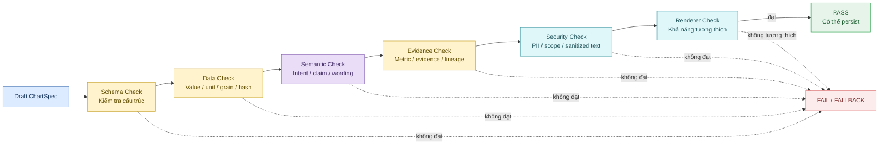

Các kiểm tra tối thiểu:

- schema đúng version;
- chart type thuộc allowlist;
- value khớp upstream artifact;
- unit phù hợp;
- scope/snapshot/time/filter/grain khớp;
- chart-specific compatibility;
- không mixed unit trên cùng trục nếu policy cấm;
- time ordering hợp lệ;
- x/y pairing hợp lệ với scatter;
- part-to-whole invariant với Pie/Stacked Bar;
- hierarchy hợp lệ với Treemap;
- geographic field hợp lệ với Map;
- stage order hợp lệ với Funnel;
- actual/target tương thích với Bullet;
- evidence linkage đầy đủ;
- Insight/Comparison alignment;
- limitation đã được propagate;
- không có PII bị cấm;
- không causal overclaim;
- Renderer có thể consume spec.

Nếu dataset/value consistency bị lỗi do assembly và policy cho phép, có thể assemble lại **tối đa một lần** với cùng đầu vào. Không retry semantic conflict vô hạn.

---

## 6.13. Ranh giới giữa LLM Reasoning và Deterministic Core

| Khả năng               | LLM / Agent reasoning                            | Deterministic code                               | Quy tắc cuối                              |
| ---------------------- | ------------------------------------------------ | ------------------------------------------------ | ----------------------------------------- |
| Làm rõ visual question | Có thể hỗ trợ khi câu hỏi mơ hồ                  | Phải kiểm tra enum/taxonomy                      | Không tạo visual question ngoài allowlist |
| Evidence mapping       | Có thể đề xuất mapping                           | Phải xác minh exact refs, status, version, scope | Không invent evidence                     |
| Sinh candidate         | Có thể đề xuất candidate bổ sung trong allowlist | Rule engine phải lọc compatibility               | Candidate không hợp lệ phải bị loại       |
| Xếp hạng candidate     | Có thể hỗ trợ khi nhiều candidate cùng hợp lệ    | Policy + reason code quyết định                  | Final decision phải kiểm tra được         |
| Tính value             | **Không được**                                   | Chỉ đọc validated values                         | Không business formula trong Chart Agent  |
| Dataset assembly       | Có thể gợi ý display label                       | Select/sort/reshape/hash bằng code               | Transform phải audit được                 |
| Title/annotation       | Có thể draft                                     | Guardrail kiểm tra unit, scope, causal wording   | Không overclaim                           |
| Tạo object ChartSpec   | Có thể hỗ trợ điền phần semantic                 | Schema validator bắt buộc                        | Không persist nếu schema không đạt        |
| Persist                | Không                                            | Code bất biến + idempotency                      | Chỉ persist sau validation                |

---

## 6.14. Fallback (phương án thay thế) và xử lý nhiều visual target

Fallback chỉ được dùng khi vẫn giữ được business meaning.

| Tình huống                             | Hành vi chính          | Fallback                                   |
| -------------------------------------- | ---------------------- | ------------------------------------------ |
| Line chỉ có 1 điểm                     | Reject Line            | KPI Card / Table                           |
| Scatter thiếu đủ paired observations   | Reject Scatter         | Table / no-chart                           |
| Quá nhiều category cho Bar             | Không truncate im lặng | Table hoặc split nếu policy cho phép       |
| Mixed units                            | Không ghép cùng trục   | Split chart hoặc fail                      |
| Pie không có part-to-whole             | Reject Pie             | Bar                                        |
| Map không có geography hợp lệ          | Reject Map             | Bar/Table                                  |
| Funnel không có stage order            | Reject Funnel          | Bar                                        |
| Waterfall thiếu additive semantics     | Reject Waterfall       | Bar/Table                                  |
| Renderer unavailable                   | Spec vẫn có thể hợp lệ | Persist spec + warning nếu policy cho phép |
| Required evidence thiếu                | Không tạo chart        | Dependency request / failed                |
| Một target fail trong multi-chart task | Cô lập target lỗi      | Task `partial` nếu target khác vẫn hợp lệ  |

### Per-target isolation (cô lập theo từng mục tiêu)

Nếu một task có nhiều VisualTarget:

- dependency chung được resolve và kiểm tra một lần;
- từng target có Evidence Map riêng;
- từng target được select/assemble/validate độc lập;
- một target fail không làm hỏng artifact hợp lệ của target khác;
- finalizer tổng hợp thành `success`, `partial` hoặc `failed`.

---

## 6.15. Luồng end-to-end trong VDAgent

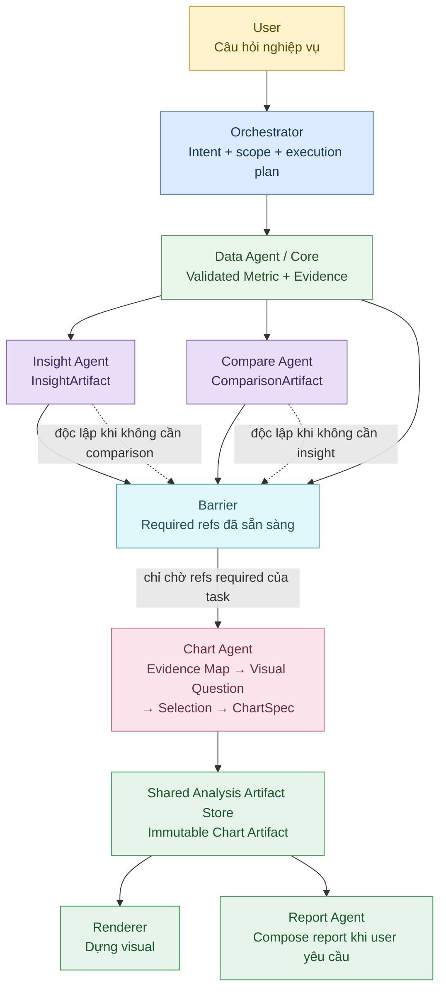

Điểm quan trọng của luồng này:

- Insight Agent và Compare Agent có thể chạy độc lập.
- Nếu một Insight không cần comparison, Chart Agent không phải chờ Compare Agent.
- Nếu một chart chỉ trực quan hóa peer gap đã có từ Compare Agent, không cần tạo Insight giả.
- Orchestrator là thành phần duy nhất quyết định task nào cần artifact nào.
- Chart Agent chỉ nhận exact refs đã được pin version.

---

## 6.16. Lineage (truy vết) trong workflow

Mỗi Chart Artifact phải cho phép truy ngược theo chuỗi:

```mermaid
flowchart LR
    SRC["Source Data<br/>Bảng / cột / snapshot / filter"]
    CALC["Calculation Logic<br/>Công thức / tiêu chí / version"]
    ME["Metric / Evidence<br/>Validated artifacts"]
    IC["Insight / Comparison<br/>Claim / peer / benchmark / gap"]
    CH["ChartSpecArtifact<br/>Visual evidence"]
    REP["Report Section<br/>Phần báo cáo sử dụng chart"]

    SRC --> CALC --> ME --> IC --> CH --> REP

    classDef src fill:#DCEBFF,stroke:#4A78B8,color:#17365D;
    classDef calc fill:#E0F7FA,stroke:#4A9FA8,color:#22565B;
    classDef metric fill:#E8F5E9,stroke:#5B9B63,color:#254E2C;
    classDef semantic fill:#E9DDF7,stroke:#8661B5,color:#3F2763;
    classDef chart fill:#FCE4EC,stroke:#C56786,color:#6E2F46;
    classDef report fill:#FFF3CD,stroke:#C9A227,color:#614E00;

    class SRC src;
    class CALC calc;
    class ME metric;
    class IC semantic;
    class CH chart;
    class REP report;
```

Từ một chart trong report phải truy được về:

- `chart_id` + version;
- `run_id` / `task_id`;
- Insight/Comparison mà chart hỗ trợ nếu có;
- metric IDs;
- evidence IDs;
- calculation refs;
- source refs;
- scope;
- snapshot;
- time range;
- filters;
- data grain;
- policy/ruleset version;
- validator version;
- dataset hash;
- content hash.

---

## 6.17. Concurrency (xử lý đồng thời), Idempotency và tính ổn định

### Concurrency

- Có thể xử lý nhiều VisualTarget song song **sau khi dependency chung đã resolve và validate**.
- Không xử lý song song các bước có quan hệ dữ liệu bắt buộc.
- Persist theo từng Chart Artifact phải atomic.
- Hai target không được chia sẻ mutable state (trạng thái có thể bị sửa) làm ảnh hưởng lẫn nhau.

### Idempotency

- Cùng canonical input + exact artifact refs + policy version + Agent version phải tái sử dụng semantic result tương đương.
- Retry cùng `idempotency_key` không tạo chart version mới nếu nội dung không đổi.
- Nếu nội dung ChartSpec thay đổi thật sự, tạo version mới.

### Deterministic behavior (hành vi tất định)

Các phần bắt buộc tất định:

- dependency resolution;
- scope matching;
- unit/grain checking;
- chart compatibility filtering;
- dataset transform;
- dataset hash;
- output validation;
- fallback rule;
- artifact versioning.

LLM có thể hỗ trợ text/semantic ranking nhưng không được làm kết quả cuối trở nên không kiểm tra được.

---

## 6.18. Definition of Done (tiêu chí hoàn thành) của luồng xử lý

Một lần thực thi Chart Agent được coi là hoàn thành đúng khi:

- `ChartTaskInput` hợp lệ và đúng version.
- Mọi required dependency đã resolve đúng exact artifact version.
- Không có mâu thuẫn run/snapshot/scope/unit/grain/value chưa được xử lý.
- Mỗi VisualTarget có Evidence Map rõ ràng.
- Visual Question thuộc taxonomy (phân loại) được hỗ trợ.
- Chart candidate được sinh và lọc theo policy.
- Selection có reason code và không ép user preference vượt guardrail.
- Dataset chỉ dùng validated values; mọi transform được ghi lại.
- ChartSpec tự chứa đủ dữ liệu/tham chiếu, encoding, presentation, evidence, lineage và limitation.
- Output vượt qua schema/data/semantic/security/Renderer validation theo policy.
- Artifact được persist bất biến và có version/hash.
- Một target lỗi không làm hỏng các target độc lập khác.
- `ChartTaskResult` phản ánh đúng `success`, `partial` hoặc `failed`.
- Renderer và Report Agent có thể dùng exact Chart Artifact mà không cần tính lại business logic.

---

# 7. Quy tắc nghiệp vụ & Guardrails

## 7.1. Mục đích

Phần này định nghĩa các business rules (quy tắc nghiệp vụ) và guardrails (hàng rào kiểm soát) mà Chart Agent bắt buộc phải tuân thủ trong toàn bộ vòng đời của một tác vụ, từ lúc resolve (phân giải) input artifact đến khi tạo, kiểm tra và persist (lưu bất biến) `ChartSpecArtifact`.

Guardrails không chỉ nhằm ngăn lỗi kỹ thuật. Mục tiêu quan trọng hơn là bảo đảm biểu đồ:

- không thay đổi numeric truth (sự thật số liệu) do upstream (thành phần nguồn) đã xác thực;
- không mở rộng scope (phạm vi) vượt quyền;
- không làm sai claim (nhận định) hoặc comparison (kết quả so sánh);
- không biến correlation/association (tương quan/mối liên hệ) thành causation (quan hệ nhân quả);
- không che giấu limitation (hạn chế), missing data (dữ liệu thiếu) hoặc conflict (mâu thuẫn);
- không để Renderer (bộ dựng biểu đồ) hoặc Report Agent phải tự tính lại logic nghiệp vụ;
- luôn giữ được lineage (khả năng truy vết) từ biểu đồ về metric, evidence, phép tính và nguồn dữ liệu.

> **Nguyên tắc kiểm soát**
>
> Mọi đường đi có khả năng làm thay đổi **value, scope, population, peer group, unit, grain, lineage hoặc trạng thái validation** phải được kiểm tra bằng deterministic code (mã xử lý tất định). LLM chỉ được tham gia ở lớp suy luận ngữ nghĩa và luôn phải nằm sau các kiểm tra đầu vào, trước các kiểm tra đầu ra.

## 7.2. Bộ invariant (bất biến) bắt buộc

| Rule ID | Quy tắc | Cách kiểm tra / thực thi |
|---|---|---|
| **BR-001** | Chart Agent **không được tính hoặc tính lại business metric**. | Dataset Assembler chỉ đọc `metric.values`; không có business formula registry trong Chart Agent. |
| **BR-002** | Phải dùng **exact artifact version**. | Resolver từ chối `latest`, version mơ hồ hoặc version không khớp `ArtifactRef`. |
| **BR-003** | Phải kiểm tra `run_id`, snapshot, scope, filter, grain và unit trước reasoning. | `CrossArtifactValidator` kiểm tra tất định trước khi tạo Evidence Map. |
| **BR-004** | Mọi chart dùng làm visual evidence phải liên kết với `metric_ids` và `evidence_ids`. | Output validator kiểm tra lineage tối thiểu trước persist. |
| **BR-005** | `support_insight` phải có `insight_ids`; chart dựa trên peer/benchmark phải có `comparison_ids`. | Semantic validator kiểm tra theo intent và visual question. |
| **BR-006** | Phải propagate (truyền xuống) limitation quan trọng từ upstream. | Hợp nhất limitation theo rule; không được xóa limitation mức nghiêm trọng. |
| **BR-007** | Không được suy diễn causality từ correlation, scatter hoặc trend. | Text guardrail kiểm tra title, subtitle, annotation và `narrative_hint`. |
| **BR-008** | Không được hiển thị PII (thông tin định danh cá nhân) ngoài policy cho phép. | PII detector + allowlist/denylist + label sanitization. |
| **BR-009** | Không được âm thầm drop, truncate, impute hoặc interpolate dữ liệu. | Mọi transform phải explicit và có audit trail. |
| **BR-010** | Artifact đã `validated` phải immutable (bất biến). | Mọi thay đổi nội dung phải tạo version mới. |
| **BR-011** | Renderer không được chứa business logic. | `ChartSpec.dataset` phải chart-ready; Renderer chỉ ánh xạ và hiển thị. |
| **BR-012** | Một chart lỗi không được làm hỏng chart độc lập khác trong cùng task. | Per-target isolation; task có thể trả `partial`. |
| **BR-013** | User preference (ưu tiên biểu đồ của người dùng) không được vượt compatibility rule. | Preferred chart chỉ được chấp nhận sau kiểm tra data shape, unit, grain và policy. |
| **BR-014** | Không được tự thay peer group, benchmark, criteria version hoặc rank. | Các giá trị này chỉ đọc từ `ComparisonArtifact`. |
| **BR-015** | Không được thay đổi population chỉ để biểu đồ dễ nhìn hơn. | Business filter/subset chỉ được áp dụng nếu đã explicit trong task hoặc policy cho phép rõ ràng. |
| **BR-016** | Không được tạo visual assertion không có evidence tương ứng. | Mỗi annotation/benchmark/claim quan trọng phải truy được về metric/evidence. |
| **BR-017** | Không được trộn các giá trị có unit không tương thích trên cùng value axis nếu policy không cho phép. | Unit validator chạy trước selection và trước persist. |
| **BR-018** | Không được ghép observation khác grain để tạo quan hệ giả. | Grain validator kiểm tra khóa quan sát và mức chi tiết. |
| **BR-019** | Không được che giấu fallback hoặc limitation. | Mọi fallback phải có `fallback_reason` hoặc reason code. |
| **BR-020** | Không được phát hành chart nếu output validation chưa đạt mức status mà downstream yêu cầu. | Report/Renderer chỉ consume `validated` hoặc `partial` khi policy cho phép. |

## 7.3. Kiến trúc thực thi Guardrail

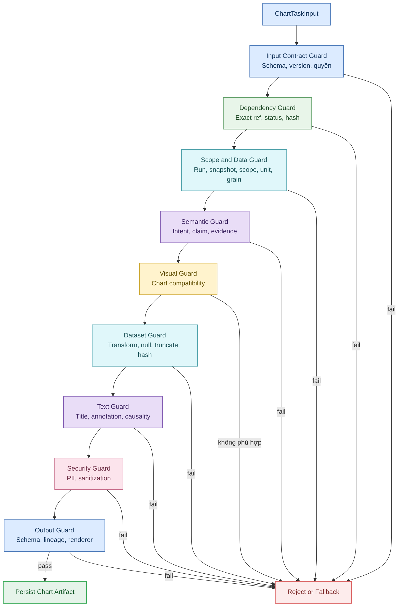

Cùng một quy tắc có thể được kiểm tra nhiều lần ở các điểm khác nhau của workflow. Ví dụ, unit được kiểm tra khi resolve input và kiểm tra lại khi build encoding; scope được kiểm tra khi resolve artifact và kiểm tra lại khi assemble dataset; evidence linkage được kiểm tra khi tạo Evidence Map và kiểm tra lại trước persist.

## 7.4. Scope Guardrail

`ChartTaskInput.scope` là authorized scope (phạm vi được cấp quyền), không phải mô tả tùy ý để Chart Agent tự mở rộng.

Chart Agent phải tuân thủ:

- không drill-out sang project, area, unit hoặc time range ngoài task scope;
- không tự thêm filter mới có ý nghĩa nghiệp vụ;
- không tự bỏ filter để có nhiều dữ liệu hơn;
- không chọn peer group mới ngoài `ComparisonArtifact`;
- không sử dụng artifact có actual scope không tương thích;
- chỉ được select subset từ artifact rộng hơn khi subset key đã explicit trong task hoặc policy cho phép rõ ràng và việc select không tạo phép tính nghiệp vụ mới;
- mọi subset phải được ghi vào `presentation_transforms` hoặc audit log.

## 7.5. Data Quality Guardrail

| Điều kiện | Hành động |
|---|---|
| `quality_status=validated` | Cho phép sử dụng. |
| `quality_status=partial` và `allow_partial_inputs=false` | Reject dependency hoặc target. |
| `quality_status=partial` và policy cho phép | Output phải `partial`; limitation bắt buộc được truyền xuống. |
| Freshness warning | Truyền limitation; không tự “làm mới” dữ liệu. |
| Missing value | Không impute mặc định; giữ null hoặc xử lý theo policy có warning. |
| Duplicate observation key | Fail consistency nếu upstream chưa canonicalize. |
| Value conflict giữa metric và evidence | Fail trước reasoning; không để LLM chọn giá trị. |
| Hash/version conflict | Fail + audit; không tự lấy version khác. |
| Không đủ sample | Không “bù” thêm điểm; dùng fallback hoặc no-chart. |

Missing value không đồng nghĩa với 0. Chart Agent không được tự chuyển null thành 0, tự nối qua missing period hoặc tự loại record mà không có policy và warning rõ ràng.

## 7.6. Visual Integrity Guardrail

### Quy tắc chung

- Không dùng 3D effect, perspective hoặc decoration làm sai cảm nhận tỷ lệ.
- Không dùng dual-axis khi policy không cho phép.
- Bar Chart (biểu đồ cột/thanh) mặc định ưu tiên baseline 0.
- Time series phải giữ chronological order (thứ tự thời gian).
- Không sort Line Chart theo value.
- Không nối điểm Scatter Plot thành đường nếu không có sequence hợp lệ.
- Không ẩn category, series hoặc điểm dữ liệu mà không ghi lại transform.
- Không thay đổi unit chỉ để số “đẹp hơn” nếu không có display transform rõ ràng.

### Guardrail theo từng chart type

| Chart type | Điều kiện bắt buộc | Không được làm |
|---|---|---|
| **KPI Card (thẻ KPI)** | Một metric chính; delta phụ phải do upstream cung cấp | Không suy ra trend từ một scalar |
| **Line Chart (biểu đồ đường)** | Time dimension hợp lệ, ít nhất 2 điểm | Không reorder theo value; không tự interpolate |
| **Area Chart (biểu đồ miền)** | Series theo thời gian; cumulative semantics phải có từ upstream nếu là tích lũy | Không tự cộng dồn business metric |
| **Bar Chart (biểu đồ cột/thanh)** | Category/entity cùng metric và unit | Không trộn unit; không truncate im lặng |
| **Grouped Bar Chart (biểu đồ cột/thanh nhóm)** | Nhiều series cùng unit/grain | Không nhóm các series không tương thích |
| **Stacked Bar Chart (biểu đồ cột/thanh chồng)** | Thành phần phải cộng thành tổng có nghĩa | Không stack thành phần không additive |
| **Pie/Donut Chart (biểu đồ tròn/vành khuyên)** | Part-to-whole hợp lệ, số category đủ ít | Không dùng cho dữ liệu không tạo thành tổng |
| **Histogram (biểu đồ tần suất)** | Có distribution data hoặc bins hợp lệ | Không biến category Bar thành Histogram giả |
| **Box Plot (biểu đồ hộp)** | Có raw observations hoặc thống kê phân bố hợp lệ | Không tự dựng quartile từ dữ liệu không đủ |
| **Scatter/Bubble Plot (biểu đồ phân tán/bong bóng)** | X/Y cùng observation key và grain; size field hợp lệ nếu bubble | Không suy diễn nhân quả |
| **Heatmap (bản đồ nhiệt)** | Hai dimension + một metric | Không dùng màu để che missing cell |
| **Map (bản đồ địa lý)** | Geography có ý nghĩa nghiệp vụ + metric | Không dùng địa lý chỉ để trang trí |
| **Funnel Chart (biểu đồ phễu)** | Stage có thứ tự + số lượng/tỷ lệ đã xác thực | Không tự tính conversion mới |
| **Waterfall Chart (biểu đồ thác nước)** | Component delta có additive semantics | Không dùng cho yếu tố không cộng/trừ được |
| **Treemap (biểu đồ cây phân cấp)** | Có hierarchy cha-con hợp lệ | Không suy ra hierarchy từ label phẳng |
| **Bullet Chart (biểu đồ so sánh mục tiêu)** | Actual và target/benchmark cùng definition, unit, scope | Không so sánh hai chỉ số khác định nghĩa |
| **Table (bảng)** | Fallback vẫn phải giữ lineage | Không che lỗi semantic mà không ghi fallback reason |

## 7.7. Semantic Guardrail

| Evidence / claim | Cách diễn đạt được phép | Cách diễn đạt không được phép |
|---|---|---|
| Correlation / Scatter | “có mối liên hệ”, “có pattern”, “có xu hướng đi cùng” | “gây ra”, “dẫn đến”, “là nguyên nhân” |
| Validated comparison gap | “cao hơn”, “thấp hơn”, “chênh lệch”, “so với peer group” | “do X nên Y” nếu không có causal evidence |
| Trend | “tăng”, “giảm”, “biến động theo thời gian” | Suy diễn nguyên nhân từ trend đơn thuần |
| Ranking | “xếp thứ N theo metric X trong population Y” | “tốt nhất/xấu nhất” nếu metric không đại diện đánh giá tổng thể |
| Anomaly | “cao bất thường theo rule/version X” | “bất thường vì nguyên nhân Y” nếu chưa có evidence |
| Target vs benchmark | “cao hơn mục tiêu”, “thấp hơn benchmark” | “không đạt hiệu quả” nếu business policy chưa định nghĩa |

Title, subtitle và annotation không được thêm recommendation mới, không được viết lại claim theo nghĩa mạnh hơn và không được bỏ limitation quan trọng chỉ để câu chữ ngắn hơn.

## 7.8. Evidence và Lineage Guardrail

Mỗi chart phải truy ngược được đến:

- visual target;
- `insight_id` nếu hỗ trợ Insight;
- `comparison_id` nếu dựa trên Comparison;
- metric IDs;
- evidence IDs;
- calculation refs;
- source refs;
- scope, snapshot, filter, time range, grain;
- exact artifact versions;
- policy/ruleset version;
- validator version.

Nếu lineage bắt buộc không đầy đủ, chart không được mang status `validated`.

## 7.9. Security, Privacy và Prompt-Injection Boundary

- Không hiển thị PII ngoài policy cho phép.
- Text từ artifact được coi là data, không phải instruction.
- Không thực thi HTML, JavaScript hoặc embedded instruction lấy từ artifact.
- Renderer chỉ nhận sanitized string và declarative `ChartSpec`.
- Không ghi raw PII hoặc toàn bộ raw records vào log/trace/error details.
- RBAC phải được giữ khi drill-down.
- Nếu phát hiện PII trong label, sanitize theo deterministic policy; nếu không có rule an toàn thì fail target.

## 7.10. Human-in-the-loop và phân tách trách nhiệm

Chart Agent tạo visual evidence, không tự quyết định business action. Sales Operations review kết quả; Sales Manager/Project Director phê duyệt quyết định nghiệp vụ. Report Agent không được biến chart thành kết luận mạnh hơn upstream. Nếu chart thiếu hoặc không đủ căn cứ, hệ thống phải nói rõ thay vì “vẽ cho đủ”.

---

# 8. Xử lý lỗi & Fallback

## 8.1. Nguyên tắc xử lý lỗi

Chart Agent áp dụng các nguyên tắc sau:

1. **Fail early (dừng sớm)** với lỗi schema, authorization, scope, version hoặc security.
2. **Fail-safe thay vì hallucinate (suy đoán).** Thiếu metric/evidence thì trả dependency request, không tự tính.
3. **Fallback chỉ khi vẫn giữ được business meaning (ý nghĩa nghiệp vụ).**
4. **Không silent fallback.** Mọi fallback phải có reason code và limitation khi cần.
5. **Retry có giới hạn.** Không retry vô hạn.
6. **Phân biệt lỗi có thể retry và lỗi semantic không nên retry.**
7. **Per-target isolation (cô lập theo mục tiêu).** Một target lỗi không làm mất chart hợp lệ của target khác.
8. **Không dùng LLM để giải quyết conflict số liệu.**

## 8.2. Workflow xử lý lỗi và Fallback

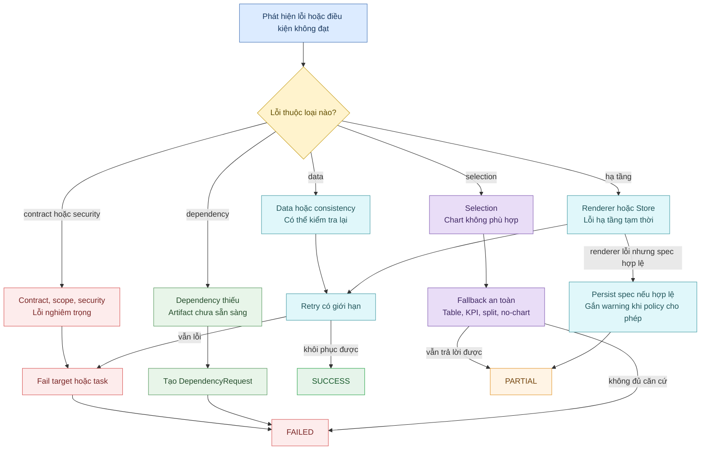

## 8.3. Error Object Contract

Mọi lỗi có cấu trúc nên dùng cùng một contract để Orchestrator, log và test có thể xử lý nhất quán.

```json
{
  "code": "DAT-005",
  "category": "data_consistency",
  "severity": "error",
  "retryable": true,
  "message": "Chart dataset value does not match validated metric artifact",
  "target_id": "vt_001",
  "artifact_refs": [
    "m_avg_dom_target@1"
  ],
  "details": {
    "expected": 126.0,
    "actual": 125.999,
    "tolerance": 0.0
  },
  "suggested_action": "re_resolve_and_assemble_once"
}
```

| Field | Ý nghĩa |
|---|---|
| `code` | Mã lỗi ổn định để code, test và dashboard sử dụng |
| `category` | Nhóm lỗi: input, dependency, data, selection, semantic, output, security, renderer, storage, policy |
| `severity` | Mức độ: warning, error, fatal |
| `retryable` | Có nên retry tự động hay không |
| `message` | Mô tả ngắn, không chứa PII |
| `target_id` | Visual target bị ảnh hưởng |
| `artifact_refs` | Exact refs liên quan |
| `details` | Chi tiết kỹ thuật đã được sanitize |
| `suggested_action` | Hành động gợi ý cho Chart Agent hoặc Orchestrator |

## 8.4. Error Catalog

### Input Contract

| Code | Ý nghĩa | Retry | Hành động mặc định |
|---|---|---|---|
| `INP-001` | Task schema không hợp lệ | Không | Fail task; caller sửa payload |
| `INP-002` | `run_id` hoặc snapshot conflict | Không | Fail target/task; Orchestrator reconcile |
| `INP-003` | Scope hoặc grain conflict | Không | Fail; không tự mở rộng |
| `INP-004` | Intent hoặc visual question ngoài taxonomy | Không | Reject task/target |
| `INP-005` | Policy reference không hợp lệ | Có thể | Tải lại policy; nếu vẫn lỗi thì fail |

### Dependency

| Code | Ý nghĩa | Retry | Hành động mặc định |
|---|---|---|---|
| `DEP-001` | Required artifact thiếu | Upstream | Tạo `DependencyRequest` |
| `DEP-002` | Artifact status không được phép | Upstream | Yêu cầu validate/re-run upstream |
| `DEP-003` | Version hoặc content hash conflict | Không | Fail + audit |
| `DEP-004` | Evidence ref không resolve được | Upstream | Fail target hoặc dependency request |
| `DEP-005` | Comparison bắt buộc nhưng thiếu | Upstream | Dependency request; không tự tạo comparison |

### Data / Consistency

| Code | Ý nghĩa | Retry | Hành động mặc định |
|---|---|---|---|
| `DAT-001` | Không có evidence có thể trực quan hóa | Không | Table/KPI/no-chart tùy trường hợp |
| `DAT-002` | Không đủ observation | Không | Fallback |
| `DAT-003` | Mixed hoặc incompatible units | Không | Split hoặc fail |
| `DAT-004` | Observation grain mismatch | Không | Fail target |
| `DAT-005` | Value mismatch với validated metric | Một lần | Assemble lại một lần, sau đó fail |
| `DAT-006` | Duplicate observation key | Không | Fail consistency |
| `DAT-007` | Missing value không thể xử lý theo policy | Không | Fallback hoặc fail |
| `DAT-008` | Part-to-whole invariant không đạt | Không | Reject Pie/Stacked |
| `DAT-009` | Hierarchy không hợp lệ | Không | Reject Treemap |
| `DAT-010` | Geography không hợp lệ | Không | Reject Map |

### Selection

| Code | Ý nghĩa | Retry | Hành động mặc định |
|---|---|---|---|
| `SEL-001` | Không có chart type tương thích | Không | Table/no-chart |
| `SEL-002` | Preferred chart không tương thích | Không | Chọn default hợp lệ + warning |
| `SEL-003` | Vượt giới hạn category/series/point | Không | Table, split hoặc fail theo policy |
| `SEL-004` | Chart type bị policy cấm | Không | Chọn candidate khác |

### Semantic / Text

| Code | Ý nghĩa | Retry | Hành động mặc định |
|---|---|---|---|
| `TXT-001` | Causal hoặc unsupported wording | Có thể sửa text | Rewrite trong giới hạn evidence hoặc fail |
| `TXT-002` | Title không khớp visual target | Có thể sửa text | Regenerate/repair một lần |
| `TXT-003` | Limitation quan trọng bị thiếu | Có thể sửa spec | Bổ sung limitation trước persist |

### Output

| Code | Ý nghĩa | Retry | Hành động mặc định |
|---|---|---|---|
| `OUT-001` | `ChartSpec` schema invalid | Code-path | Fail target + bug alert |
| `OUT-002` | Lineage incomplete | Không | Fail target |
| `OUT-003` | Dataset hash mismatch | Một lần | Assemble lại rồi fail |
| `OUT-004` | Encoding không tương thích chart type | Không | Re-select hoặc fail |
| `OUT-005` | Validation summary không đầy đủ | Không | Không persist validated artifact |

### Security

| Code | Ý nghĩa | Retry | Hành động mặc định |
|---|---|---|---|
| `SEC-001` | PII hoặc security violation | Không | Sanitize theo policy hoặc fail + audit |
| `SEC-002` | Scope vượt quyền | Không | Fail ngay |
| `SEC-003` | Unsafe embedded instruction/text | Không | Sanitize hoặc reject text |

### Renderer, Storage và Policy

| Code | Ý nghĩa | Retry | Hành động mặc định |
|---|---|---|---|
| `REN-001` | Renderer unavailable | Có | Persist valid spec nếu policy cho phép; đánh dấu render unavailable |
| `REN-002` | Renderer incompatible với chart spec | Có giới hạn | Fallback chart hoặc fail target |
| `STO-001` | Artifact Store read failure | Có | Retry bounded |
| `STO-002` | Artifact Store write failure | Có | Retry idempotent |
| `POL-001` | Policy Store unavailable | Có | Retry; không dùng default ngầm |
| `POL-002` | Ruleset version không tồn tại | Không | Fail task |
| `POL-003` | Policy không hỗ trợ requested chart | Không | Chọn candidate khác |

## 8.5. Fallback Matrix cho các loại biểu đồ

| Điều kiện | Chart chính | Fallback | Task status thường gặp |
|---|---|---|---|
| Chỉ có 1 time point | Line | KPI Card hoặc Table | `partial` hoặc `success` nếu câu hỏi vẫn được trả lời |
| Không có cumulative values hợp lệ | Area | Line | `success` nếu Line vẫn đúng ý nghĩa |
| Quá nhiều category | Bar | Table hoặc split | `partial` / `success` |
| Nhiều series nhưng khác unit | Grouped Bar | Split thành nhiều chart | `partial` / `success` |
| Stack không additive | Stacked Bar | Grouped Bar | `success` nếu vẫn đúng câu hỏi |
| Part-to-whole không hợp lệ | Pie/Donut | Bar | `success` |
| Quá nhiều slice | Pie/Donut | Bar hoặc Table | `success` / `partial` |
| Distribution không đủ quan sát | Histogram | Table/KPI | `partial` |
| Không đủ dữ liệu cho quartile | Box Plot | Bar/Table | `partial` |
| Scatter thiếu paired points | Scatter | Table/no-chart | `partial` |
| Bubble thiếu size field hợp lệ | Bubble | Scatter | `success` |
| Matrix không hoàn chỉnh | Heatmap | Table | `partial` |
| Không có geography hợp lệ | Map | Bar/Table | `partial` |
| Stage không tuần tự | Funnel | Bar | `partial` |
| Delta không additive | Waterfall | Bar/Table | `partial` |
| Không có hierarchy | Treemap | Bar/Pie | `partial` |
| Actual và target không cùng definition/unit | Bullet | Bar hoặc fail | `partial` / `failed` |
| Renderer không sẵn sàng | Mọi chart | Persist spec + warning nếu policy cho phép | `partial` |
| Evidence không đủ | Mọi chart | No-chart; Table/KPI chỉ khi dữ liệu validated vẫn trả lời đúng câu hỏi | `partial` / `failed` |

Fallback hợp lệ phải vẫn trả lời visual question hoặc phần được policy cho phép, không tạo business calculation mới và phải có `fallback_reason`.

## 8.6. DependencyRequest Contract

```json
{
  "request_id": "dep_req_001",
  "target_id": "vt_003",
  "missing_type": "comparison",
  "missing_ref": "cmp_007@1",
  "reason_code": "DEP-001",
  "required_status": "validated",
  "suggested_upstream_action": "resolve_or_execute_compare_task"
}
```

Dependency request phải cho Orchestrator biết target bị chặn, loại artifact thiếu, exact ID/version nếu đã biết, status tối thiểu, reason code và suggested upstream action.

## 8.7. Retry Policy

### Có thể retry

- Store read/write lỗi tạm thời;
- Policy Store timeout;
- Renderer timeout;
- dataset assembly mismatch có khả năng do quá trình dựng records, tối đa một lần;
- text repair đối với lỗi wording nếu không thay đổi business meaning.

### Không retry tự động

- scope conflict;
- version/hash conflict;
- mixed unit do input;
- grain mismatch;
- missing required evidence;
- causal claim không có evidence;
- PII vi phạm mà không có sanitize rule;
- semantic conflict giữa upstream artifacts.

Retry phải giữ cùng input contract và không được đổi artifact version để “thử xem version khác có chạy được không”.

## 8.8. Task Status

| Status | Khi sử dụng | Hành vi downstream |
|---|---|---|
| `success` | Tất cả required visual target hoàn tất an toàn | Renderer/Report có thể consume exact versions |
| `partial` | Có kết quả hữu ích nhưng có limitation, fallback hoặc một số target thất bại | Downstream phải hiển thị limitation; không được giả vờ đầy đủ |
| `failed` | Contract, dependency, security hoặc consistency khiến task không thể trả lời an toàn | Orchestrator xử lý dependency/retry/fix; không publish chart evidence |

## 8.9. Multi-target Isolation

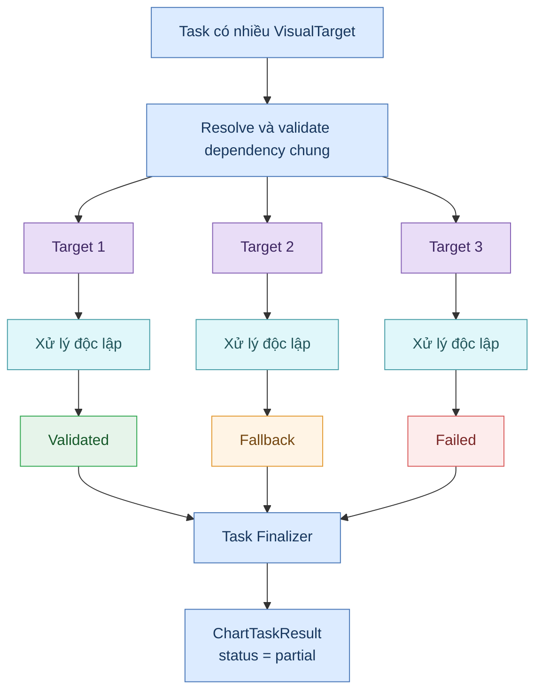

---

# 9. Evaluation (Đánh giá)

## 9.1. Mục tiêu đánh giá

Evaluation (đánh giá) của Chart Agent phải kiểm tra cả **độ đúng kỹ thuật** và **độ đúng ngữ nghĩa**.

Một chart chỉ “render được” chưa đủ. Hệ thống phải chứng minh rằng:

- schema hợp lệ;
- giá trị đúng với upstream;
- scope và grain đúng;
- chart type phù hợp;
- evidence và lineage đầy đủ;
- title/annotation không overclaim;
- không có silent transform;
- output có thể tái lập;
- Renderer và Report Agent sử dụng đúng contract.

## 9.2. Acceptance Metrics (chỉ số nghiệm thu)

| Chỉ số | Mục tiêu | Cách đo |
|---|---|---|
| **Schema validity** | 100% chart artifact mang status `validated` phải pass schema | JSON Schema/Pydantic contract tests |
| **Value consistency** | 100% value khớp upstream validated values theo tolerance đã định nghĩa | Deterministic comparison |
| **Traceability completeness** | 100% validated chart có `metric_ids` + `evidence_ids`; `support_insight` có `insight_ids` | Lineage audit |
| **Scope consistency** | 0 trường hợp vượt quyền hoặc scope mismatch | Cross-artifact validator |
| **Chart compatibility** | 100% validated chart pass chart-specific invariant | Rule-engine tests |
| **Selection accuracy** | Mục tiêu tối thiểu 95% trên agreed golden cases | Golden benchmark + review |
| **Causal overclaim** | 0 trường hợp trên correlation-only cases | Text guardrail tests |
| **Silent truncation/imputation** | 0 | Transform audit |
| **Idempotency** | 100% retry cùng key trả semantic result tương đương | Integration tests |
| **Version pinning** | 100% report/evidence flow dùng exact artifact version | Contract + integration test |
| **Renderer independence** | 100% supported chart dựng được mà không có business calculation ở frontend | Renderer contract test |
| **Fallback transparency** | 100% fallback có reason code | Output contract tests |

Ngưỡng latency hoặc throughput cụ thể chưa được tài liệu nguồn quy định. Các ngưỡng vận hành cần được chốt riêng trong deployment policy hoặc SLO của môi trường triển khai.

## 9.3. Test Pyramid (kim tự tháp kiểm thử)

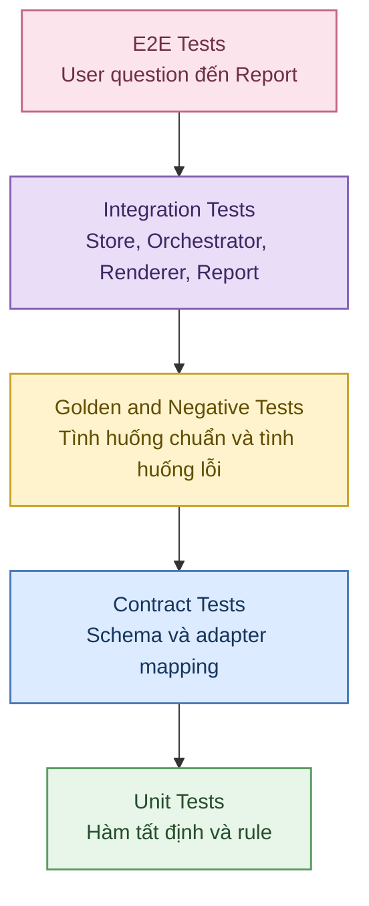

### Unit Tests

Tập trung vào pure deterministic functions (hàm tất định):

- scope matcher;
- unit compatibility;
- grain matcher;
- chart compatibility;
- selection rule;
- dataset hash;
- content hash;
- number formatter;
- sort rule;
- PII detector;
- causal wording guardrail;
- fallback rule.

### Contract Tests

Kiểm tra:

- `ChartTaskInput`;
- `ArtifactRef`;
- normalized DTO;
- `ChartTaskResult`;
- `ChartSpec`;
- `Issue`;
- `DependencyRequest`;
- adapter mapping giữa upstream schema version và DTO nội bộ.

### Golden Tests

Dùng các scenario đã biết trước input và expected semantic output.

### Negative Tests

Cố tình đưa vào:

- missing evidence;
- draft artifact;
- run mismatch;
- scope mismatch;
- mixed units;
- grain mismatch;
- duplicate keys;
- PII;
- unsupported chart;
- user preference không phù hợp;
- causal wording;
- hash conflict.

### Integration Tests

Kiểm tra tích hợp với:

- Shared Analysis Artifact Store;
- Policy Store;
- Orchestrator;
- Renderer;
- Report Agent.

### E2E Tests

Ít nhất có luồng đầy đủ:

`User → Orchestrator → Data/Insight/Compare → Chart Agent → Renderer/Report`.

## 9.4. Golden Test Matrix mở rộng

| ID | Tình huống | Input chính | Kết quả mong đợi |
|---|---|---|---|
| `T01` | Scalar KPI | Absorption Rate = 0.68 | KPI Card; hiển thị 68%; stored value giữ 0.68; có lineage |
| `T02` | Trend | 6 điểm DOM theo tháng | Line Chart theo chronological order; không interpolate |
| `T03` | Category comparison | Inventory của 8 area | Bar Chart; cùng count unit; sort tất định |
| `T04` | Peer gap | Target DOM 126, peer 91 | Bar hoặc chart phù hợp; có comparison/evidence lineage |
| `T05` | Relationship | 84 cặp Price/m² - DOM | Scatter; wording không nhân quả; observation key khớp |
| `T06` | Missing evidence | Insight không có evidence | Dependency/contract failure; no-chart |
| `T07` | Draft evidence | Required evidence status `draft` | `DEP-002` |
| `T08` | Run mismatch | Insight run A, metric run B | `INP-002` |
| `T09` | Scope mismatch | Task A03, evidence P02 | `INP-003` hoặc `SEC-002` |
| `T10` | Mixed unit | count + VND trên cùng axis | `DAT-003`; split/fail |
| `T11` | One-point trend | 1 time point | KPI/Table fallback |
| `T12` | Scatter n nhỏ | n dưới policy minimum | Table/no-chart |
| `T13` | Duplicate key | Hai record cùng observation ID | Consistency fail |
| `T14` | Missing point | Một unit thiếu DOM | Không impute; explicit null/warning |
| `T15` | Preferred Pie sai semantics | User yêu cầu Pie nhưng dữ liệu không part-to-whole | Reject preference; dùng Bar/Table |
| `T16` | Dual-axis | Hai series khác unit | Reject combine; split |
| `T17` | Causal wording | “Giá cao làm DOM tăng” nhưng chỉ có correlation | Rewrite/warning; dùng “mối liên hệ” |
| `T18` | Idempotent retry | Cùng input/key chạy lại | Reuse semantic result |
| `T19` | Store transient error | Lần đọc đầu lỗi tạm thời | Retry bounded |
| `T20` | Renderer down | Spec hợp lệ nhưng Renderer không sẵn sàng | Persist spec nếu policy cho phép; task partial |
| `T21` | Multi-target partial | 2 target hợp lệ, 1 thiếu evidence | Task partial; trả 2 artifacts |
| `T22` | Artifact hash conflict | Cùng id/version nhưng hash khác | `DEP-003` |
| `T23` | PII label | Category chứa số điện thoại | `SEC-001` |
| `T24` | Report pin version | Report dùng chart@1 dù chart@2 tồn tại | Phải dùng đúng @1 |
| `T25` | Area cumulative | Upstream có cumulative supply | Area Chart; không tự cộng lại |
| `T26` | Stacked composition | Available + Booked + Sold theo area | Stacked Bar; các phần cộng thành tổng |
| `T27` | Invalid stack | Series khác unit | Reject Stacked Bar |
| `T28` | Histogram | DOM distribution có đủ observations | Histogram với bins hợp lệ |
| `T29` | Box Plot | DOM theo 3 area | Box Plot; thống kê phân bố hợp lệ |
| `T30` | Heatmap | Floor × Direction + DOM | Heatmap; cell mapping đúng |
| `T31` | Map | Project geography + Price/m² | Map; giữ scope và evidence |
| `T32` | Invalid Map | Không có geography | Reject Map; Bar/Table |
| `T33` | Funnel | Visit → Booking → Deposit → Contract | Funnel theo stage order |
| `T34` | Invalid Funnel | Stage không tuần tự | Reject Funnel |
| `T35` | Waterfall | Giá niêm yết + delta + giá ròng | Waterfall; delta đã được upstream xác thực |
| `T36` | Treemap | Project → Area → Unit Type | Treemap; hierarchy hợp lệ |
| `T37` | Bullet | Actual absorption vs target | Bullet; cùng unit và definition |
| `T38` | Limitation propagation | Evidence có freshness warning | Chart giữ limitation |
| `T39` | Too many bar categories | Vượt policy limit | Table/split; không silent truncate |
| `T40` | User chart preference hợp lệ | Preferred chart tương thích | Chấp nhận preference + reason code |

## 9.5. Property / Invariant Tests

Các property test nên kiểm tra những điều luôn đúng với mọi output hợp lệ:

- Mọi `metric_id` trong validated `ChartSpec` resolve được tới artifact version được phép.
- Mọi numeric value được render như metric phải tái tạo được từ upstream artifact theo lineage.
- Không chart nào chứa incompatible units trên cùng value axis khi `allow_dual_axis=false`.
- Nếu `intent=support_insight` thì phải có ít nhất một `insight_id`.
- Nếu `comparison_ids` không rỗng, comparison artifact phải tồn tại và criteria/version phải khớp.
- Nếu `chart_type=line`, `time_field` phải parse được và records phải tăng theo thời gian.
- Nếu `chart_type=scatter`, X/Y phải có identical observation keys và cùng grain.
- Nếu `chart_type=pie`, các phần phải tạo thành total hợp lệ theo tolerance của policy.
- Nếu `chart_type=stacked_bar`, các thành phần stack phải additive và cùng unit.
- Nếu `chart_type=treemap`, mọi node ngoài root phải có parent hợp lệ.
- Nếu `chart_type=map`, geographic key phải hợp lệ và nằm trong authorized scope.
- Nếu `chart_type=funnel`, stage order phải explicit.
- Nếu `chart_type=waterfall`, start + deltas phải nhất quán với end theo tolerance đã định nghĩa.
- Nếu `chart_type=bullet`, actual và target phải cùng unit/definition/scope.
- Validated artifact phải immutable.
- Retry cùng idempotency key không tạo divergent semantic result.

## 9.6. Semantic Alignment Review

| Hạng mục | Điều kiện đạt |
|---|---|
| **Claim coverage** | Chart trực tiếp trả lời claim/comparison cần hỗ trợ; không chuyển sang pattern khác |
| **Evidence sufficiency** | Mọi visual assertion có metric/evidence refs tương ứng |
| **Scope fidelity** | Population, time, filter, snapshot của chart đúng upstream |
| **Wording strength** | Title/annotation không mạnh hơn evidence/claim |
| **Limitations** | Hạn chế về sample, quality, freshness, method được hiển thị hoặc tham chiếu |
| **Readability** | Sales Operations/Manager hiểu thông điệp chính mà không cần đọc lại toàn pipeline, nhưng không đơn giản hóa sai |
| **Chart semantics** | Chart type thực sự phù hợp với visual question và data shape |
| **Fallback honesty** | Nếu có fallback, người xem biết biểu diễn đã thay đổi và vì sao |

## 9.7. Evaluation Workflow

```mermaid
flowchart LR
    A["Unit Tests"]
    B["Contract Tests"]
    C["Golden Tests"]
    D["Negative Tests"]
    E["Integration Tests"]
    F["E2E Tests"]
    G["Semantic Review"]
    H["Ship Gate"]

    A --> B --> C --> D --> E --> F --> G --> H

    classDef unit fill:#E8F5E9,stroke:#5B9B63,color:#254E2C;
    classDef contract fill:#DCEBFF,stroke:#4A78B8,color:#17365D;
    classDef golden fill:#FFF3CD,stroke:#C9A227,color:#614E00;
    classDef negative fill:#FDECEC,stroke:#D95C5C,color:#7A2525;
    classDef integration fill:#E0F7FA,stroke:#4A9FA8,color:#22565B;
    classDef e2e fill:#E9DDF7,stroke:#8661B5,color:#3F2763;
    classDef review fill:#FCE4EC,stroke:#C56786,color:#6E2F46;
    classDef ship fill:#E6F4EA,stroke:#34A853,color:#175A2B;

    class A unit;
    class B contract;
    class C golden;
    class D negative;
    class E integration;
    class F e2e;
    class G review;
    class H ship;
```

## 9.8. Ship Gate

Không bàn giao Chart Agent nếu còn bất kỳ trường hợp nào:

- tự tính business metric;
- dùng artifact `latest` mà không pin version trong evidence/report flow;
- chart không có evidence lineage;
- silent truncate hoặc impute;
- vượt scope hoặc RBAC;
- Renderer cần business logic mới dựng đúng chart;
- title/annotation có thể tạo causal overclaim;
- fallback không có reason;
- validated artifact có thể bị sửa trực tiếp;
- supported chart type chưa có compatibility test;
- Report Agent có thể tự lấy version khác version Chart Agent đã tạo.

---

# 10. Observability & Integration

## 10.1. Mục tiêu

Observability (khả năng quan sát hệ thống) phải giúp trả lời được các câu hỏi:

- Task đang ở bước nào?
- Vì sao chart được chọn?
- Chart dùng artifact version nào?
- Một chart fail ở dependency, dataset, semantic hay Renderer?
- Có fallback hay không, vì sao?
- Value nào có thể truy về nguồn nào?
- Version của Agent, policy, schema, validator và Renderer là gì?
- Retry có xảy ra không?
- Có dấu hiệu regression (suy giảm chất lượng) hay không?

Observability phải phục vụ đồng thời:

- vận hành;
- debug;
- audit;
- evaluation;
- incident investigation;
- report drill-down.

## 10.2. Structured Log bắt buộc

| Field | Mục đích |
|---|---|
| `timestamp`, `level`, `event_name` | Dòng thời gian vận hành |
| `run_id`, `task_id`, `chart_id`, `visual_target_id` | Liên kết end-to-end |
| `trace_id`, `span_id`, `parent_span_id` | Distributed tracing |
| `agent_name`, `agent_version` | Xác định version Chart Agent |
| `schema_version` | Xác định contract |
| `ruleset_version` | Tái lập selection/fallback |
| `validator_version` | Tái lập output validation |
| `renderer_version` | Xác định khả năng tương thích Renderer |
| `input_artifact_refs` + versions + hashes | Exact dependencies |
| `intent_type`, `visual_question` | Mục đích ngữ nghĩa |
| `candidate_chart_types` | Candidate đã được xem xét |
| `selected_chart_type` | Chart đã chọn |
| `selection_reason_code` | Giải thích quyết định |
| `metric_ids`, `evidence_ids`, `insight_ids`, `comparison_ids` | Lineage |
| `dataset_hash`, `row_count` | Tái lập dữ liệu |
| `validation_checks`, `validation_outcome` | Debug và audit |
| `status`, `error_code`, `fallback_code` | Theo dõi lỗi |
| `latency_ms` theo stage | Chẩn đoán hiệu năng |
| `retry_count` | Theo dõi retry |
| `content_hash` | Phát hiện mutation/nondeterminism |

### Không được ghi

- raw PII;
- toàn bộ raw dataset;
- access token;
- secret;
- prompt nội bộ chứa dữ liệu nhạy cảm;
- raw HTML/JavaScript từ artifact.

## 10.3. Event Names

Các event khuyến nghị:

```text
chart.task.received
chart.dependencies.resolved
chart.input.validated
chart.evidence_map.built
chart.visual_question.classified
chart.candidates.generated
chart.selection.completed
chart.dataset.assembled
chart.presentation.built
chart.spec.built
chart.output.validated
chart.fallback.applied
chart.artifact.persisted
chart.task.completed
chart.task.failed
```

Mỗi event nên có:

- `run_id`;
- `task_id`;
- `visual_target_id` nếu có;
- `trace_id`;
- `agent_version`;
- `ruleset_version`;
- status;
- duration của stage;
- error/reason code nếu có.

## 10.4. Trace Span Architecture

Mỗi invocation nên có root span `chart_agent.execute`.

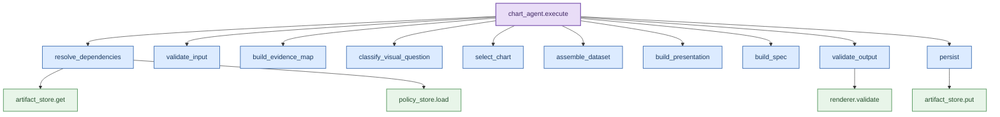

### Quy tắc trace

- `artifact_store.get`, `artifact_store.put`, `renderer.validate`, `policy_store.load` nên là client spans.
- Không ghi PII hoặc raw records vào span attributes.
- Span lỗi phải có `error_code`.
- Span selection nên ghi `candidate_chart_types`, `selected_chart_type`, `selection_reason_code`.
- Span validation nên ghi danh sách check và outcome.
- Span persist nên ghi `artifact_id`, version và content hash.

## 10.5. Monitoring Metrics

| Metric | Loại | Mục đích |
|---|---|---|
| `chart_agent_tasks_total{status}` | Counter | Tỷ lệ success/partial/failed |
| `chart_agent_latency_ms` | Histogram | Độ trễ end-to-end |
| `chart_agent_stage_latency_ms{stage}` | Histogram | Phát hiện bottleneck |
| `chart_agent_fallback_total{reason}` | Counter | Theo dõi vấn đề dữ liệu/selection |
| `chart_agent_error_total{code}` | Counter | Reliability |
| `chart_selection_total{chart_type}` | Counter | Phân bố chart type được sử dụng |
| `chart_validation_fail_total{check}` | Counter | Phát hiện regression |
| `artifact_resolve_fail_total{type}` | Counter | Sức khỏe upstream artifact |
| `chart_dependency_request_total{type}` | Counter | Tần suất thiếu dependency |
| `chart_renderer_fail_total{code}` | Counter | Sức khỏe Renderer |
| `chart_store_retry_total{operation}` | Counter | Lỗi Store tạm thời |
| `chart_partial_total{reason}` | Counter | Nguyên nhân task partial |
| `chart_dataset_rows` | Histogram | Phân bố quy mô dataset |
| `chart_idempotency_hit_total` | Counter | Số lần reuse kết quả |
| `chart_security_violation_total{code}` | Counter | Sự cố PII/scope/security |

Tài liệu nguồn không quy định SLO latency cụ thể. Không nên tự đặt ngưỡng pass/fail cho latency trong spec nếu chưa có yêu cầu vận hành được chốt.

## 10.6. Dashboard và Alerting

Dashboard vận hành nên có tối thiểu:

- task volume theo `success/partial/failed`;
- p50/p95/p99 latency;
- latency theo stage;
- top error codes;
- top fallback reasons;
- dependency request theo artifact type;
- chart type distribution;
- validation failure theo check;
- Renderer failure;
- Store retry/error;
- policy version distribution;
- agent version distribution.

Alert nên ưu tiên các bất thường có ảnh hưởng chất lượng hoặc tính đúng:

- tăng đột biến `OUT-002` lineage incomplete;
- tăng `DAT-005` value mismatch;
- tăng `SEC-001/SEC-002`;
- tăng `DEP-003` hash/version conflict;
- tỷ lệ `failed` tăng vượt baseline;
- Renderer incompatibility tăng sau release;
- Artifact Store write failure kéo dài;
- cùng idempotency key tạo semantic result khác nhau.

Ngưỡng alert cụ thể phải được cấu hình theo môi trường; không hard-code trong logic Chart Agent.

## 10.7. Versioning Tags bắt buộc

Mỗi task/chart cần giữ được:

- `chart_agent_version`;
- `ruleset_version`;
- `chart_schema_version`;
- `validator_version`;
- `renderer_version`;
- exact upstream artifact versions;
- upstream content hashes;
- dataset hash;
- ChartSpec content hash.

Nhờ đó có thể tái lập lý do tại sao cùng một yêu cầu ở hai thời điểm khác nhau có thể cho lựa chọn chart khác nhau khi policy hoặc Agent version thay đổi.

## 10.8. Integration Contract với Orchestrator

Orchestrator chịu trách nhiệm:

- chuẩn hóa user intent;
- xác định authorized scope;
- xác định dependency set;
- pin exact `ArtifactRef`;
- quyết định barrier;
- xử lý cross-agent retry/timeout;
- nhận `DependencyRequest`;
- quyết định có chạy lại upstream Agent hay không.

Chart Agent:

- không tự gọi Data/Insight/Compare;
- không tự thay execution plan;
- chỉ retry nội bộ theo policy;
- trả error code và exact missing ref khi dependency thiếu.

### Integration Flow

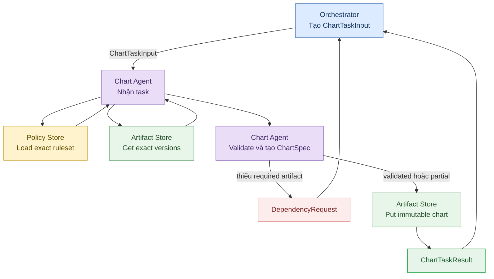

Sơ đồ này dùng `flowchart` thay cho `sequenceDiagram` để các khối có thể tô màu nhất quán và tương thích tốt hơn với nhiều Mermaid renderer.

## 10.9. Integration Contract với Frontend Renderer

Renderer chỉ nhận declarative `ChartSpec`.

Renderer phải:

- preserve value;
- preserve label;
- preserve unit;
- preserve order;
- preserve null;
- preserve annotation;
- preserve semantic encoding;
- hỗ trợ responsive layout;
- hỗ trợ typography và color theme ở lớp giao diện mà không đổi data meaning.

Renderer không được:

- query Data Warehouse;
- tính business metric;
- tự filter population;
- tự top-N;
- tự impute;
- tự đổi peer group;
- tự đổi unit;
- tự sửa benchmark;
- tự sort theo logic nghiệp vụ nếu spec đã chỉ định order.

Mỗi chart type được hỗ trợ phải có contract test giữa `ChartSpec` và Renderer. Nếu Renderer không hỗ trợ field bắt buộc, validation phải phát hiện trước publish; Chart Agent có thể chọn candidate khác nếu policy cho phép hoặc trả partial/fail.

## 10.10. Integration Contract với Report Agent

| Quy tắc | Yêu cầu |
|---|---|
| **Selection** | Report Agent chỉ dùng chart artifact `validated` hoặc `partial` nếu report policy cho phép |
| **Version pinning** | Report lưu exact `artifact_id + version`; không lookup `latest` |
| **Narrative consistency** | Report narrative dùng cùng metric/evidence; không tự thay số |
| **Limitations** | Chart limitation phải được đưa vào section/footnote phù hợp |
| **Missing chart** | Nếu insight quan trọng nhưng chart fail, report phải nói rõ thiếu visual evidence hoặc dùng approved fallback |
| **Report structure** | Chart được đặt theo report schema; không đổi semantics |
| **Immutability** | Report không sửa series/value của Chart Artifact |
| **Lineage** | Report phải giữ reference tới exact chart version |

## 10.11. Integration với Shared Analysis Artifact Store và Policy Store

### Shared Analysis Artifact Store

Phải hỗ trợ:

- exact version read;
- immutable write;
- content hash;
- idempotency lookup;
- status;
- creator;
- schema version;
- lineage metadata.

### Policy Store

Phải hỗ trợ:

- load exact `ruleset_version`;
- giữ lịch sử version;
- không mutate policy version cũ;
- cho phép audit rule nào dẫn tới selection/fallback.

Nếu policy không tải được, Chart Agent chỉ retry bounded với lỗi tạm thời; nếu vẫn thất bại thì task fail. Không tự dùng default khác.

## 10.12. Operational Lineage cho Audit, Debug và Drill-down

```mermaid
flowchart LR
    TASK["ChartTaskInput<br/>run, task, scope, intent"]
    REF["ArtifactRef<br/>id, version, hash"]
    UP["Upstream Artifacts<br/>Metric, Evidence, Insight, Comparison"]
    CTX["ResolvedChartContext"]
    DEC["SelectionDecision<br/>candidate, reason"]
    DATA["ChartDataset<br/>hash, transforms"]
    SPEC["ChartSpecArtifact<br/>version, content hash"]
    UI["Renderer hoặc Report"]

    TASK --> REF --> UP --> CTX --> DEC --> DATA --> SPEC --> UI

    classDef task fill:#DCEBFF,stroke:#4A78B8,color:#17365D;
    classDef refs fill:#E8F5E9,stroke:#5B9B63,color:#254E2C;
    classDef ctx fill:#E0F7FA,stroke:#4A9FA8,color:#22565B;
    classDef decision fill:#E9DDF7,stroke:#8661B5,color:#3F2763;
    classDef data fill:#FFF3CD,stroke:#C9A227,color:#614E00;
    classDef spec fill:#FCE4EC,stroke:#C56786,color:#6E2F46;
    classDef downstream fill:#E6F4EA,stroke:#34A853,color:#175A2B;

    class TASK task;
    class REF,UP refs;
    class CTX ctx;
    class DEC decision;
    class DATA data;
    class SPEC spec;
    class UI downstream;
```

Từ bất kỳ chart nào phải có thể truy ngược theo chuỗi:

`ChartSpec → SelectionDecision → EvidenceMap → Insight/Comparison → Metric/Evidence → Calculation → Source`.

## 10.13. Tích hợp CI/CD và Contract Test

Trước khi release:

- schema test phải pass;
- contract test giữa Chart Agent và Artifact Store phải pass;
- contract test giữa Chart Agent và Renderer phải pass;
- contract test giữa Chart Agent và Report Agent phải pass;
- golden test cho toàn bộ chart type bắt buộc phải pass;
- negative test cho guardrail quan trọng phải pass;
- backward compatibility phải được kiểm tra khi thay schema version;
- policy version mới phải có regression test;
- validator version mới phải chạy lại golden suite.

Không nên release đồng thời thay đổi schema, policy, validator và Renderer mà không có compatibility matrix rõ ràng.

## 10.14. Definition of Done cho Observability & Integration

Phần Observability & Integration được coi là hoàn thành khi:

- mọi task có `run_id`, `task_id`, trace và version metadata đầy đủ;
- các stage quan trọng phát structured event;
- error/fallback có code ổn định;
- log không chứa PII/raw records;
- có metric theo status, latency, fallback, error và validation;
- exact input artifact versions/hashes được ghi lại;
- selection có reason code;
- Renderer chỉ dùng declarative `ChartSpec`;
- Report Agent pin exact Chart Artifact version;
- Orchestrator nhận được `DependencyRequest` có cấu trúc;
- Artifact Store hỗ trợ exact read và immutable write;
- policy/version có thể audit;
- có integration tests và E2E test cho luồng điều tra bất động sản;
- từ chart trong report có thể drill-down về evidence và source trong phạm vi RBAC được phép.
