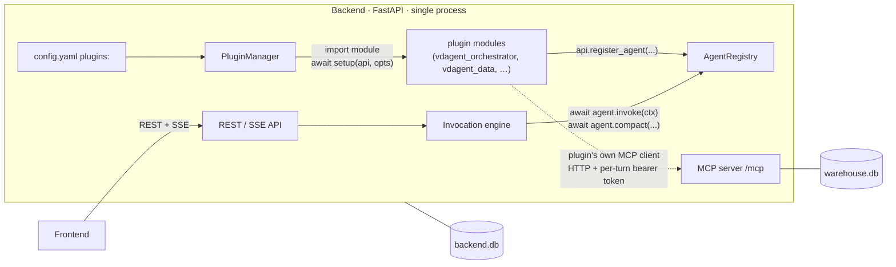
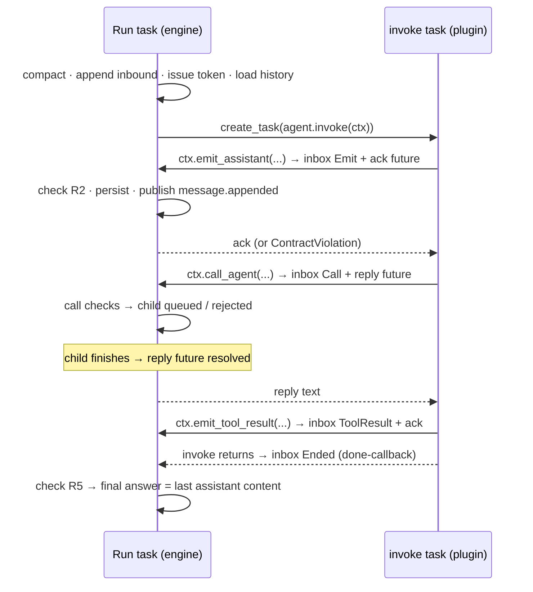

# vdagent — Agents as In-Process Plugins — Design Spec

Status: implemented · Date: 2026-09-26
Supersedes: `2026-09-24-agent-connect-direction-design.md` (entirely).
Amends: `2026-09-24-vdagent-design.md` (D8, D12, D13, §2, §4.1, §4.3, §4.4, §4.6, §4.7, §5, §10,
§11, §12, §13) and `2026-09-24-agent-template-design.md` (host, contract, entrypoint, env loading).
Amended by: `2026-09-28-agent-freedom-design.md` (rules R1 and R7, `ctx.memory`).

## 1. Purpose and scope

Today every agent is a separate process that dials the Backend's gRPC hub (`agent_listen`) and
speaks `proto/agent.proto`. Replace this with a **Neovim-style plugin system**: the Backend reads a
spec list in `config.yaml` (like lazy.nvim), imports each plugin's Python module, and calls its
`setup(api, opts)`. Plugins register agents through the `api` handle. The engine then runs turns by
calling the registered agent objects **in-process**.

The Backend publishes a small SDK (`vdagent_sdk`) that holds only the interface: protocols,
dataclasses and exceptions. How a plugin thinks (LLM, framework, tool loop, MCP client) is its own
business. The Backend only expects the interface.

**Unchanged:**
- engine semantics: stacks, FIFO queues, the wait-for graph, call checks, compaction, startup
  recovery and cancel;
- persistence, SSE events other than the removed `healthy` field, and the MCP server with its
  per-turn bearer tokens and permission matrix;
- the agent turn rules R1–R9 and each agent's brain.

**In scope:**
- new package `sdk/` (`vdagent_sdk`);
- the Backend plugin loader and registry, and the engine's in-process turn driver with
  `InvocationContext`;
- config schema changes;
- removal of the hub, proto and host;
- conversion of `_template` and the five agents to plugins;
- health removal in the Backend and Frontend;
- Makefile, compose, Dockerfile, READMEs, spec amendments and tests.

**Out of scope:**
- out-of-process or remote agents (the gRPC path is deleted, not kept as an option);
- hot reload or unload of plugins at runtime;
- plugin-registered MCP tools;
- dependency isolation between plugins;
- sandboxing and resource limits;
- making the MCP permission matrix plugin-aware (§8).

### 1.1 Decisions log

| # | Decision |
|---|---|
| P1 | **In-process plugins.** The Backend imports plugin modules and awaits agent methods in its own event loop. There are no agent processes, no gRPC and no serialization. |
| P2 | **Spec list in `config.yaml`** (lazy.nvim style): `plugins: [{module, opts, enabled}]`. Load order is list order. Plugins are installable Python packages in the Backend's environment (uv workspace members). |
| P3 | **Imperative `setup(api, opts)`** (Neovim `setup()` style). The plugin registers 0..N agents and shutdown hooks through `api`. Rejected: a declarative factory (one agent per plugin, identity owned by the config) and a class-based plugin (couples plugins to SDK base classes). |
| P4 | **SDK = interface only.** `vdagent_sdk` uses the stdlib only and holds `Protocol`s, frozen dataclasses and exceptions. There are no base classes and no helpers. Plugins depend on `vdagent_sdk`, never on `vdagent_backend`. The Backend depends on `vdagent_sdk` and implements its protocols. |
| P5 | **No shared brain code.** The LiteLLM loop, `llm.py` and `mcp_client.py` stay inside each plugin that uses them. The SDK does not ship them. |
| P6 | **Tools are the plugin's business.** The Backend keeps its MCP server and hands each turn `ctx.mcp` (URL and per-turn token). Whether and how a plugin calls tools is not the Backend's concern. |
| P7 | **Plugins own their configuration.** Each plugin reads its own `agents/<name>/.env` (via `dotenv_values`, never writing `os.environ`). `opts` in `config.yaml` is a free-form dict that the Backend never interprets. |
| P8 | **Registrations are per-plugin transactions.** A plugin whose `setup` fails registers nothing. It is logged and skipped, and the Backend still starts. |
| P9 | **One place enforces R2–R5.** The engine's `InvocationContext` raises `ContractViolation` at the offending call and fails the turn. This replaces the checks duplicated in `host.py` and in the engine (`ProtocolError`). |
| P10 | **The final answer is implicit.** When `invoke` returns, the answer is the content of the last assistant step, which must have no tool calls, with nothing left unresolved (R5). There is no explicit `final`. |
| P11 | **Health is removed.** A registered agent is always available. The `healthy` field, `503 agent_unavailable`, `error: <x> is unavailable` and the UI health dots are deleted. |
| P12 | **Clean cutover.** `proto/`, `vdagent_proto`, `grpcio`, `grpcio-tools`, `engine/hub.py`, every `host.py`/`__main__.py`/`contract.py`, `agent_listen`, the `agents:` config block, `make agent-<name>` and the compose agent services are deleted. There is no dual mode. |
| P13 | **Contract-violation failure reason** is `contract violation: <detail>`. This replaces both `protocol error: …` (engine) and `INTERNAL: contract violation: …` (host). |

## 2. Architecture



### 2.1 Packages

| Package | Path | Depends on | Role |
|---|---|---|---|
| `vdagent-sdk` (`vdagent_sdk`) | `sdk/` | stdlib | The plugin interface (§3). |
| `vdagent-backend` | `backend/` | `vdagent-sdk`, FastAPI, … (no `grpcio`, no `vdagent-proto`) | Loads plugins, runs the engine, serves REST/SSE/MCP and the UI. |
| `vdagent-agent-template` (`agent_template`) | `agents/_template/` | `vdagent-sdk` | Copyable echo plugin, not listed in `config.yaml` by default. |
| `vdagent-<name>` (`vdagent_<name>`) ×5 | `agents/<name>/` | `vdagent-sdk`, `litellm`, `mcp`, `python-dotenv` | The five LLM agents as plugins. |

The uv workspace root depends on every member, so `uv sync` installs every plugin into the one
venv the Backend runs from. `backend/pyproject.toml` does **not** depend on any plugin: the Backend
knows plugins only through `config.yaml`.

### 2.2 Repository layout (after)

```
pyproject.toml                # workspace: sdk, backend, agents/_template, agents/<name> ×5
sdk/
  pyproject.toml              # package `vdagent-sdk`
  vdagent_sdk/__init__.py     # the whole interface (§3)
backend/
  config.yaml, config.compose.yaml   # `plugins:` list
  vdagent_backend/
    app.py                    # lifespan: load plugins → engine → serve → engine.stop → plugin shutdown
    config.py                 # PluginSpec parsing
    plugins.py                # PluginManager, _PluginAPI, AgentRegistry  (new)
    engine/engine.py          # in-process turn driver + InvocationContext implementation
    engine/context.py         # TurnContext (the ctx object) and inbox events  (new)
    engine/waitgraph.py, api/, mcp/, db/, events.py, tokens.py, ids.py
  tests/
agents/
  _template/
    README.md, pyproject.toml, .env.example
    agent_template/__init__.py   # setup()
    agent_template/agent.py      # EchoAgent
    agent_template/tests/
  <name>/                     # orchestrator, data, compare, insight, report
    README.md, pyproject.toml, .env, .env.example
    vdagent_<name>/__init__.py   # setup()
    vdagent_<name>/agent.py, llm.py, mcp_client.py, settings.py, prompts/
    vdagent_<name>/tests/test_agent.py
```

Deleted: `proto/` (including `scripts/gen.py`), every `host.py`, `__main__.py` and `contract.py`
under `agents/`, every `tests/test_host.py`, `backend/vdagent_backend/engine/hub.py`,
`backend/tests/test_hub.py` and `backend/tests/hub_client.py`.

## 3. The SDK (`vdagent_sdk`)

One module, stdlib only. Everything a plugin touches is defined here.

```python
"""vdagent plugin interface. Plugins import only this package."""

# ---- entry point -------------------------------------------------------------------------
# The module named in config.yaml MUST export:
#     def setup(api: PluginAPI, opts: Mapping[str, Any]) -> None | Awaitable[None]
# It is called once at Backend startup; an awaitable return value is awaited.

SEND_TO_AGENT = "send_to_agent"
Message = dict[str, Any]          # OpenAI chat-completions shape (unchanged from contract.py)

@dataclass(frozen=True)
class ToolCall:     id: str; name: str; arguments_json: str
@dataclass(frozen=True)
class Peer:         name: str; description: str
@dataclass(frozen=True)
class McpEndpoint:  url: str; token: str

class PluginAPI(Protocol):
    plugin: str                        # module name from config.yaml
    log: logging.Logger                # logger "vdagent.plugin.<module>"
    def register_agent(self, *, name: str, description: str, agent: Agent) -> None: ...
    def on_shutdown(self, fn: Callable[[], Awaitable[None]]) -> None: ...

class Agent(Protocol):
    async def invoke(self, ctx: InvocationContext) -> None: ...
    async def compact(self, previous_summary: str, messages: list[Message]) -> str: ...

class InvocationContext(Protocol):
    invocation_id: str
    task_id: str
    user_id: str
    summary: str
    history: list[Message]
    peers: list[Peer]
    mcp: McpEndpoint
    max_steps: int
    async def emit_assistant(self, content: str, tool_calls: Sequence[ToolCall] = ()) -> None: ...
    async def emit_tool_result(self, tool_call_id: str, content: str) -> None: ...
    async def call_agent(self, tool_call_id: str, target: str, message: str) -> str: ...

class PluginConfigError(Exception): ...   # raise from setup() for bad/missing configuration
class AgentTimeoutError(Exception): ...   # raise from invoke/compact when the model times out
class ContractViolation(Exception): ...   # raised BY the Backend's ctx at the offending call
```

The module docstring carries the turn rules. R1–R9 are copied verbatim from today's `contract.py`,
with "(host)" replaced by "(Backend)". Two rules are new:

- **R10.** Never block the event loop. The plugin runs inside the Backend's loop, so blocking I/O
  or CPU-heavy work goes through `asyncio.to_thread` or an executor. Nothing enforces this.
- **R11.** Never write to `os.environ` or other process-global state shared with other plugins.
  Read your own `.env` with `dotenv_values()`.

### 3.1 `InvocationContext` semantics

- **Inputs** (R1: the whole truth for the turn):
  - `history` holds the uncompacted messages, with inbound ones rendered `[from: <sender>] <text>`.
    The last item is the inbound message.
  - `summary` is the rolling summary, or `""`.
  - `peers` holds every other registered agent.
  - `mcp` holds `cfg.mcp_public_url` and this turn's bearer token (revoked when the turn ends).
  - `max_steps` is taken from config.
- **`emit_assistant(content, tool_calls)`** records one assistant step and persists and publishes it
  before returning.
- **`emit_tool_result(id, content)`** records the result of one tool call of the latest assistant
  step.
- **`call_agent(id, target, message)`** is only valid for an unresolved `send_to_agent` call of the
  latest step. It runs the call checks (§5.4) and waits for the target's reply. It returns the reply
  text, or `error: …` text when the call is rejected or the target fails. The reply is **not**
  recorded; the plugin emits it with `emit_tool_result` (R3).
- **Violations.** Any call that breaks R2–R5 raises `ContractViolation` and fails the turn, even if
  the plugin catches the exception.
- **After the turn** (return, failure or cancel), every method raises `ContractViolation("the turn
  is over")` and has no other effect.

### 3.2 Minimal plugin

```python
from collections.abc import Mapping
from typing import Any
from vdagent_sdk import InvocationContext, Message, PluginAPI

class EchoAgent:
    async def invoke(self, ctx: InvocationContext) -> None:
        await ctx.emit_assistant(f"echo: {ctx.history[-1]['content']}")

    async def compact(self, previous_summary: str, messages: list[Message]) -> str:
        return previous_summary

def setup(api: PluginAPI, opts: Mapping[str, Any]) -> None:
    api.register_agent(name=opts.get("name", "echo"), description="Echoes the inbound message.", agent=EchoAgent())
```

## 4. Configuration

### 4.1 `config.yaml`

```yaml
backend_db: ./var/backend.db
warehouse_db: ./var/warehouse.db
mcp_public_url: http://localhost:8000/mcp   # URL plugins' MCP clients use (loopback: same process)
frontend_dist: ./frontend/dist
max_depth: 4
max_steps: 12
# Agent plugins, loaded in order. Each module must export setup(api, opts).
plugins:
  - module: vdagent_orchestrator
  - module: vdagent_data
  - module: vdagent_compare
  - module: vdagent_insight
  - module: vdagent_report
  # - module: agent_template
  #   opts: {name: echo}
```

**`PluginSpec(module: str, opts: dict[str, Any] = {}, enabled: bool = True)`**

`Config` loses `agent_listen` and `agents` and gains `plugins: list[PluginSpec]`. Parsing fails
with `ValueError` naming the entry index for:
- a non-list `plugins`;
- an entry that is not a mapping;
- a missing or empty `module`;
- non-mapping `opts`;
- non-bool `enabled`;
- unknown entry keys.

A missing `plugins` key means no plugins. The `VDAGENT_AGENT_LISTEN` override and `AgentSpec` are
removed. Stale top-level keys such as `agents:` or `agent_listen:` are ignored, like any other
unknown top-level key today.

`config.compose.yaml` is the same file with `mcp_public_url: http://localhost:8000/mcp`, because
plugins now run inside the backend container.

### 4.2 Plugin environment

Each LLM plugin reads its settings like this:
- The source is `{**os.environ, **dotenv_values(PLUGIN_DIR / ".env")}`, where `PLUGIN_DIR` is
  `Path(__file__).resolve().parents[1]`, i.e. `agents/<name>/`. The `.env` wins over the process
  env, which is today's precedence.
- `os.environ` is never modified.
- A missing file is allowed. A missing required variable raises `PluginConfigError` naming it.

The existing `settings.load_settings(env)` is kept per plugin with `AgentConfigError` →
`PluginConfigError`. The variables stay the same: `OPENAI_API_KEY`, `OPENAI_BASE_URL`, `LLM_MODEL`
and optional `LLM_TIMEOUT_S`. `VDAGENT_BACKEND` is removed from every `.env.example`.

## 5. Backend

### 5.1 Plugin loading (`plugins.py`)

`PluginManager.load(specs) -> AgentRegistry`, awaited in the lifespan before the engine starts. It
takes each **enabled** spec in order:

1. `importlib.import_module(spec.module)`, then `setup = getattr(module, "setup")`, which must be
   callable.
2. Build `_PluginAPI(plugin=spec.module)` and call `setup(api, dict(spec.opts))`. If the result is
   awaitable, await it.
3. `api.register_agent` buffers entries and raises `ValueError` at the call for an empty name, an
   empty description, or a name already registered by this plugin or an earlier one.
4. When `setup` returns normally, commit the buffered agents and shutdown hooks and log
   `plugin <module> loaded: <agent names>`.
5. On **any** exception in steps 1–3 (import error, missing `setup`, `PluginConfigError`,
   `ValueError` from `register_agent`, anything else), commit nothing. Log `plugin <module>
   failed: <reason>` at ERROR, with a traceback unless the exception is a `PluginConfigError`,
   and continue with the next spec. `asyncio.CancelledError` propagates.

Disabled specs are logged at INFO (`plugin <module> disabled`) and not imported.

After loading, `api` is closed: later `register_agent` / `on_shutdown` calls raise `RuntimeError`.

**`AgentRegistry`** is immutable after load:
- `names() -> list[str]` in registration order;
- `get(name) -> RegisteredAgent(name, description, agent, plugin) | None`;
- `__contains__`.

It is the single source for the REST agent list, `ctx.peers` (all but self), the unknown-agent
check and the POST target check. It replaces `cfg.agents` and `hub.is_healthy` everywhere.

**Shutdown.** `PluginManager.close()` runs the committed hooks in reverse registration order. Each
hook gets `asyncio.wait_for(fn(), 5 s)`. A timeout or exception is logged and the remaining hooks
still run.

### 5.2 Lifespan (`app.py`)

`load_config` → `create_db` → `create_mcp` → *lifespan*:

1. `registry = await plugins.load(cfg.plugins)`
2. `engine = Engine(cfg, db, bus, tokens, registry)`
3. `await engine.start()` (startup recovery as today)
4. Serve inside `mcp.lifespan()`.
5. On exit: `await engine.stop()`, which cancels running turns, then `await plugins.close()`, then
   `await db.dispose()`.

### 5.3 Running a turn in-process

The engine keeps its structure: one asyncio task per running invocation (`_run` → `_drive` →
`_execute`) owns the stack lock and is the only writer of that stack (I1). The gRPC turn channel is
replaced by an **inbox** of events that the plugin's `ctx` produces.



**Inbox events** (`engine/context.py`; all but `Ended` carry an `asyncio.Future` for the reply):
- `Emit(content, tool_calls, future)`
- `ToolResult(tool_call_id, content, future)`
- `Call(tool_call_id, target, message, future)`
- `Ended(task)`, posted by the invoke task's done-callback; the engine reads the task's outcome.

**`TurnContext`** implements `InvocationContext`. Each method checks `closed`, puts its event on
the run's inbox and awaits the future. It never touches the DB. Cancelling the plugin's task while
it awaits an ack therefore cannot interrupt a DB write: the write runs in the run task. Closing the
context fails any event still queued with `ContractViolation("…: the turn is over")`.

**Run loop** (replaces `hub.invoke` + `turn.read()`):
`event = await inbox.get()`, then dispatch:

| Event | Checks, raising `ContractViolation` (set on the event's future **and** fails the turn) | Effect |
|---|---|---|
| `Emit` | R2: no unresolved tool calls of the previous step; tool-call ids non-empty and unique | Persist the assistant row, reset `unresolved`/`tool_calls`/`called` for the new step, remember `last_assistant = (content, has_tool_calls)`, ack |
| `ToolResult` | R3: id is unresolved in the latest step; R4: no `call_agent` for the id is still pending (pending = its `reply` future is not done) | Persist the tool row, resolve the id, ack |
| `Call` | R4: id belongs to the latest step, is named `send_to_agent`, is unresolved, and was not called before | Add the id to `called` and keep its `reply` future, then run the call checks (§5.4). Rejected: resolve `reply` with the error text. Accepted: enqueue the child; the child's finish resolves `reply` (the call is pending until then) |
| `Ended` (returned) | R5: nothing unresolved, and `last_assistant` exists without tool calls | Close ctx; the final answer is `last_assistant.content` → finish (§4.1 step 5 of the main spec) |
| `Ended` (raised) | — | Close ctx; fail the turn per the mapping below |

The engine's run task awaits `inbox.get()` and checks cancellation between events, as it does now
between frames. A `Call` is dispatched synchronously with its checks and the wait-for edge (I3),
exactly like today's `_on_call`. Child results reach the parent by resolving the `reply` future
instead of pushing `AgentCallResult` onto `run.outbound`. `run.outbound` is deleted.

**Failure mapping** (the reason stored on the invocation and shown in the UI):

| Cause | Reason |
|---|---|
| `ContractViolation` from a check, or raised out of `invoke` | `contract violation: <detail>` |
| `invoke` raised `AgentTimeoutError`, directly, inside an exception group, or in its `__cause__` chain | `DEADLINE_EXCEEDED: <detail>` |
| `invoke` raised any other `Exception` | `INTERNAL: <ExcType>: <detail>`, logged with traceback |
| Task cancelled | `cancelled` (unchanged) |

When a turn ends while `invoke` is still running (e.g. a violation raised on a future the plugin
swallowed), the engine closes ctx, cancels pending `reply` futures, and yields to the loop once so
the plugin receives the `ContractViolation` at its offending call. It then cancels the invoke task
and waits up to 5 s for it (a warning is logged if the plugin ignores cancellation), ignoring its
outcome, before patching the stack (§4.6 of the main spec, unchanged). Late child results are
discarded as today.

**Cancel** (`POST /api/tasks/{id}/cancel`): as today, except that `run.rpc.cancel()` now cancels
the plugin's invoke task. The plugin sees `CancelledError` (R9), and `ctx` rejects further calls.

**Compaction:** `asyncio.wait_for(agent.compact(previous, messages), 150 s)` runs in a task stored
as `run.rpc`, so cancel still abandons it. Messages are passed as `Message` dicts built by the
existing row→history rendering (`_to_proto` becomes `_to_message`, returning a dict). Any
exception or timeout is logged and the turn continues without compacting (unchanged).

### 5.4 Call checks

This is main spec §4.4 with the health row removed:
- unknown target (not in the registry) → `error: unknown agent '<x>'`
- self → `error: you cannot call yourself`
- depth → `error: call depth limit reached; answer your caller with what you have`
- wait-for path → `error: calling <x> would deadlock (it is waiting on you); answer with what you have`

### 5.5 REST / SSE

- `GET /api/agents` → `[{name, description, busy, queue_len}]` from the registry. `healthy` is
  removed.
- `agent.status` event → `{agent, busy, queue_len}`.
- `POST /api/agents/{agent}/messages`:
  - an agent not in the registry → `404 unknown_agent` (unchanged);
  - `503 agent_unavailable` and `AgentUnavailableError` are removed.
- `GET /api/agents/{agent}/messages`: the known-agent check uses the registry.

## 6. Plugins

### 6.1 Template (`agents/_template/`)

- `agent_template/__init__.py` exports `setup`, which registers `EchoAgent` under `opts["name"]`
  (default `echo`).
- `agent.py` keeps `EchoAgent` with the naive-summary `compact`.
- `host.py`, `contract.py`, `__main__.py` and `NAME` are deleted. The template has no `.env`
  requirement.

The README is rewritten around `setup()`:
- how to copy the template;
- how to add the plugin to the workspace and to `config.yaml` `plugins:`;
- the SDK reference (§3), with rules R1–R11;
- reading your own `.env` (§4.2);
- the existing LangChain and OpenAI Agents SDK recipes, ported from `build_agent` to `setup`.

### 6.2 The five LLM agents

For each of `orchestrator`, `data`, `compare`, `insight` and `report`:
- `vdagent_<name>/__init__.py`:
  ```python
  def setup(api: PluginAPI, opts: Mapping[str, Any]) -> None:
      api.register_agent(name=NAME, description=DESCRIPTION, agent=build_agent(read_env()))
  ```
  `read_env()` implements §4.2.
- `agent.py`:
  - imports come from `vdagent_sdk` instead of `.contract`;
  - `build_agent(env)` takes the env mapping;
  - `DESCRIPTION` moves here from `config.yaml` (same text as today).
- `settings.py` raises `PluginConfigError`.
- `llm.py`, `mcp_client.py` and prompts are unchanged.
- The "COPIED FROM template" headers are removed: the five packages are independent plugins.
- `pyproject.toml`: drop `vdagent-proto` and `grpcio`, add `vdagent-sdk`.

## 7. Deployment and tooling

- **Makefile:** `backend` and `reset-db` stay. The `agent-<name>` targets and `AGENTS` are deleted.
  The help text says agents load as plugins listed in `backend/config.yaml`.
- **docker-compose:**
  - the five agent services and the `x-agent` anchor are deleted;
  - the backend no longer exposes 50050;
  - the backend service mounts each `agents/<name>/.env` read-only at `/app/agents/<name>/.env`,
    because `.dockerignore` excludes `**/.env` from the image and workspace members are installed
    editable, so `__file__` resolves under `/app/agents/`.
- **Dockerfile.python:**
  - the `proto` copy, codegen and import check are deleted, and `sdk/pyproject.toml` is copied
    instead;
  - `EXPOSE 8000` only;
  - the comment reads "one image for backend (with agent plugins) and the seed job".
- **Root `pyproject.toml`:**
  - drop `vdagent-proto` from the members, dependencies, sources and basedpyright `extraPaths`, and
    add `sdk`;
  - drop `grpcio-tools` from the dev group.
- **README:**
  - the run section becomes `make backend` (no agent terminals);
  - the env section documents per-plugin `.env` files loaded by the plugin, and removes
    `VDAGENT_BACKEND` and `VDAGENT_AGENT_LISTEN`;
  - a new "Plugins" section covers `config.yaml` `plugins:`, writing one, and the rules.
- **Specs:**
  - the connect-direction spec gets a banner saying it is superseded by this spec;
  - the main and template specs get the amendments listed in the header (banner plus edits to the
    named sections, so they describe the current design).

## 8. Known limitations

- **No isolation.** A plugin that blocks the loop (R10), leaks memory or crashes the interpreter
  takes the Backend down with it. All plugins share one venv and must agree on dependency versions.
- **MCP permissions stay hard-coded.** The matrix in `mcp/tools.py` names the five agents
  (`ALL_AGENTS`). An agent registered under another name (e.g. the echo template) sees no MCP
  tools. Making permissions plugin-declared is out of scope (P6).
- **Unavailable-agent errors are gone.** Replies from `error: <x> is unavailable` no longer occur.
  An agent whose plugin failed to load is simply absent from `peers`, and a call to it gets
  `error: unknown agent '<x>'`.
- **Orphaned history.** Stacks of an agent whose plugin is removed stay in `backend.db`, but its
  chat is not listed and `GET …/messages` returns `404 unknown_agent`.

## 9. Testing (TDD)

Tests are written first for each unit. Throwaway smoke checks are not committed.

- **`backend/tests/test_config.py`:**
  - `plugins:` parsing: defaults, order, and each validation error in §4.1;
  - a missing key gives an empty list;
  - `agent_listen`/`agents` assertions are removed.
- **`backend/tests/test_plugins.py`** (new). Fake plugin modules are written to `tmp_path` and
  added with `monkeypatch.syspath_prepend`. Covered:
  - load order;
  - `opts` passed as a copy;
  - sync and async `setup`;
  - a failing `setup` commits nothing and the next plugin still loads;
  - `PluginConfigError` is logged without a traceback;
  - import error and missing `setup` are skipped;
  - a duplicate name across plugins skips the second plugin entirely;
  - a disabled spec is not imported;
  - `register_agent` after load raises;
  - shutdown hooks run in reverse order, and a failing or timing-out hook does not stop the rest.
- **`backend/tests/test_engine.py`:**
  - `conftest.Harness` registers scripted fake `Agent` objects in an `AgentRegistry` instead of hub
    clients;
  - `Session.ask`/`final` become thin wrappers over `ctx` (`emit_assistant` + `call_agent` +
    `emit_tool_result`);
  - existing scenarios are kept: delegation, queueing, deadlock rejection, depth, cancel, restart
    recovery and compaction;
  - new cases, migrated from the template's `test_host.py`:
    - each R2–R5 violation makes the call raise `ContractViolation` and fails the turn with
      `contract violation: …`, even when the plugin swallows it;
    - `ctx` methods raise after the turn;
    - `AgentTimeoutError` (direct and chained) → `DEADLINE_EXCEEDED: …`;
    - another exception → `INTERNAL: …`;
    - cancel delivers `CancelledError` into `invoke`;
    - a compaction exception or timeout is non-fatal.
  - Health tests are removed.
- **`backend/tests/test_api.py`:** the agent list shape without `healthy`; the `503` test is
  removed.
- **Deleted:** `test_hub.py`, `hub_client.py`, every `tests/test_host.py`.
- **Plugin tests** (`agents/*/tests/test_agent.py`):
  - imports switch to `vdagent_sdk`;
  - the brain tests are kept;
  - per plugin: `setup` with a fake `PluginAPI` registers `NAME`/`DESCRIPTION`, and
    `build_agent({})` raises `PluginConfigError` naming `OPENAI_API_KEY`.
  - Template: `setup` registers under `opts["name"]`.
- **Frontend:** `applyEvent.test.ts` fixtures drop `healthy`. Per main spec §13, `applyEvent` is
  the only unit under test.
- **Manual E2E** (main spec §13 checklist):
  1. `make backend` only; the log shows five `plugin … loaded` lines.
  2. Run "Compare revenue by region in 2025 vs 2024 and write a report" end to end; it produces a
     report with a chart.
  3. Cancel mid-task.
  4. Break one plugin's `.env` (remove `LLM_MODEL`); the Backend starts, the log shows
     `plugin vdagent_insight failed: …`, and the agent is absent from the UI.
