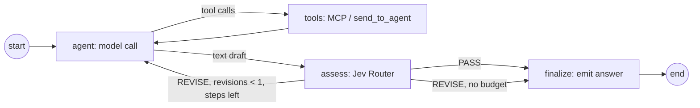

# vdagent — Agents Are More Than a ReAct Loop — Design Spec

Status: draft, awaiting review · Date: 2026-09-28
Amends: `2026-09-26-agent-plugins-design.md` (SDK rules R1 and R7, `InvocationContext`, schema).

## 1. Purpose and scope

Colleagues argue that an agent is just a ReAct loop the Backend should own, with agent teams only
supplying prompts and tools. Today the repo supports them: all five agents are copies of the same
205-line LiteLLM loop and differ only in `prompts/*.md`.

This PoC shows, in a **code walkthrough**, that the plugin boundary (`invoke(ctx)`) lets agent teams
build structurally different programs. Behaviour the Backend can neither see nor own:

| Agent | Framework | Beyond a ReAct loop | What the Backend sees |
|---|---|---|---|
| orchestrator, data, compare | LiteLLM (unchanged) | nothing: the control group | assistant steps, tool results |
| insight | LangChain 1.x `create_agent` + middleware | recalls earlier findings (vector search), extracts and saves new ones, dedups | the same, plus `ctx.memory` rows |
| report | LangGraph hand-built `StateGraph` | drafts are judged by a second model (Jev Router); one revision edge; only the approved answer is emitted | only the final, assessed answer |

**Unchanged:** the engine flow, REST/SSE, UI, MCP server, `config.yaml` plugin entries, agent
names, the demo query, `_template`, and the orchestrator/data/compare agents.

**Out of scope:** REST or UI for memories, memory expiry, hybrid (rank-fusion) search, the raw
TypeSafe Jev API, and changes to the unchanged agents.

### 1.1 Decisions log

| # | Decision | Why |
|---|---|---|
| D1 | Proof is a code walkthrough, not a UI demo | User choice; nothing has to surface in the UI |
| D2 | Memory lives in the Backend DB and is exposed to agents as `ctx.memory` | User choice; the Backend stores, the agent decides what, when and how to use |
| D3 | Memory scope is fixed to `(ctx.user_id, agent)` | Same stack key as `stack_summaries`; no cross-agent permission rules |
| D4 | Keyword search (FTS5) plus vector search (sqlite-vec) | User asked for vectors; `sqlite-vec` 0.1.9 loads in this Python (checked) |
| D5 | The agent computes embeddings; the Backend never calls an embedding model | Model choice stays with the agent team, which is the point being proven |
| D6 | Vectors are a nullable BLOB compared with `vec_distance_cosine`, not a `vec0` table | `vec0` fixes one dimension for all agents; brute force within one scope is fine at PoC scale |
| D7 | Approach A: two showcase agents on two frameworks, three agents left as control | Three designs behind one interface; YAGNI over five frameworks |
| D8 | Jev is used through OpenRouter `typesafe/jev-router` as a quality judge | User choice; OpenRouter has only Jev Router (`typesafe/jev-latest` → 400, checked), which picks a model and returns text, not a calibrated score |
| D9 | insight wraps its own `mcp_client.py` tools, not `langchain-mcp-adapters` | Adapters require `mcp<2`; the workspace is locked to `mcp 2.2.0` and in-process plugins share one environment |
| D10 | R7 budgets emitted assistant steps only | Internal calls (embeddings, extraction, judge) are invisible to the Backend and belong to the plugin |

## 2. Backend memory

### 2.1 Schema (`backend/vdagent_backend/db/schema.sql`)

Idempotent like the rest of the schema, so existing databases gain the tables at startup.

```sql
CREATE TABLE IF NOT EXISTS memories (
  id          INTEGER PRIMARY KEY AUTOINCREMENT,
  user_id     TEXT NOT NULL REFERENCES users(id),
  agent       TEXT NOT NULL,              -- scope = (user_id, agent)
  kind        TEXT NOT NULL,              -- agent-defined label, e.g. 'finding'
  text        TEXT NOT NULL,
  embedding   BLOB,                       -- float32 little-endian (sqlite_vec.serialize_float32); NULL = none
  created_at  TEXT NOT NULL DEFAULT (strftime('%Y-%m-%dT%H:%M:%fZ','now'))
);
CREATE INDEX IF NOT EXISTS memories_scope ON memories (user_id, agent, id);
CREATE VIRTUAL TABLE IF NOT EXISTS memories_fts USING fts5(text, content='memories', content_rowid='id');
-- AFTER INSERT and AFTER DELETE triggers keep memories_fts in sync (rows are never updated).
```

The schema needs no extension; only vector search does (§2.3).

### 2.2 SDK (`sdk/vdagent_sdk`)

```python
@dataclass(frozen=True)
class Note:
    id: int
    kind: str
    text: str
    created_at: str
    score: float | None = None
    """Vector search: cosine distance (lower is closer). Keyword search: bm25 (lower is better). Else None."""

class Memory(Protocol):
    """Notes of one (user, agent) scope, kept by the Backend across turns and tasks."""

    async def save(self, text: str, kind: str = "note", embedding: Sequence[float] | None = None) -> int: ...
    async def search(self, query: str, limit: int = 5, embedding: Sequence[float] | None = None) -> list[Note]:
        """With `embedding`: nearest notes by cosine distance among this scope's notes whose embedding
        has the same dimension. Without: FTS5 keyword match on `query`. Nearest/best first."""
    async def recent(self, limit: int = 10) -> list[Note]: ...        # newest first
    async def delete(self, note_id: int) -> bool: ...                  # False if absent or out of scope

class InvocationContext(Protocol):
    ...
    memory: Memory
    """Scoped to (user_id, the invoked agent). The plugin cannot choose another scope."""
```

`save` rejects empty `text`/`kind` and empty embeddings with `ValueError`. `Note`, `Memory` are
added to `__all__`.

**Rule changes** in the SDK docstring:

- **R1** No hidden memory between turns: `ctx.summary`, `ctx.history` and `ctx.memory` are the whole
  truth. Keep state that spans turns in `ctx.memory`, never on `self` or elsewhere.
- **R7** Emit at most `ctx.max_steps` assistant steps. Internal model calls (embeddings,
  extraction, judges, classifiers) are the plugin's own budget.

### 2.3 Engine

- `db/memory.py`: scoped async functions (`save`, `search_text`, `search_vector`, `recent`,
  `delete`) over the `AsyncEngine`, and `ScopedMemory(db, user_id, agent)` implementing `Memory`.
- `TurnContext` takes a `ScopedMemory` built by the engine for the invoked agent and exposes it as
  `ctx.memory`. Memory calls go straight to the DB, not through the run inbox: they are not
  transcript events and take no part in R2–R5.
- Keyword search turns free text into quoted, OR-ed FTS tokens (`"revenue" OR "west"`), so FTS
  syntax or punctuation in a query never raises; an empty token list returns `[]`.
- Vector search: `vec_distance_cosine(embedding, :q)` with
  `WHERE user_id = :u AND agent = :a AND embedding IS NOT NULL AND vec_length(embedding) = :dim`,
  `ORDER BY distance LIMIT :limit`.
- `sqlite-vec` is a Backend dependency, loaded on every pooled connection through a SQLAlchemy
  `connect` event on `engine.sync_engine`. Risk: whether SQLAlchemy's aiosqlite adapter exposes
  `enable_load_extension`/`load_extension`; the first failing test settles it, with
  `dbapi_conn.driver_connection` as the fallback route.
- Reset is unchanged: `rm -f var/backend.db*` also clears memories.

## 3. `insight` on LangChain with memory

Per turn, `invoke(ctx)` builds and runs

```python
create_agent(
    model=ChatOpenAI(model=LLM_MODEL, base_url=OPENAI_BASE_URL, api_key=OPENAI_API_KEY, timeout=LLM_TIMEOUT_S),
    tools=turn_tools,                      # MCP tools + send_to_agent (when ctx.peers), built per turn
    system_prompt=build_system_prompt(prompt, ctx.summary),
    middleware=[MemoryMiddleware(...), CtxBridge(ctx)],
)
```

with `ctx.history` as the input messages.

### 3.1 Tools (`tools.py`)

Each MCP tool from the existing `mcp_client.py` session becomes a `StructuredTool` with the MCP
input schema. It runs through `run_mcp_tool`, keeping the 30 s timeout, `error: …` text and
truncation. `send_to_agent` is declared with the same schema as today; its execution is taken over
by `CtxBridge`.

### 3.2 `CtxBridge` middleware (`bridge.py`)

Maps LangChain's loop onto the contract:
- `awrap_model_call`: counts model calls. On call `ctx.max_steps` it removes the tools from the
  request. If the model still returns tool calls, the reply becomes `STEP_LIMIT_TEXT`.
- `aafter_model`: `ctx.emit_assistant(content, tool_calls)` for the new `AIMessage` (R2).
- `awrap_tool_call`: `send_to_agent` → validate arguments, `ctx.call_agent(id, agent, message)`,
  handler not called. Other tools → handler. Any exception other than `CancelledError` →
  `error: …` (R6). Then `ctx.emit_tool_result(id, content)` (R3) and return the `ToolMessage`.
- Model timeout (`openai.APITimeoutError`) → `AgentTimeoutError`.

### 3.3 `MemoryMiddleware` (`memory.py`)

- `abefore_agent`: embed the inbound message (`ctx.history[-1]`) with `OpenAIEmbeddings(model=
  EMBED_MODEL)` via OpenRouter; `ctx.memory.search(text, 5, embedding=v)`. If any notes come back,
  prepend one `SystemMessage` to the input messages (after the system prompt, before the history):
  "What you already found for this user (earlier tasks)", one line per note with its date.
  Findings keep their dataset ids.
- `aafter_agent`: one extraction call with `prompts/extract.md` (inbound request + final answer →
  JSON list of at most 3 durable, self-contained findings, `[]` if none). For each finding, embed it,
  `search(text, 1, embedding=v)`; if the nearest note is closer than cosine distance `0.1`, skip it,
  else `ctx.memory.save(text, "finding", v)`.
- Any failure in either hook (embedding API, bad JSON, DB) is logged as a warning and the turn
  continues. Memory never fails a turn; the answer is already emitted when `aafter_agent` runs.

### 3.4 Other changes

- `compact()` uses `ChatOpenAI` with the existing `prompts/compact.md`.
- `settings.py`: optional `EMBED_MODEL`, default `openai/text-embedding-3-small`.
- Deleted: `llm.py`. `pyproject.toml`: drop `litellm`; add `langchain`, `langchain-openai`.

## 4. `report` on LangGraph with a Jev quality gate

A hand-built `StateGraph` (not `create_agent`), to contrast with insight.



**State** (per turn): `messages` (internal transcript), `steps`, `revisions`, `draft`, `critique`.

**Nodes** (`graph.py`):

- `agent`: `ChatOpenAI.bind_tools(schemas)` with the OpenAI schemas from the existing
  `mcp_client.py` (no LangChain tool wrappers). A reply with tool calls is emitted immediately
  (R2). A text reply is stored as `draft` and **not emitted**. On step `ctx.max_steps` tools are
  unbound; tool calls on that step become `STEP_LIMIT_TEXT`.
- `tools`: as today: `send_to_agent` → `ctx.call_agent`, MCP tools through `run_mcp_tool`,
  `error: …` on failure, `emit_tool_result` per call, results appended to `messages`.
- `assess` (`judge.py`): one call to `JUDGE_MODEL` (default `typesafe/jev-router`, same OpenRouter
  key) with `prompts/assess.md`. The rubric: answers the request, cites the `ch_…`/`rp_…` ids it
  created, quotes key numbers, invents nothing. The expected reply is `PASS` or `REVISE: <reason>`.
  An unparseable reply or an error counts as PASS and is logged.
- Edges after `assess`: PASS → `finalize`. REVISE with `revisions == 0` and `steps < max_steps` →
  append the draft and a reviewer message with the critique to `messages`, `revisions += 1`, → `agent`.
  Otherwise → `finalize`.
- `finalize`: `ctx.emit_assistant(draft)`.

The Backend therefore sees only the assessed answer. At most two judge calls per turn (plugin
budget, R7).

**Honest framing** (module docstring and README): Jev Router picks the judging model; the verdict
is text, not a calibrated probability.

**Other changes:** `compact()` uses `ChatOpenAI`. `settings.py`: optional `JUDGE_MODEL`. The README
includes the graph from `graph.get_graph().draw_mermaid()`. Deleted: `llm.py`. `pyproject.toml`:
drop `litellm`; add `langgraph`, `langchain-openai`.

## 5. Shared pieces

- **Dependencies:** one `uv.lock` for the workspace (plugins run in one process). New:
  `sqlite-vec` (backend), `langchain` + `langchain-openai` (insight), `langgraph` +
  `langchain-openai` (report). The first implementation step runs `uv lock` to prove they resolve
  with `litellm` and `mcp 2.2.0`.
- **Config:** `EMBED_MODEL` in `agents/insight/.env.example`, `JUDGE_MODEL` in
  `agents/report/.env.example`, both optional; README environment table updated.
- **Docs:** README section "Agents are different programs" with the table from §1 and the report
  graph; SDK docstring (R1, R7, `ctx.memory`); `_template` README mentions `ctx.memory`; the
  2026-09-26 plugins spec gets a one-line amendment pointer to this spec.

## 6. Known limitations

- In-process plugins share one dependency set: a framework pinning a conflicting version (e.g.
  `langchain-mcp-adapters` and `mcp<2`) cannot be used as-is.
- Vector search is a brute-force scan per scope; fine for PoC volumes only.
- Embeddings from different models with equal dimension are indistinguishable to the Backend; an
  agent that changes `EMBED_MODEL` must accept mixed-quality recall or delete old notes.
- Jev Router's verdict is a generative model's text; a lenient judge makes the gate a no-op.

## 7. Testing (TDD)

Each item starts as a failing test.

**Backend** (`backend/tests/test_memory.py`, `test_engine.py`):
- scope isolation: another user's or agent's notes are invisible to `search`/`recent` and
  `delete` returns False;
- keyword search matches and ranks; punctuation and FTS syntax in queries are safe; an empty query
  returns `[]`;
- vector search returns nearest first; skips notes without embeddings or with another dimension;
- `save` validation errors;
- an engine turn's `ctx.memory` writes rows scoped to the invoked agent and user.

**insight** (fake tool-calling chat model, fake ctx and memory, fake embeddings):
- events in contract order (assistant step, then its tool results; final step has no tools);
- `send_to_agent` goes to `ctx.call_agent`; tool exceptions become `error: …`;
- last step has no tools; `STEP_LIMIT_TEXT` when the model ignores that;
- recalled notes appear in the first model request;
- findings saved with embeddings after the answer; near-duplicates skipped;
- memory failures (embedding error, bad extraction JSON) still end the turn normally.

**report** (fake chat model, fake judge):
- PASS emits exactly one final answer, equal to the draft;
- REVISE feeds the critique back and emits only the revised draft;
- at most one revision; no revision when the step budget is spent;
- judge garbage or error → PASS;
- tool-call steps keep contract order.

**Smoke** (throwaway DB, real OpenRouter): run the demo query; logs show the `assess` verdict and
`memories` holds insight findings with embeddings; a related second query logs the recalled notes.
The full Python suite and Vitest stay green.
